INLA for linear regression
================
[Julian Faraway](https://julianfaraway.github.io/)
21 September 2020

In this example, we compare the Bayesian model output with the linear
model fit. Although the interpretation of these two fits is different,
we expect similar numerical results provided the priors are not
informative.

See the [introduction](index.md) for an overview. Load the packages:
(you may need to install them first)

``` r
library(ggplot2)
library(INLA)
```

    Loading required package: Matrix

    Loading required package: sp

    Loading required package: parallel

    Loading required package: foreach

    This is INLA_20.03.17 built 2020-09-21 11:41:39 UTC.
    See www.r-inla.org/contact-us for how to get help.
    To enable PARDISO sparse library; see inla.pardiso()

``` r
library(faraway)
library(gridExtra)
library(brinla)
```

## Data

Load in the Chicago Insurance dataset as analyzed in [Linear Models with
R](http://people.bath.ac.uk/jjf23/LMR/index.html):

``` r
data(chredlin, package="faraway")
```

We take `involact` as the response. Make some plots of the data:

``` r
p1=ggplot(chredlin,aes(race,involact)) + geom_point() 
p2=ggplot(chredlin,aes(fire,involact)) + geom_point() 
p3=ggplot(chredlin,aes(theft,involact)) + geom_point()
p4=ggplot(chredlin,aes(age,involact)) + geom_point() 
p5=ggplot(chredlin,aes(income,involact)) + geom_point() 
grid.arrange(p1,p2,p3,p4,p5)
```

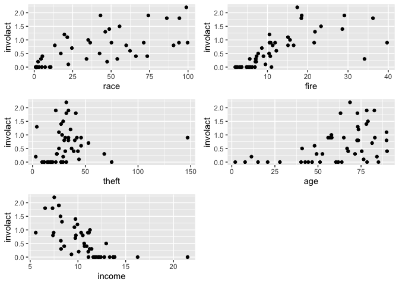<!-- -->

## Linear model analysis

Fit the standard linear model for reference purposes:

``` r
lmod <- lm(involact ~ race + fire + theft + age + log(income),  chredlin)
sumary(lmod)
```

``` 
            Estimate Std. Error t value Pr(>|t|)
(Intercept) -1.18554    1.10025   -1.08  0.28755
race         0.00950    0.00249    3.82  0.00045
fire         0.03986    0.00877    4.55  4.8e-05
theft       -0.01029    0.00282   -3.65  0.00073
age          0.00834    0.00274    3.04  0.00413
log(income)  0.34576    0.40012    0.86  0.39254

n = 47, p = 6, Residual SE = 0.335, R-Squared = 0.75
```

## INLA default model

Run the default INLA model and compare to the `lm` output:

``` r
formula <- involact ~ race + fire + theft + age + log(income)
imod <- inla(formula, family="gaussian", data=chredlin)
cbind(imod$summary.fixed[,1:2],summary(lmod)$coef[,1:2])
```

``` 
                  mean        sd   Estimate Std. Error
(Intercept) -1.1853891 1.0979085 -1.1855396  1.1002549
race         0.0095020 0.0024844  0.0095022  0.0024896
fire         0.0398555 0.0087480  0.0398560  0.0087661
theft       -0.0102944 0.0028121 -0.0102945  0.0028179
age          0.0083354 0.0027383  0.0083356  0.0027440
log(income)  0.3457063 0.3992695  0.3457615  0.4001234
```

The first two columns are the posterior means and SDs from the INLA fit
while the third and fourth are the corresponding values from the lm fit.
We can see they are almost identical. We expect this.

We can get the posterior for the SD of the error as:

``` r
bri.hyperpar.summary(imod)
```

``` 
                                    mean       sd  q0.025    q0.5  q0.975    mode
SD for the Gaussian observations 0.33244 0.036546 0.27005 0.32914 0.41338 0.32274
```

which compares with the linear model estimate of:

``` r
summary(lmod)$sigma
```

    [1] 0.33453

which gives a very similar result. But notice that the Bayesian output
gives us more than just a point estimate.

The function `inla.hyperpar()` is advertized to improve the estimates of
the hyperparameters (just sigma here) but makes very little difference
in this example:

``` r
bri.hyperpar.summary(inla.hyperpar(imod))
```

``` 
                                    mean       sd  q0.025    q0.5 q0.975    mode
SD for the Gaussian observations 0.33245 0.036554 0.27005 0.32914 0.4134 0.32274
```

## Plots of the posteriors

For the error SD

``` r
bri.hyperpar.plot(imod)
```

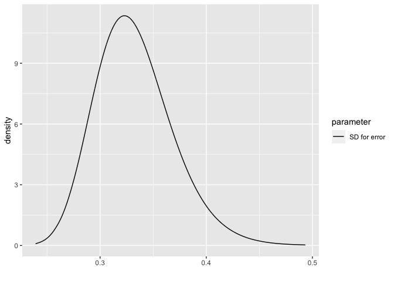<!-- -->

For the fixed parameters:

``` r
bri.fixed.plot(imod)
```

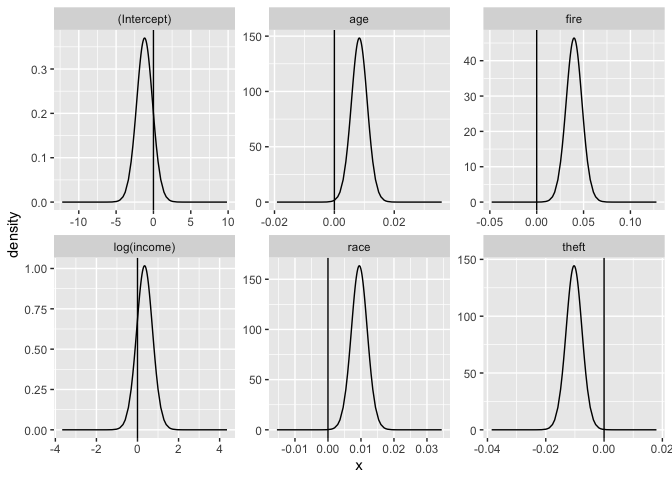<!-- -->

We can use these plots to judge which parameters may be different from
zero. For age, fire, race and theft, we see the posterior density is
well away from zero but for log(income) there is an overlap. This can be
qualitatively compared to the p-values from the linear model output. The
conclusions are compatible although the motivation and justifactions are
different.

## Fitted values

We need to set the control.predictor to compute the posterior means of
the linear predictors:

``` r
result <- inla(formula, family="gaussian", control.predictor=list(compute=TRUE),data=chredlin)
ypostmean <- result$summary.linear.predictor
```

Compare these posterior means to the lm() fitted values:

``` r
plot(ypostmean[,1],lmod$fit, xlab="INLA posterior fitted means", ylab="LM fitted values")
abline(0,1)
```

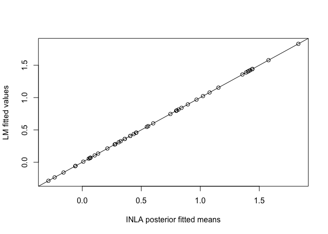<!-- -->

Can see these are the same. Now compare the SDs from INLA with the SEs
from the LM fit:

``` r
lmfit <- predict(lmod, se=TRUE)
plot(ypostmean[,2], lmfit$se.fit, xlab="INLA posterior SDs", ylab="LM fitted SEs")
abline(0,1)
```

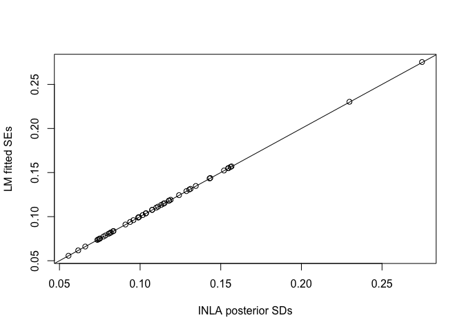<!-- -->

We see that these are the same.

## Prediction

Suppose we wish to predict the response at a new set of inputs. We add a
case for the new inputs and set the response to missing:

``` r
newobs = data.frame(race=25,fire=10,theft=30,age=65,involact=NA,income=11,side="s")
chpred = rbind(chredlin,newobs)
```

We fit the model as before:

``` r
respred <- inla(formula, family="gaussian", control.predictor=list(compute=TRUE), data=chpred)
respred$summary.fixed
```

``` 
                  mean        sd 0.025quant   0.5quant 0.975quant       mode        kld
(Intercept) -1.1853891 1.0979084 -3.3512580 -1.1854262  0.9787808 -1.1853992 2.5514e-05
race         0.0095020 0.0024844  0.0046010  0.0095019  0.0143991  0.0095020 2.5522e-05
fire         0.0398555 0.0087480  0.0225979  0.0398553  0.0570993  0.0398556 2.5526e-05
theft       -0.0102944 0.0028121 -0.0158419 -0.0102945 -0.0047513 -0.0102944 2.5527e-05
age          0.0083354 0.0027383  0.0029334  0.0083353  0.0137331  0.0083354 2.5525e-05
log(income)  0.3457063 0.3992695 -0.4419491  0.3456954  1.1327297  0.3457100 2.5513e-05
```

The output is the same as before as expected. The fitted value for the
last observation (the new 48th observation) provides the posterior
distribution for the linear predictor corresponding to the new set of
inputs.

``` r
respred$summary.fitted.values[48,]
```

``` 
                       mean       sd 0.025quant 0.5quant 0.975quant    mode
fitted.Predictor.48 0.51265 0.054281     0.4057  0.51265     0.6196 0.51265
```

We might compare this to the standard linear model prediction:

``` r
predict(lmod, newdata=newobs, interval = "confidence", se=TRUE)
```

    $fit
          fit     lwr     upr
    1 0.51266 0.40292 0.62239
    
    $se.fit
    [1] 0.054337
    
    $df
    [1] 41
    
    $residual.scale
    [1] 0.33453

We get the essentially the same outcome. These answers only reflect
variability in the linear predictor.

Usually we want to include the variation due to a new error. This
requires more effort. One solution is based on simulation. We can sample
from the posterior we have just calculated and sample from the posterior
for the error distribution. Adding these together, we will get a sample
from the posterior predictive distribution. Although this can be done
quickly, it goes against the spirit of INLA by using simulation.

We can compute an approximation for the posterior predictive
distribution using some trickery. We set up an index variable `idx`. We
add a *random effect* term using this index with the `f()` function.
This is a mean zero Gaussian random variable whose variance is a
hyperparameter. This term functions exactly the same as the usual error
term. Since the model will also add an error term, we would be stuck
with two essentially identical terms. But we are able to knock out the
usual error term by specifying that it have a very high precision
(i.e. it will vary just a little bit). In this way, our random effect
term will take almost all the burden of representing this variation.

``` r
chpred$idx <- 1:48
eformula <- involact ~ race + fire + theft + age + log(income) + f(idx, model="iid", hyper = list(prec = list(param=c(1, 0.01))))
respred <- inla(eformula, data = chpred, control.predictor = list(compute=TRUE), control.family=list(initial=12,fixed=TRUE))
bri.hyperpar.summary(respred)
```

``` 
              mean       sd  q0.025    q0.5  q0.975    mode
SD for idx 0.33315 0.036626 0.27063 0.32984 0.41427 0.32342
```

We see that the SD for the index variable is about the same as the
previous SD for the error. Look at the predictive distribution:

``` r
respred$summary.fitted.values[48,]
```

``` 
                       mean      sd 0.025quant 0.5quant 0.975quant    mode
fitted.Predictor.48 0.51266 0.33893   -0.15516  0.51265     1.1804 0.51265
```

We can compare this to the linear model prediction interval:

``` r
predict(lmod,newdata=newobs,interval="prediction")
```

``` 
      fit      lwr    upr
1 0.51266 -0.17179 1.1971
```

The results are similar but not the same. Notice that the lower end of
the intervals are both negative which should not happen with a strictly
positive response. But that’s not the fault of this process but of our
choice of model.

Here is a posterior predictive density for the prediction:

``` r
ggplot(data.frame(respred$marginals.fitted.values[[48]]),aes(x,y))+geom_line()+ylab("Density")+xlab("involact")
```

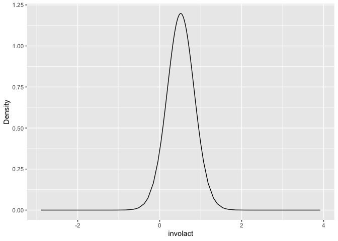<!-- -->

We see the problem of having density for values less than zero.

For more on this, see the [Google groups INLA mailing
list](https://groups.google.com/forum/#!topic/r-inla-discussion-group/2FYu8lAqid4)
discussion.

## Conditional Predictive Ordinates and Probability Integral Transform

Bayesian diagnostic methods can use these statistics. We need to ask for
them at the time we fit the model:

``` r
imod <- inla(formula, family="gaussian", data=chredlin, control.compute=list(cpo=TRUE))
```

The CPO is the probability density of an observed response based on the
model fit to the rest of the data. We are interested in small values of
the CPO since these represent unexpected response values. Plot the CPOs:

``` r
n = nrow(chredlin)
plot(1:n,imod$cpo$cpo, ylab="CPO",type="n")
text(1:n,imod$cpo$cpo, 1:n)
```

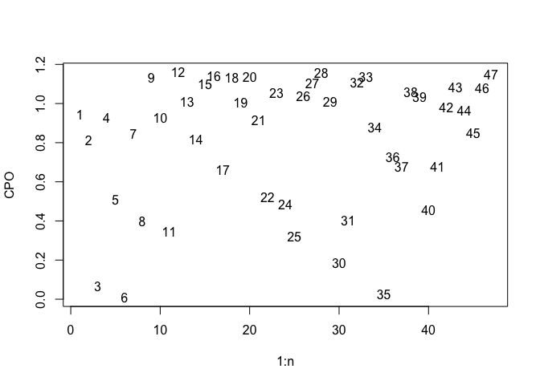<!-- -->

Observations 3, 6 and 35 have particularly low values. We might compare
these to the jacknife residuals (an analogous quantity) from the
standard linear model:

``` r
plot(imod$cpo$cpo, abs(rstudent(lmod)), xlab="CPO",ylab="Absolute residuals", type="n")
text(imod$cpo$cpo, abs(rstudent(lmod)), 1:n)
```

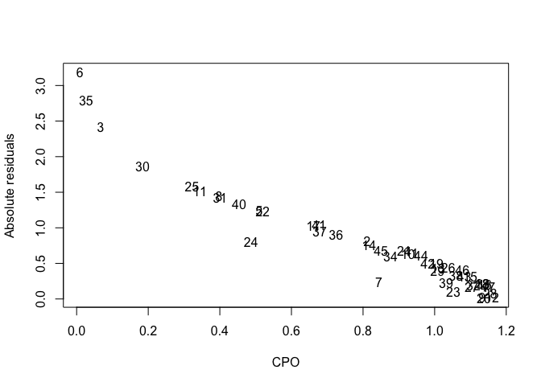<!-- -->

We can see the two statistics are related. They pick out the same three
observations.

The PIT is the probability of a new response less than the observed
response using a model based on the rest of the data. We’d expect the
PIT values to be uniformly distributed if the model assumptions are
correct.

``` r
pit <- imod$cpo$pit
uniquant <- (1:n)/(n+1)
plot(uniquant, sort(pit), xlab="uniform quantiles", ylab="Sorted PIT values")
abline(0,1)
```

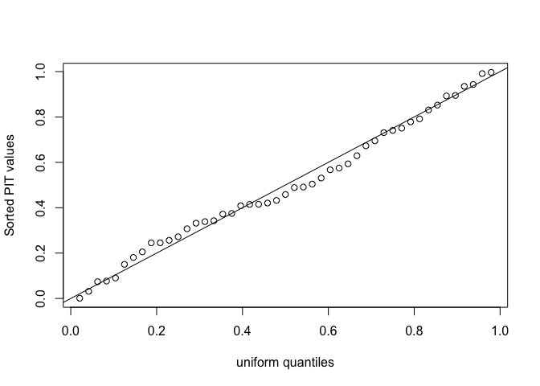<!-- -->

Looks good - no indication of problems. Might be better to plot these on
a logit scale because probabilities very close to 0 or 1 won’t be
obvious from the above plot.

``` r
plot(logit(uniquant), logit(sort(pit)), xlab="uniform quantiles", ylab="Sorted PIT values", main="Logit scale")
abline(0,1)
```

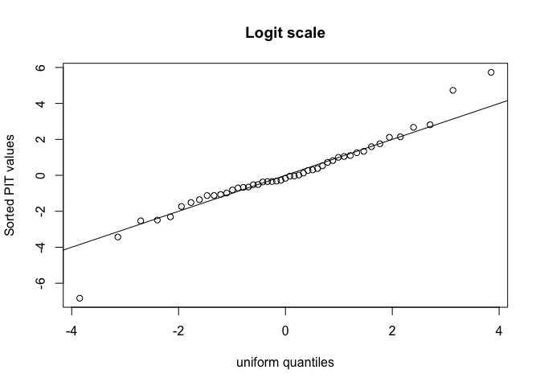<!-- -->

This marks out three points as being somewhat unusual:

``` r
which(abs(logit(pit)) > 4)
```

    [1]  3  6 35

The same three points picked out by the CPO statistic.

We can compare the PIT values and posterior means for the fitted values
(which are the same as the fitted values from the linear model fit).

``` r
plot(predict(lmod), pit, xlab="Posterior fitted means", ylab="PIT")
```

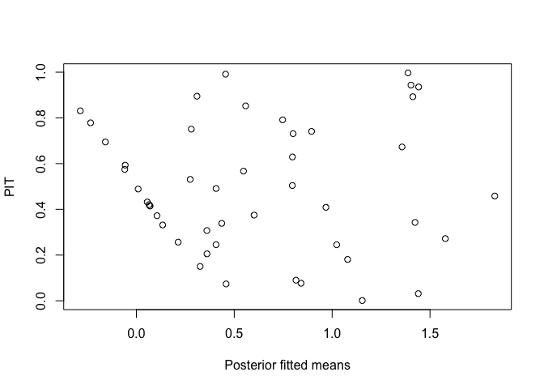<!-- -->

This indicates some problems for low values. Since the response is
strictly positive and this is not reflected in our models, this does
spot a real flaw in our model.

Incidentally, a similar conclusion can be made from the standard linear
model diagnostic:

``` r
plot(lmod,1)
```

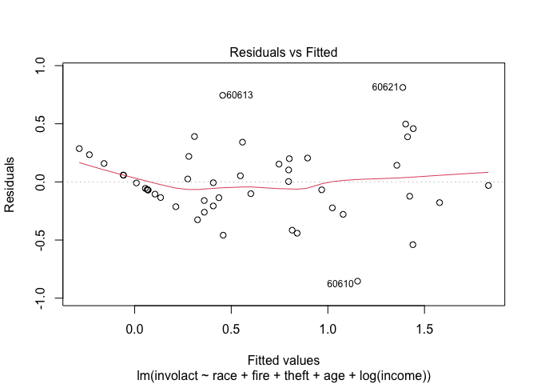<!-- -->

which looks fairly similar. In this example, we might try something
other than a Gaussian response which reflects the zero response values.

We can also plot the PITs against the predictors - for example:

``` r
plot(chredlin$race, pit, xlab="Minority percentage", ylab="PIT")
```

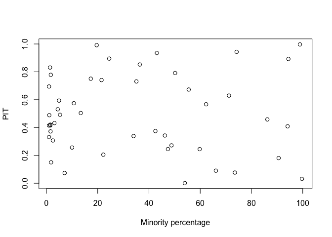<!-- -->

Which shows no problems with the fit.

## Model Selection

We need to ask to get the Watanabe AIC (WAIC) and deviance information
criterion DIC calculated:

``` r
imod <- inla(formula, family="gaussian", data=chredlin, control.compute=list(dic=TRUE, waic=TRUE))
```

which produces:

``` r
c(WAIC=imod$waic$waic, DIC=imod$dic$dic)
```

``` 
  WAIC    DIC 
40.151 38.611 
```

We do not have many predictors here so exhaustive search is feasible. We
fit all models that include race but with some combination of the other
four predictors. Use `lm()` to get the AIC but INLA to get DIC and WAIC

``` r
listcombo <- unlist(sapply(0:4,function(x) combn(4, x, simplify=FALSE)),recursive=FALSE)
predterms <- lapply(listcombo, function(x) paste(c("race",c("fire","theft","age","log(income)")[x]),collapse="+"))
coefm <- matrix(NA,16,3)
for(i in 1:16){
    formula <- as.formula(paste("involact ~ ",predterms[[i]]))
    lmi <- lm(formula, data=chredlin)
    result <- inla(formula, family="gaussian", data=chredlin, control.compute=list(dic=TRUE, waic=TRUE))
    coefm[i,1] <- AIC(lmi)
    coefm[i,2] <- result$dic$dic
    coefm[i,3] <- result$waic$waic
}
rownames(coefm) <- predterms
colnames(coefm) <- c("AIC","DIC","WAIC")
round(coefm,4)
```

``` 
                                   AIC    DIC   WAIC
race                            62.032 62.216 62.416
race+fire                       50.744 50.990 54.014
race+theft                      63.925 64.171 64.073
race+age                        54.026 54.273 54.304
race+log(income)                57.883 58.129 58.572
race+fire+theft                 43.970 44.303 46.623
race+fire+age                   47.306 47.639 50.031
race+fire+log(income)           51.412 51.744 54.445
race+theft+age                  54.252 54.585 54.597
race+theft+log(income)          59.591 59.923 60.360
race+age+log(income)            54.804 55.137 55.152
race+fire+theft+age             36.876 37.321 39.117
race+fire+theft+log(income)     45.569 46.013 48.202
race+fire+age+log(income)       49.272 49.717 51.793
race+theft+age+log(income)      55.215 55.660 55.810
race+fire+theft+age+log(income) 38.028 38.611 40.151
```

The model corresponding to the minimum value of the criterion is the
same for all three. We would choose `involact ~ race+fire+theft+age`.

## Conclusion

We see that the standard linear modeling and the Bayesian approach using
INLA produce very similar results. On one hand, one might decide to
stick with the standard approach since it is easier. But on the other
hand, this does give the user confidence to use the Bayesian approach
with INLA because it opens up other possibilities with the model fitting
and interpretation. The consistency between the approaches in the
default settings is reassuring.
