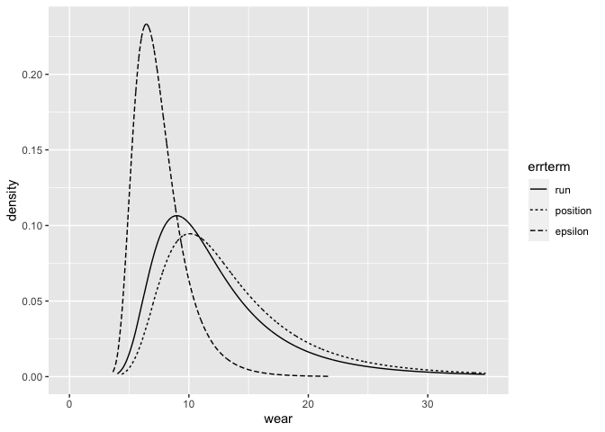
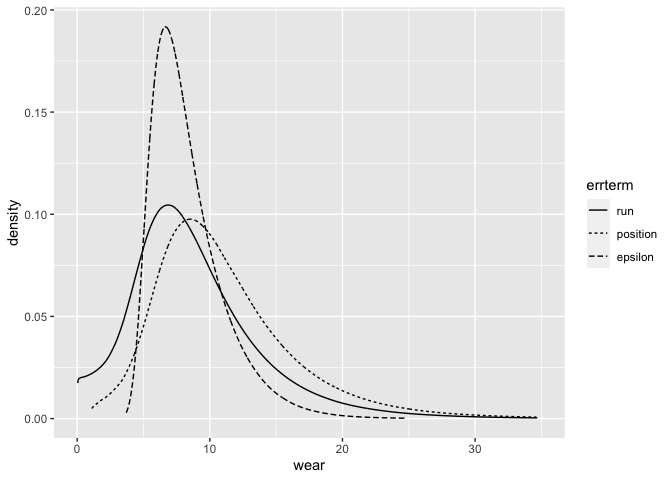

INLA analysis of Latin Square design - one fixed and two crossed random
effects
================
[Julian Faraway](https://julianfaraway.github.io/)
22 September 2020

See the [introduction](index.md) for an overview. Load the libraries:

``` r
library(ggplot2)
library(INLA)
```

# Data

``` r
data(abrasion, package="faraway")
abrasion
```

``` 
   run position material wear
1    1        1        C  235
2    1        2        D  236
3    1        3        B  218
4    1        4        A  268
5    2        1        A  251
6    2        2        B  241
7    2        3        D  227
8    2        4        C  229
9    3        1        D  234
10   3        2        C  273
11   3        3        A  274
12   3        4        B  226
13   4        1        B  195
14   4        2        A  270
15   4        3        C  230
16   4        4        D  225
```

``` r
ggplot(abrasion,aes(x=material, y=wear, shape=run, color=position))+geom_point(position = position_jitter(width=0.1, height=0.0))
```

<!-- -->

# Default prior model

``` r
formula <- wear ~ material + f(run, model="iid") + f(position, model="iid")
result <- inla(formula, family="gaussian", data=abrasion)
result <- inla.hyperpar(result)
summary(result)
```

``` 

Call:
   "inla(formula = formula, family = \"gaussian\", data = abrasion)" 
Time used:
    Pre = 1.44, Running = 8.07, Post = 0.441, Total = 9.95 
Fixed effects:
               mean     sd 0.025quant 0.5quant 0.975quant    mode kld
(Intercept) 260.937  7.149    246.059  261.177    274.424 261.608   0
materialB   -38.750 10.110    -57.790  -39.100    -17.689 -39.735   0
materialC   -18.178 10.022    -37.230  -18.460      2.523 -18.970   0
materialD   -28.819 10.065    -47.861  -29.136     -7.936 -29.710   0

Random effects:
  Name    Model
    run IID model
   position IID model

Model hyperparameters:
                                         mean    sd 0.025quant 0.5quant 0.975quant  mode
Precision for the Gaussian observations 5e-03 2e-03      0.002 5.00e-03    9.0e-03 0.004
Precision for run                       2e+04 2e+04    505.736 1.39e+04    7.4e+04 0.028
Precision for position                  2e+04 2e+04    505.040 1.39e+04    7.4e+04 0.013

Expected number of effective parameters(stdev): 3.71(0.098)
Number of equivalent replicates : 4.32 

Marginal log-Likelihood:  -85.52 
```

The run and position precisions look far too high. Need to change the
default prior

# Informative Gamma priors on the precisions

Now try more informative gamma priors for the random effect precisions.
Define it so the mean value of gamma prior is set to the inverse of the
variance of the residuals of the fixed-effects only model. We expect the
error variances to be lower than this variance so this is an
overestimate. The variance of the gamma prior (for the precision) is
controlled by the `apar` shape parameter.

``` r
apar <- 0.5
lmod <- lm(wear ~ material, abrasion)
bpar <- apar*var(residuals(lmod))
lgprior <- list(prec = list(prior="loggamma", param = c(apar,bpar)))
formula = wear ~ material+f(run, model="iid", hyper = lgprior)+f(position, model="iid", hyper = lgprior)
result <- inla(formula, family="gaussian", data=abrasion)
result <- inla.hyperpar(result)
summary(result)
```

``` 

Call:
   "inla(formula = formula, family = \"gaussian\", data = abrasion)" 
Time used:
    Pre = 1.43, Running = 1.44, Post = 0.149, Total = 3.02 
Fixed effects:
               mean     sd 0.025quant 0.5quant 0.975quant    mode kld
(Intercept) 264.406 10.223    243.794  264.424    284.959 264.481   0
materialB   -43.814  5.196    -53.596  -44.031    -32.714 -44.368   0
materialC   -22.356  5.169    -32.182  -22.539    -11.419 -22.823   0
materialD   -33.455  5.182    -43.257  -33.655    -22.434 -33.967   0

Random effects:
  Name    Model
    run IID model
   position IID model

Model hyperparameters:
                                         mean    sd 0.025quant 0.5quant 0.975quant  mode
Precision for the Gaussian observations 0.021 0.011      0.006    0.020      0.047 0.016
Precision for run                       0.010 0.008      0.001    0.008      0.031 0.004
Precision for position                  0.008 0.006      0.001    0.007      0.025 0.004

Expected number of effective parameters(stdev): 9.27(0.445)
Number of equivalent replicates : 1.73 

Marginal log-Likelihood:  -81.86 
```

Compute the transforms to an SD scale for the random effect terms. Make
a table of summary statistics for the posteriors:

``` r
sigmarun <- inla.tmarginal(function(x) 1/sqrt(exp(x)),result$internal.marginals.hyperpar[[2]])
sigmapos <- inla.tmarginal(function(x) 1/sqrt(exp(x)),result$internal.marginals.hyperpar[[3]])
sigmaepsilon <- inla.tmarginal(function(x) 1/sqrt(exp(x)),result$internal.marginals.hyperpar[[1]])
restab=sapply(result$marginals.fixed, function(x) inla.zmarginal(x,silent=TRUE))
restab=cbind(restab, inla.zmarginal(sigmarun,silent=TRUE))
restab=cbind(restab, inla.zmarginal(sigmapos,silent=TRUE))
restab=cbind(restab, inla.zmarginal(sigmaepsilon,silent=TRUE))
colnames(restab) = c("mu","B-A","C-A","D-A","run","position","epsilon")
data.frame(restab)
```

``` 
               mu     B.A     C.A     D.A    run position epsilon
mean       264.41 -43.814 -22.357 -33.455 12.682   14.211  7.5626
sd         10.222  5.1944  5.1675  5.1808  6.502   7.2926  2.1673
quant0.025 243.78 -53.602 -32.197 -43.269 5.7023   6.3527  4.6048
quant0.25  257.95   -47.2 -25.711 -36.827 8.5602    9.588  6.0385
quant0.5   264.39 -44.055 -22.565 -33.682 11.024   12.356  7.1351
quant0.75  270.79 -40.722 -19.262 -30.364 14.745   16.533  8.5983
quant0.975 284.89 -32.754 -11.455 -22.474 29.617   33.205  13.003
```

Also construct a plot the SD posteriors:

``` r
ddf <- data.frame(rbind(sigmarun,sigmapos,sigmaepsilon),errterm=gl(3,nrow(sigmarun),labels = c("run","position","epsilon")))
ggplot(ddf, aes(x,y, linetype=errterm))+geom_line()+xlab("wear")+ylab("density")+xlim(0,35)
```

<!-- -->

Posteriors look OK although no weight given to smaller values.

# Penalized Complexity Prior

In [Simpson et al (2015)](http://arxiv.org/abs/1403.4630v3), penalized
complexity priors are proposed. This requires that we specify a scaling
for the SDs of the random effects. We use the SD of the residuals of the
fixed effects only model (what might be called the base model in the
paper) to provide this scaling.

``` r
lmod <- lm(wear ~ material, abrasion)
sdres <- sd(residuals(lmod))
pcprior <- list(prec = list(prior="pc.prec", param = c(3*sdres,0.01)))
formula = wear ~ material+f(run, model="iid", hyper = pcprior)+f(position, model="iid", hyper = pcprior)
result <- inla(formula, family="gaussian", data=abrasion)
result <- inla.hyperpar(result)
summary(result)
```

``` 

Call:
   "inla(formula = formula, family = \"gaussian\", data = abrasion)" 
Time used:
    Pre = 1.54, Running = 17.4, Post = 1.3, Total = 20.2 
Fixed effects:
               mean    sd 0.025quant 0.5quant 0.975quant    mode   kld
(Intercept) 264.435 8.748    246.663  264.475    282.025 264.571 0.000
materialB   -43.855 5.179    -53.401  -44.150    -32.279 -44.526 0.001
materialC   -22.392 5.142    -32.024  -22.640    -11.051 -22.956 0.001
materialD   -33.494 5.160    -43.080  -33.766    -22.031 -34.113 0.001

Random effects:
  Name    Model
    run IID model
   position IID model

Model hyperparameters:
                                         mean     sd 0.025quant 0.5quant 0.975quant  mode
Precision for the Gaussian observations 0.019  0.011      0.004    0.017      0.045 0.012
Precision for run                       1.350 55.826      0.002    0.015      0.670 0.006
Precision for position                  0.019  0.047      0.002    0.010      0.091 0.005

Expected number of effective parameters(stdev): 8.94(0.75)
Number of equivalent replicates : 1.79 

Marginal log-Likelihood:  -84.54 
```

Compute the summaries as before:

``` r
sigmarun <- inla.tmarginal(function(x) 1/sqrt(exp(x)),result$internal.marginals.hyperpar[[2]])
sigmapos <- inla.tmarginal(function(x) 1/sqrt(exp(x)),result$internal.marginals.hyperpar[[3]])
sigmaepsilon <- inla.tmarginal(function(x) 1/sqrt(exp(x)),result$internal.marginals.hyperpar[[1]])
restab=sapply(result$marginals.fixed, function(x) inla.zmarginal(x,silent=TRUE))
restab=cbind(restab, inla.zmarginal(sigmarun,silent=TRUE))
restab=cbind(restab, inla.zmarginal(sigmapos,silent=TRUE))
restab=cbind(restab, inla.zmarginal(sigmaepsilon,silent=TRUE))
colnames(restab) = c("mu","B-A","C-A","D-A","run","position","epsilon")
data.frame(restab)
```

``` 
               mu     B.A     C.A     D.A    run position epsilon
mean       264.44 -43.856 -22.394 -33.495 8.9199   11.097  8.3418
sd         8.7473  5.1768  5.1396  5.1581 5.0464    5.398  2.7518
quant0.025 246.65 -53.417 -32.028  -43.09  1.227   3.3229  4.7356
quant0.25     259 -47.174 -25.664 -36.789 5.5882   7.4367  6.3684
quant0.5   264.44 -44.172 -22.662 -33.788 8.0419    10.06   7.724
quant0.75  269.83 -40.945 -19.472 -30.579 11.258   13.596  9.6682
quant0.975 281.97 -32.323 -11.092 -22.074 21.508   24.675   15.32
```

Make the plots:

``` r
ddf <- data.frame(rbind(sigmarun,sigmapos,sigmaepsilon),errterm=gl(3,nrow(sigmarun),labels = c("run","position","epsilon")))
ggplot(ddf, aes(x,y, linetype=errterm))+geom_line()+xlab("wear")+ylab("density")+xlim(0,35)
```

<!-- -->

Posteriors put more weight on lower values compared to gamma prior. Some
work is necessary to correctly compute the tails of the densities.

# Package version info

``` r
sessionInfo()
```

``` 
R version 4.0.2 (2020-06-22)
Platform: x86_64-apple-darwin17.0 (64-bit)
Running under: macOS Catalina 10.15.6

Matrix products: default
BLAS:   /Library/Frameworks/R.framework/Versions/4.0/Resources/lib/libRblas.dylib
LAPACK: /Library/Frameworks/R.framework/Versions/4.0/Resources/lib/libRlapack.dylib

locale:
[1] en_GB.UTF-8/en_GB.UTF-8/en_GB.UTF-8/C/en_GB.UTF-8/en_GB.UTF-8

attached base packages:
[1] parallel  stats     graphics  grDevices utils     datasets  methods   base     

other attached packages:
[1] INLA_20.03.17 foreach_1.5.0 sp_1.4-2      Matrix_1.2-18 ggplot2_3.3.2 knitr_1.29   

loaded via a namespace (and not attached):
 [1] pillar_1.4.6         compiler_4.0.2       iterators_1.0.12     tools_4.0.2          digest_0.6.25       
 [6] evaluate_0.14        lifecycle_0.2.0      tibble_3.0.3         gtable_0.3.0         lattice_0.20-41     
[11] pkgconfig_2.0.3      rlang_0.4.7          yaml_2.2.1           xfun_0.16            withr_2.2.0         
[16] dplyr_1.0.2          stringr_1.4.0        MatrixModels_0.4-1   generics_0.0.2       vctrs_0.3.4         
[21] grid_4.0.2           tidyselect_1.1.0     glue_1.4.2           R6_2.4.1             rmarkdown_2.3       
[26] farver_2.0.3         purrr_0.3.4          magrittr_1.5         splines_4.0.2        scales_1.1.1        
[31] codetools_0.2-16     ellipsis_0.3.1       htmltools_0.5.0.9000 colorspace_1.4-1     Deriv_4.0.1         
[36] labeling_0.3         stringi_1.4.6        munsell_0.5.0        crayon_1.3.4        
```
