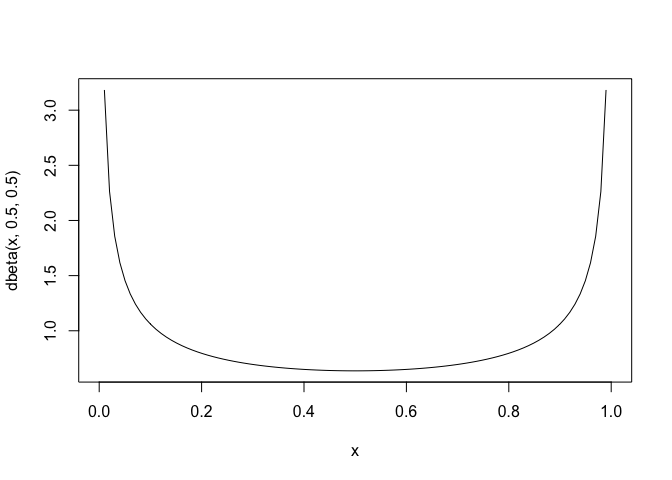
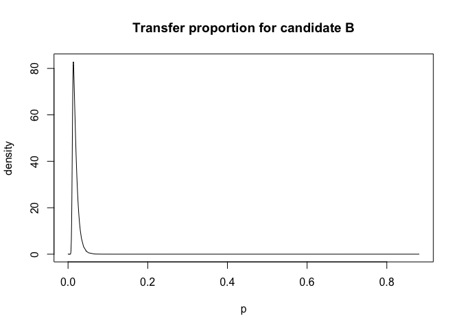
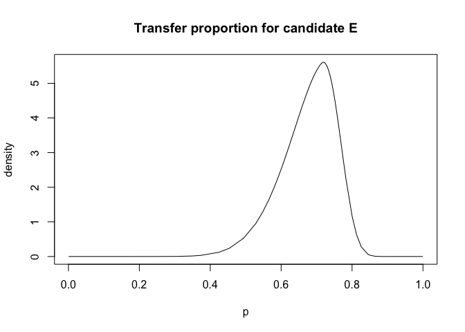

Regression with bounded coefficients
================
[Julian Faraway](https://julianfaraway.github.io/)
21 September 2020

See the [introduction](index.md) for an overview. Load the libraries:

``` r
library(INLA)
library(faraway)
```

## Data

Data come from the `faraway` package. The help page reads:

Elections for the French presidency proceed in two rounds. In 1981,
there were 10 candidates in the first round. The top two candidates then
went on to the second round, which was won by Francois Mitterand over
Valery Giscard-d’Estaing. The losers in the first round can gain
political favors by urging their supporters to vote for one of the two
finalists. Since voting is private, we cannot know how these votes were
transferred, we might hope to infer from the published vote totals how
this might have happened. Data is given for vote totals in every fourth
department of France:

``` r
data(fpe,package="faraway")
head(fpe)
```

``` 
                    EI   A   B   C   D  E  F  G  H  J K  A2  B2  N
Ain                260  51  64  36  23  9  5  4  4  3 3 105 114 17
Alpes               75  14  17   9   9  3  1  2  1  1 1  32  31  5
Ariege             107  27  18  13  17  2  2  2  1  1 1  57  33  6
Bouches.du.Rhone  1036 191 204 119 205 29 13 13 10 10 6 466 364 30
Charente.Maritime  367  71  76  47  37  8 34  5  4  4 2 163 142 17
Cotes.du.Nord      396  93  90  57  54 13  5  9  4  3 5 193 155 15
```

Proportion voting for Mitterand in second round is made up from some
proportion of first round votes:

``` r
lmod <- lm(A2 ~ A+B+C+D+E+F+G+H+J+K+N-1, fpe)
coef(lmod)
```

``` 
       A        B        C        D        E        F        G        H        J        K        N 
 1.07515 -0.12456  0.25745  0.90454  0.67068  0.78253  2.16566 -0.85429  0.14442  0.51813  0.55827 
```

But all these coefficients should lie in the range \[0,1\]. Note we have
ignored the fact that the number of voters in each department varies so
we should use weights.

Can recursively set coefficients to the boundary to find a valid
solution but this is not optimal. Instead, can solve the least squares
problem with inequality constraints:

``` r
library(mgcv)
M <- list(w=rep(1,24),X=model.matrix(lmod), y=fpe$A2, Ain=rbind(diag(11),-diag(11)), C=matrix(0,0,0), array(0,0), S=list(), off=NULL, p=rep(0.5,11), bin=c(rep(0,11), rep(-1,11)))
a <- pcls(M)
names(a) <- colnames(model.matrix(lmod))
round(a,3)
```

``` 
    A     B     C     D     E     F     G     H     J     K     N 
1.000 0.000 0.177 0.938 0.508 0.777 1.000 0.787 0.000 1.000 0.476 
```

But this gives no uncertainties on the estimates.

# Bayes linear model with constraints

The `clinear` latent model in INLA allows us to constrain the values of
the parameter within a specified range - in this case \[0,1\]. The
default version of this model is:

``` r
cmod <- inla(A2 ~ -1 + 
               f(A, model = "clinear", range = c(0, 1)) + 
               f(B, model = "clinear", range = c(0, 1)) + 
               f(C, model = "clinear", range = c(0, 1)) + 
               f(D, model = "clinear", range = c(0, 1)) + 
               f(E, model = "clinear", range = c(0, 1)) + 
               f(F, model = "clinear", range = c(0, 1)) + 
               f(G, model = "clinear", range = c(0, 1)) + 
               f(H, model = "clinear", range = c(0, 1)) + 
               f(J, model = "clinear", range = c(0, 1)) + 
               f(K, model = "clinear", range = c(0, 1)) + 
               f(N, model = "clinear", range = c(0, 1)), 
              family="gaussian",data=fpe)
cmod$summary.hyperpar
```

``` 
                                             mean        sd 0.025quant  0.5quant 0.975quant      mode
Precision for the Gaussian observations 0.0071623 0.0025398  0.0033231 0.0067957   0.013214 0.0060943
Beta for A                              0.5078184 0.0553696  0.4015157 0.5067422   0.618896 0.5025527
Beta for B                              0.3694364 0.0544457  0.2682897 0.3672396   0.482506 0.3620399
Beta for C                              0.5298825 0.0704591  0.3867526 0.5320976   0.662282 0.5395054
Beta for D                              0.7285578 0.0546967  0.6089986 0.7330047   0.823130 0.7432761
Beta for E                              0.6939082 0.0699518  0.5401903 0.7006194   0.812660 0.7171017
Beta for F                              0.7104743 0.0644789  0.5737567 0.7142743   0.825127 0.7219545
Beta for G                              0.7116300 0.0646158  0.5729891 0.7161290   0.825255 0.7258868
Beta for H                              0.7017946 0.0680777  0.5651479 0.7025936   0.829664 0.7004296
Beta for J                              0.7240770 0.0638378  0.5835548 0.7301107   0.832421 0.7441004
Beta for K                              0.7204370 0.0661010  0.5720932 0.7280202   0.829291 0.7464775
Beta for N                              0.6946876 0.0674787  0.5520013 0.6984283   0.815593 0.7060155
```

But this does not produce the expected results as the posterior means
are all in the midrange whereas our previous analysis leads us to expect
some of them to be close to zero or one. The problem is that the slope
parameters are re-expressed as

\[
\beta = \frac{\exp (\theta)}{1+ \exp (\theta)}
\]

and the prior is put on theta. The logit transformation means that much
of the weight is put on the midrange and less on the regions close to
zero and one.

The `logitbeta` prior conveniently allows us to express the prior on the
slope parameter as a beta distribution. If we choose the hyperparameters
of beta(a,b) with both a and b small, values close to zero or one will
be preferred. Here is the density of beta(0.5,0.5)

``` r
x = seq(0,1,length.out = 100)
plot(x,dbeta(x,0.5,0.5),type="l")
```

<!-- -->

This seems reasonable since we expect supporters of minor parties to
throw support almost exclusively to one of the two final round
candidates.

``` r
bprior = list(theta = list(prior = "logitbeta", param=c(0.5,0.5)))
cmod <- inla(A2 ~ -1 + 
               f(A, model = "clinear", range = c(0, 1), hyper = bprior) + 
               f(B, model = "clinear", range = c(0, 1), hyper = bprior) + 
               f(C, model = "clinear", range = c(0, 1), hyper = bprior) + 
               f(D, model = "clinear", range = c(0, 1), hyper = bprior) + 
               f(E, model = "clinear", range = c(0, 1), hyper = bprior) + 
               f(F, model = "clinear", range = c(0, 1), hyper = bprior) + 
               f(G, model = "clinear", range = c(0, 1), hyper = bprior) + 
               f(H, model = "clinear", range = c(0, 1), hyper = bprior) + 
               f(J, model = "clinear", range = c(0, 1), hyper = bprior) + 
               f(K, model = "clinear", range = c(0, 1), hyper = bprior) + 
               f(N, model = "clinear", range = c(0, 1), hyper = bprior), 
              family="gaussian",data=fpe)
cmod$summary.hyperpar$mode
```

``` 
 [1] 0.090453 0.996418 0.013470 0.085320 0.926339 0.717844 0.778540 0.977449 0.715109 0.085220 0.908704 0.711309
```

We can plot the posteriors for each of the candidates in the first
round:

``` r
plot(cmod$marginals.hyperpar$`Beta for B`,type="l", xlab = "p", ylab="density",main="Transfer proportion for candidate B")
```

<!-- -->

We see that almost all candidate B (Giscard) first round voters did
*not* vote for Mitterand in the second round. In contrast,

``` r
plot(cmod$marginals.hyperpar$`Beta for E`,type="l", xlab = "p", ylab="density",main="Transfer proportion for candidate E")
```

<!-- -->

E was the Ecology party. We see that Ecology party supporters divided
their allegiance between the two candidates but with some apparent
preference for A (Mitterand).
