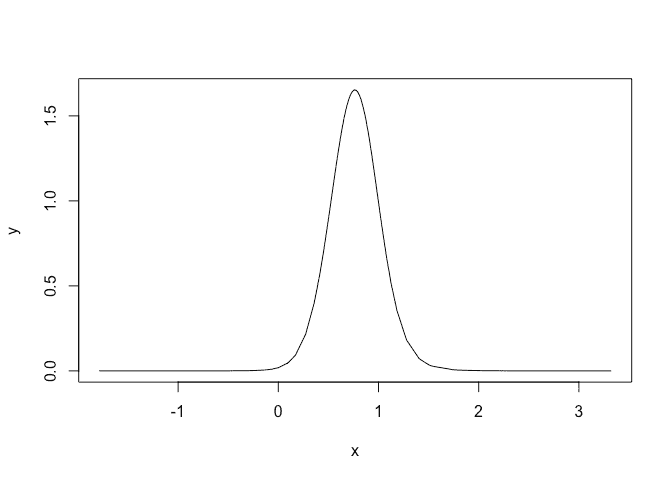
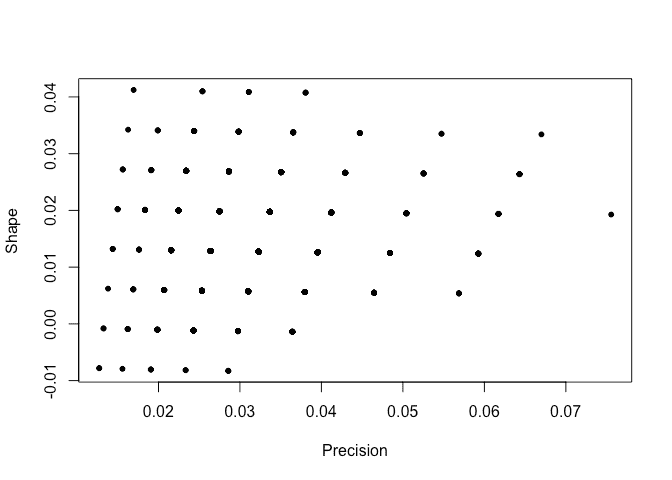

Extreme values using INLA
================
[Julian Faraway](https://julianfaraway.github.io/)
21 February 2022

See the [introduction](index.md) for more about INLA. Load in the
packages:

``` r
library(INLA)
library(brinla)
```

# Data

Extreme flows in rivers are of special interest since flood defences
must be designed with these in mind. The National River Flow Archive
provides data about river flows in the United Kingdom. For this example,
we consider data on annual maximum flow rates from the River Calder in
Cumbria, England from 1973 to 2014:

``` r
data(calder, package = "brinla")
plot(Flow ~ WaterYear, calder)
```

<!-- -->

Rescale year for convenience:

``` r
calder$year = calder$WaterYear-1973
```

# Generalized Extreme value distribution

Some scaling is necessary to get the model to fit. Generalized extreme
value distributions are notoriously difficult to fit. It is not unusual
to see failures to fit which require some tinkering to rectify. The
current implementation is marked as experimental so you may experience
some difficulties with the fit. We will need the
`control.compute = list(config=TRUE)` in the computations later in this
example.

``` r
imod <- inla(Flow ~ 1 + year, data = calder, family = "gev", scale = 0.1, control.compute = list(config=TRUE))
imod$summary.fixed
```

                    mean      sd 0.025quant 0.5quant 0.975quant     mode        kld
    (Intercept) 36.60812 5.85907   25.18367 36.54763    48.3342 36.40377 5.7647e-05
    year         0.76643 0.25438    0.27329  0.76397     1.2793  0.76394 2.1949e-05

We can see that there is positive linear trend term indicating the peak
flows for this river are increasing over time. We can plot the fixed
effect posterior for the year:

``` r
plot(imod$marginals.fixed$year, type="l")
```

<!-- -->

We can see that the posterior for the trend in year is concentrated
above zero indicating evidence of an increasing trend. Probability that
slope is negative is:

``` r
inla.pmarginal(0, imod$marginals.fixed$year)
```

    [1] 0.0019367

Rather small.

Plot the posterior for the precision:

``` r
plot(imod$marginals.hyperpar$`precision for GEV observations`,type="l",xlim=c(0,0.1))
```

<!-- -->

or plot that on an SD scale:

``` r
plot(bri.hyper.sd(imod$marginals.hyperpar$`precision for GEV observations`),type="l")
```

<!-- -->

Plot the posterior for the tail parameter:

``` r
plot(imod$marginals.hyperpar$`tail parameter for GEV observations`,type="l",xlim=c(-0.2,0.5))
```

<!-- -->

A small chance that this is negative.

# Predictions

The maximum flow over the period observation occured in the 1997 water
year measuring 173.17 m^3/s. Under our fitted model, what was the
probability of observing such a flow (or greater)? This will give us a
measure of how unusual this event was. First we need an `R` function to
compute P(Y \< y) for the generalized extreme value distribution:

``` r
pgev = function(y,xi,tau,eta,sigma=1){
  exp(-(1+xi*sqrt(tau*sigma)*(y-eta))^(-1/xi))
}
```

Compute probability of observed flow less than this maximum flow in
1997:

``` r
yr = 1997-1973
maxflow = 173.17
eta = sum(c(1,yr)*imod$summary.fixed$mean)
tau = imod$summary.hyperpar$mean[1]
xi = imod$summary.hyperpar$mean[2]
sigma = 0.1
(pless = pgev(maxflow, xi, tau, eta,sigma))
```

    [1] 0.99113

So probability of exceeding the observed value is:

``` r
1-pless
```

    [1] 0.0088729

Hydrologists often work with the expected time for the event to occur
called the *recurrence interval*. In this case, the value is:

``` r
1/(1-pless)
```

    [1] 112.7

Now set year to 2017:

``` r
yr = 2017-1973
maxflow = 173.17
eta = sum(c(1,yr)*imod$summary.fixed$mean)
tau = imod$summary.hyperpar$mean[1]
xi = imod$summary.hyperpar$mean[2]
sigma = 0.1
pless = pgev(maxflow, xi, tau, eta,sigma)
1/(1-pless)
```

    [1] 71.433

We see that the recurrence interval substantially reduced.

# Credibility interval

Can compute a 95% credibility interval. Need to sample from the full
posterior. This is where we need the
`control.compute = list(config=TRUE)` option.

``` r
nsamp = 999
postsamp = inla.posterior.sample(nsamp, imod)
pps = t(sapply(postsamp, function(x) c(x$hyperpar, x$latent[42:43])))
colnames(pps) <- c("precision","shape","beta0","beta1")
```

Plot the sampled hyperparameters:

``` r
plot(pps[,1],pps[,2]*0.01,xlab="Precision",ylab="Shape")
```

<!-- -->

We see that the sampled hyperparameters are concentrated on a sparse
grid. Here is the sampled posterior for the linear model parameters:

``` r
plot(pps[,3],pps[,4])
```

<!-- -->

No problem with this. We compute the recurrency interval for each
sample.

``` r
sigma = 0.1
maxflow = 173
retp = numeric(nsamp)
for(i in 1:nsamp){
  eta = sum(c(1,yr)*pps[i,3:4])
  tau = pps[i,1]
  xi = 0.01*pps[i,2]
  pless = pgev(maxflow, xi, tau, eta,sigma)
  retp[i] = 1/(1-pless)
}
```

From this we can compute the credibility interval:

``` r
quantile(retp, c(0.025, 0.5, 0.975))
```

        2.5%      50%    97.5% 
      48.393  248.126 2074.246 

This is quite wide. If we want a denser grid for the hyperparameters, we
can redo INLA with a smaller step size for the grid. We will get denser
coverage but it’s still a grid. This is somewhat undesirable but not as
bad as it seems because these are the integration points.

# Package versions

``` r
sessionInfo()
```

    R version 4.1.0 (2021-05-18)
    Platform: x86_64-apple-darwin17.0 (64-bit)
    Running under: macOS Big Sur 10.16

    Matrix products: default
    BLAS:   /Library/Frameworks/R.framework/Versions/4.1/Resources/lib/libRblas.dylib
    LAPACK: /Library/Frameworks/R.framework/Versions/4.1/Resources/lib/libRlapack.dylib

    locale:
    [1] en_GB.UTF-8/en_GB.UTF-8/en_GB.UTF-8/C/en_GB.UTF-8/en_GB.UTF-8

    attached base packages:
    [1] parallel  stats     graphics  grDevices utils     datasets  methods   base     

    other attached packages:
    [1] brinla_0.1.0  INLA_22.01.25 sp_1.4-6      foreach_1.5.2 Matrix_1.4-0  knitr_1.37   

    loaded via a namespace (and not attached):
     [1] rstudioapi_0.13     magrittr_2.0.2      splines_4.1.0       mnormt_2.0.2        lattice_0.20-45    
     [6] Deriv_4.1.3         rlang_1.0.1         fastmap_1.1.0       stringr_1.4.0       highr_0.9          
    [11] tools_4.1.0         grid_4.1.0          tmvnsim_1.0-2       xfun_0.29           cli_3.1.1          
    [16] htmltools_0.5.2     iterators_1.0.14    MatrixModels_0.5-0  yaml_2.2.2          digest_0.6.29      
    [21] numDeriv_2016.8-1.1 codetools_0.2-18    evaluate_0.14       sn_2.0.1            rmarkdown_2.11     
    [26] stringi_1.7.6       compiler_4.1.0      stats4_4.1.0       

# References
