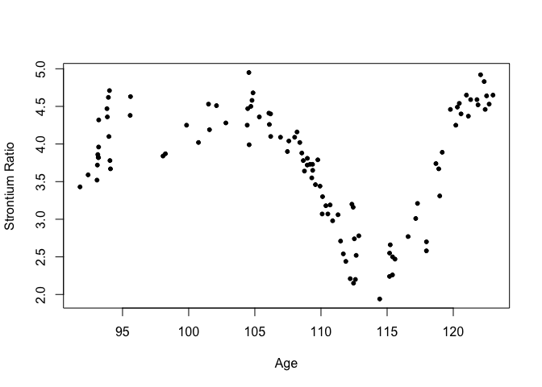
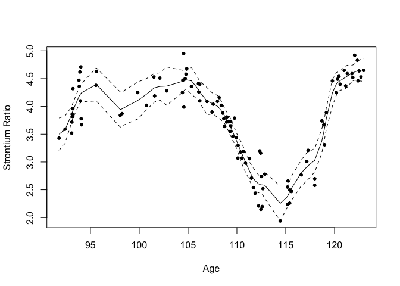

Gaussian process regression using INLA
================
[Julian Faraway](https://julianfaraway.github.io/)
21 September 2020

See the [introduction](index.md) for more about INLA. This [tutorial
paper](http://www.math.ntnu.no/inla/r-inla.org/papers/jss/lindgren.pdf)
is directed towards spatial problems but same methods can be profitably
applied on one-dimensional smoothing problems. See also (Lindgren and
Rue 2015) for details. The construction is detailed in our book.

Load the packages (you may need to [install the brinla
package](https://github.com/julianfaraway/brinla)):

``` r
library(ggplot2)
library(INLA)
library(brinla)
```

# Data

We use the fossil example from (Bralower et al. 1997) and used by
(Chaudhuri and Marron 1999). We have the ratio of strontium isotopes
found in fossil shells in the mid-Cretaceous period from about 90 to 125
million years ago. We rescale the response as in the SiZer paper.

``` r
data(fossil, package="brinla")
fossil$sr <- (fossil$sr-0.7)*100
```

Plot the data:

``` r
plot(sr ~ age, fossil, xlab="Age",ylab="Strontium Ratio")
```

<!-- -->

# GP fitting

The default fit uses priors based on the SD of the response and the
range of the predictor to motivate sensible priors.

``` r
gpmod = bri.gpr(fossil$age, fossil$sr)
```

We can plot the resulting fit and 95% credible bands

``` r
plot(sr ~ age, fossil, xlab="Age",ylab="Strontium Ratio")
lines(gpmod$xout, gpmod$mean)
lines(gpmod$xout, gpmod$lcb, lty=2)
lines(gpmod$xout, gpmod$ucb, lty=2)
```

<!-- -->

## Basis functions

The default number of spline basis functions is 25. Let’s see what
happens if you increase this to 100:

``` r
gpmod = bri.gpr(fossil$age, fossil$sr, nbasis = 100)
```

``` r
plot(sr ~ age, fossil, xlab="Age",ylab="Strontium Ratio")
lines(gpmod$xout, gpmod$mean)
lines(gpmod$xout, gpmod$lcb, lty=2)
lines(gpmod$xout, gpmod$ucb, lty=2)
```

<!-- -->

It makes very little difference although it does take longer to compute.
This demonstrates that you just need enough splines for the flexibility
you want. If you use more, you won’t get a rougher fit.

## Spline degree

We can decrease the degree of the splines (default is 2 corresponding to
cubic splines):

``` r
gpmod = bri.gpr(fossil$age, fossil$sr, degree=0)
```

``` r
plot(sr ~ age, fossil, xlab="Age",ylab="Strontium Ratio")
lines(gpmod$xout, gpmod$mean)
lines(gpmod$xout, gpmod$lcb, lty=2)
lines(gpmod$xout, gpmod$ucb, lty=2)
```

<!-- -->

We get a piecewise constant fit (the diagonal parts are just from
interpolating the fit - could use a better grid to avoid this)

## GP kernel shape

We can change the shape of the GP kernel where default is alpha = 2

``` r
gpmod = bri.gpr(fossil$age, fossil$sr, alpha = 1)
```

``` r
plot(sr ~ age, fossil, xlab="Age",ylab="Strontium Ratio")
lines(gpmod$xout, gpmod$mean)
lines(gpmod$xout, gpmod$lcb, lty=2)
lines(gpmod$xout, gpmod$ucb, lty=2)
```

<!-- -->

The kernel is less smooth resulting in a rougher fit.

## Prior means on sigma and range

We can set the prior mean on the error to be much larger than the
default (which is the SD of the response - already quite large:

``` r
gpmod = bri.gpr(fossil$age, fossil$sr, sigma0 = 10*sd(fossil$sr))
```

``` r
plot(sr ~ age, fossil, xlab="Age",ylab="Strontium Ratio")
lines(gpmod$xout, gpmod$mean)
lines(gpmod$xout, gpmod$lcb, lty=2)
lines(gpmod$xout, gpmod$ucb, lty=2)
```

<!-- -->

Doesn’t have much affect on the outcome. Nice to have a robust choice of
prior.

We can set the prior mean on the error to be much smaller than the
default (which is the SD of the response)

``` r
gpmod = bri.gpr(fossil$age, fossil$sr, sigma0 = 0.1*sd(fossil$sr))
```

``` r
plot(sr ~ age, fossil, xlab="Age",ylab="Strontium Ratio")
lines(gpmod$xout, gpmod$mean)
lines(gpmod$xout, gpmod$lcb, lty=2)
lines(gpmod$xout, gpmod$ucb, lty=2)
```

<!-- -->

Again quite robust to this choice.

We can also experiment with the range. The default is one quarter of the
range of the predictor. Let’s make it equal to the range:

``` r
gpmod = bri.gpr(fossil$age, fossil$sr, rho0 = max(fossil$age) - min(fossil$age))
```

``` r
plot(sr ~ age, fossil, xlab="Age",ylab="Strontium Ratio")
lines(gpmod$xout, gpmod$mean)
lines(gpmod$xout, gpmod$lcb, lty=2)
lines(gpmod$xout, gpmod$ucb, lty=2)
```

<!-- -->

Again makes very little difference.

## Penalized complexity priors

We can also use penalized complexity priors. We set a high value for
sigma where we judge only a 5% chance it is more than this and a high
value for the range where we judge only a 5% chance that it is less than
this.

``` r
highsig = 10*sd(fossil$sr)
lowrho = 0.05*(max(fossil$age) - min(fossil$age))
gpmod = bri.gpr(fossil$age, fossil$sr, pcprior = c(highsig, lowrho))
```

``` r
plot(sr ~ age, fossil, xlab="Age",ylab="Strontium Ratio")
lines(gpmod$xout, gpmod$mean)
lines(gpmod$xout, gpmod$lcb, lty=2)
lines(gpmod$xout, gpmod$ucb, lty=2)
```

<!-- -->

# Package versions

``` r
sessionInfo()
```

``` 
R version 4.0.2 (2020-06-22)
Platform: x86_64-apple-darwin17.0 (64-bit)
Running under: macOS Catalina 10.15.6

Matrix products: default
BLAS:   /Library/Frameworks/R.framework/Versions/4.0/Resources/lib/libRblas.dylib
LAPACK: /Library/Frameworks/R.framework/Versions/4.0/Resources/lib/libRlapack.dylib

locale:
[1] en_GB.UTF-8/en_GB.UTF-8/en_GB.UTF-8/C/en_GB.UTF-8/en_GB.UTF-8

attached base packages:
[1] parallel  stats     graphics  grDevices utils     datasets  methods   base     

other attached packages:
[1] brinla_0.1.0  INLA_20.03.17 foreach_1.5.0 sp_1.4-2      Matrix_1.2-18 ggplot2_3.3.2 knitr_1.29   

loaded via a namespace (and not attached):
 [1] pillar_1.4.6         compiler_4.0.2       iterators_1.0.12     tools_4.0.2          digest_0.6.25       
 [6] evaluate_0.14        lifecycle_0.2.0      tibble_3.0.3         gtable_0.3.0         lattice_0.20-41     
[11] pkgconfig_2.0.3      rlang_0.4.7          yaml_2.2.1           xfun_0.16            withr_2.2.0         
[16] dplyr_1.0.2          stringr_1.4.0        MatrixModels_0.4-1   generics_0.0.2       vctrs_0.3.4         
[21] grid_4.0.2           tidyselect_1.1.0     glue_1.4.2           R6_2.4.1             rmarkdown_2.3       
[26] purrr_0.3.4          magrittr_1.5         splines_4.0.2        scales_1.1.1         codetools_0.2-16    
[31] ellipsis_0.3.1       htmltools_0.5.0.9000 colorspace_1.4-1     stringi_1.4.6        munsell_0.5.0       
[36] crayon_1.3.4        
```

# References

<div id="refs" class="references">

<div id="ref-bral:gsa:97">

Bralower, T. J., P. D. Fullagar, C. K. Paull, G. S. Dwyer, and R. M.
Leckie. 1997. “Mid-Cretaceous Strontium-Isotope Stratigraphy of Deep-Sea
Sections.” *Geological Society of America Bulletin* 109: 1421–42.

</div>

<div id="ref-chaud:jasa:99">

Chaudhuri, Probal, and J. S. Marron. 1999. “SiZer for Exploration of
Structures in Curves.” *Journal of the American Statistical Association*
94 (447): 807–23.

</div>

<div id="ref-lind:rue:jss:15">

Lindgren, Finn, and Havard Rue. 2015. “Bayesian Spatial Modelling with
R-INLA.” *Journal of Statistical Software* 63 (19): 1–25.

</div>

</div>
