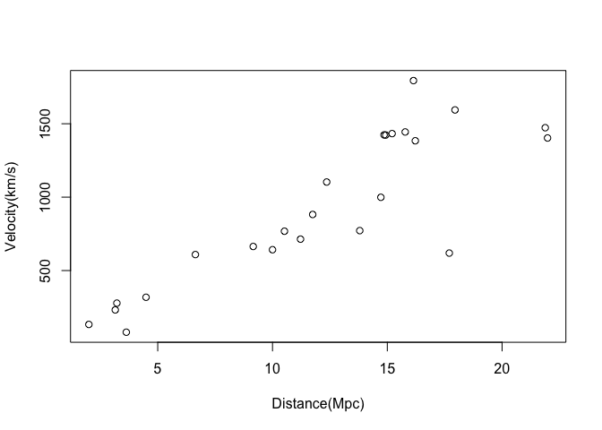
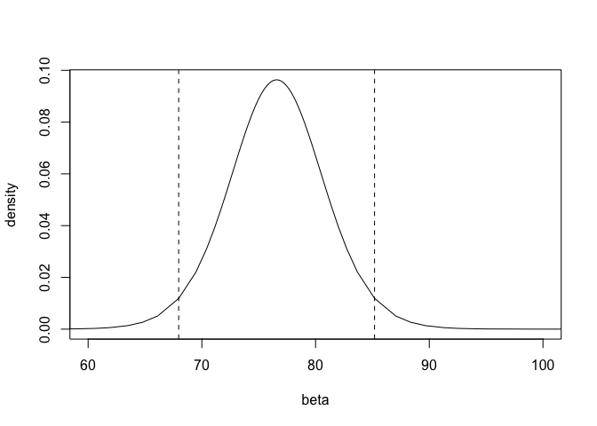
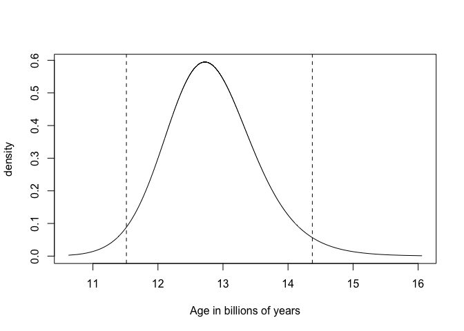

Simple example with INLA
================
[Julian Faraway](https://julianfaraway.github.io/)
21 September 2020

See the [introduction](index.md) for general information. We need the
following packages (which you must install first).

``` r
library(INLA)
```

    Loading required package: Matrix

    Loading required package: sp

    Loading required package: parallel

    Loading required package: foreach

    This is INLA_20.03.17 built 2020-09-21 11:41:39 UTC.
    See www.r-inla.org/contact-us for how to get help.
    To enable PARDISO sparse library; see inla.pardiso()

``` r
library(brinla)
```

# Data and Model

The data for the example comes from the Hubble space telescope. It can
also be found in the *gamair* package. We have the relative velocity and
distance for 24 galaxies. Read [background
info](http://www.space.com/25179-hubble-constant.html) Load and plot the
data:

``` r
plot(y ~ x, xlab="Distance(Mpc)", ylab="Velocity(km/s)", data=hubble)
```

<!-- -->

The velocity *y* is related to the distance *x* by \[
y = \beta x
\]

where \(\beta\) is *Hubble’s constant*. The age of universe is
approximated by the inverse of Hubble’s constant.

# Least squares

We can estimate beta using the standard linear model:

``` r
lmod <- lm(y~x-1, data=hubble)
coef(lmod)
```

``` 
     x 
76.581 
```

We have 60 seconds, 60 minutes, 24 hours and 365.25 days in a year and
one megaparsec (Mpc) is 3.09e19 km. Here is a function to transform
Hubble’s constant into the age of the universe in billions of years. We
apply it our estimate:

``` r
hubtoage <- function(x) 3.09e19/(x*60^2*24*365.25*1e9)
hubtoage(coef(lmod))
```

``` 
     x 
12.786 
```

Our estimate is 12.79 billion years. We can form a 95% confidence
interval for Hubble’s constant.

``` r
(bci <- confint(lmod))
```

``` 
   2.5 % 97.5 %
x 68.379 84.783
```

We can transform this into a 95% confidence interval for the age of the
universe in billions of years:

``` r
hubtoage(bci)
```

``` 
  2.5 % 97.5 %
x 14.32 11.549
```

The upper and lower bound come out in the reverse order because of the
inversion of Hubble’s constant.

# INLA with the default prior

We can fit the same model using the default setting in INLA:

``` r
imod <- inla(y ~ x -1, family="gaussian", data=hubble)
imod$summary.fixed
```

``` 
   mean     sd 0.025quant 0.5quant 0.975quant   mode        kld
x 75.43 3.9146     67.508   75.485     83.017 75.572 2.6405e-08
```

The resulting posterior mean is different from the linear model estimate
of beta. Since we are using a different method, we should not expect it
to be the same. Even so, there is a reason for this difference. The
regression parameters of an LGM have, by definition, a Gaussian prior.
The default mean and precision are:

``` r
inla.set.control.fixed.default()[c('mean','prec')]
```

    $mean
    [1] 0
    
    $prec
    [1] 0.001

We see that the default prior on beta is normal with mean zero and
precision 0.001. The precision is the inverse of the variance. We
convert this to SD:

``` r
sqrt(1/0.001)
```

    [1] 31.623

We can see that the linear model fit for beta is somewhat more than two
standard deviations from prior mean. So in this case, the default prior
is actually quite informative. We need to make an adjustment by setting
the precision to a much smaller value.

# INLA with a weakly informative prior

We use a very small precision:

``` r
imod <- inla(y ~ x -1, family="gaussian", control.fixed=list(prec=1e-9), data=hubble)
(ibci <- imod$summary.fixed)
```

``` 
    mean     sd 0.025quant 0.5quant 0.975quant   mode        kld
x 76.581 4.2478     68.122   76.581     85.034 76.581 6.4301e-06
```

We get a posterior mean which is the same as the least squares estimate.
The 95% credibility interval is \[68.1, 85\] which is comparable but
also a bit different from the 95% confidence interval. Quite apart from
the numerical differences, the two intervals are conceptually different.

We can make a plot of the posterior density of beta (with the 95%
credible interval added)

``` r
x <- seq(60, 100, length.out = 100)
plot(imod$marginals.fixed$x, type = "l", xlab = "beta", ylab = "density", 
    xlim = c(60, 100))
abline(v = ibci[c(3, 5)], lty = 2)
```

<!-- -->

We can convert to statements about the age of the universe in terms of
billions of years:

``` r
hubtoage(ibci[c(1,3,4,5,6)])
```

``` 
    mean 0.025quant 0.5quant 0.975quant   mode
x 12.786     14.374   12.786     11.515 12.786
```

This can also be plotted:

``` r
ageden <- inla.tmarginal(hubtoage, imod$marginals.fixed$x)
plot(ageden, type = "l", xlab = "Age in billions of years", ylab = "density")
abline(v = hubtoage(ibci[c(3, 5)]), lty = 2)
```

<!-- -->

The 95% credible interval is \[11.51, 14.37\] billion years.
