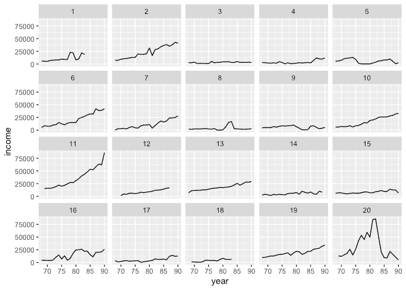
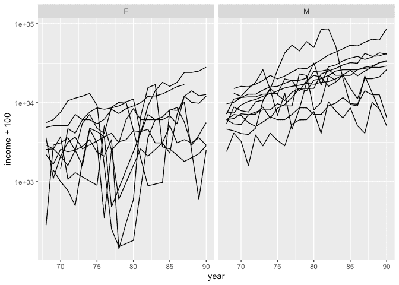
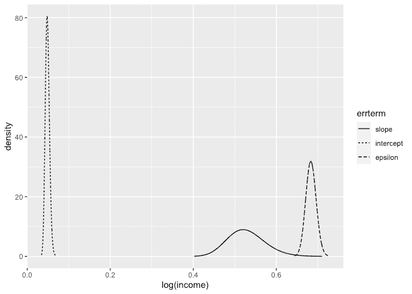

INLA analysis of a longitudinal model
================
[Julian Faraway](https://julianfaraway.github.io/)
22 September 2020

See the [introduction](index.md) for an overview.

Load the libraries:

``` r
library(ggplot2)
library(INLA)
library(dplyr)
```

# Data

Load in and plot the data:

``` r
data(psid, package="faraway")
head(psid)
```

``` 
  age educ sex income year person
1  31   12   M   6000   68      1
2  31   12   M   5300   69      1
3  31   12   M   5200   70      1
4  31   12   M   6900   71      1
5  31   12   M   7500   72      1
6  31   12   M   8000   73      1
```

``` r
summary(psid)
```

``` 
      age            educ      sex         income            year          person    
 Min.   :25.0   Min.   : 3.0   F:732   Min.   :     3   Min.   :68.0   Min.   : 1.0  
 1st Qu.:28.0   1st Qu.:10.0   M:929   1st Qu.:  4300   1st Qu.:73.0   1st Qu.:20.0  
 Median :34.0   Median :12.0           Median :  9000   Median :78.0   Median :42.0  
 Mean   :32.2   Mean   :11.8           Mean   : 13575   Mean   :78.6   Mean   :42.4  
 3rd Qu.:36.0   3rd Qu.:13.0           3rd Qu.: 18050   3rd Qu.:84.0   3rd Qu.:63.0  
 Max.   :39.0   Max.   :16.0           Max.   :180000   Max.   :90.0   Max.   :85.0  
```

``` r
psid$cyear <- psid$year-78
psid20 <- filter(psid, person <= 20)
ggplot(psid20, aes(x=year, y=income))+geom_line()+facet_wrap(~ person)
```

<!-- -->

``` r
ggplot(psid20, aes(x=year, y=income+100, group=person)) +geom_line()+facet_wrap(~ sex)+scale_y_log10()
```

<!-- -->

# Default prior model

``` r
psid$slperson <- psid$person
formula <- log(income) ~ cyear*sex+age+educ + f(person, model="iid") + f(slperson, cyear , model="iid")
result <- inla(formula, family="gaussian", data=psid)
result <- inla.hyperpar(result)
summary(result)
```

``` 

Call:
   "inla(formula = formula, family = \"gaussian\", data = psid)" 
Time used:
    Pre = 1.72, Running = 6.12, Post = 0.0885, Total = 7.93 
Fixed effects:
              mean    sd 0.025quant 0.5quant 0.975quant   mode kld
(Intercept)  6.629 0.549      5.549    6.629      7.709  6.629   0
cyear        0.086 0.009      0.068    0.086      0.103  0.085   0
sexM         1.153 0.121      0.915    1.153      1.391  1.153   0
age          0.011 0.014     -0.016    0.011      0.037  0.011   0
educ         0.109 0.022      0.066    0.109      0.151  0.109   0
cyear:sexM  -0.026 0.012     -0.050   -0.026     -0.002 -0.026   0

Random effects:
  Name    Model
    person IID model
   slperson IID model

Model hyperparameters:
                                          mean     sd 0.025quant 0.5quant 0.975quant   mode
Precision for the Gaussian observations   2.14  0.079       1.99     2.14       2.30   2.14
Precision for person                      3.66  0.626       2.56     3.62       5.01   3.54
Precision for slperson                  438.18 91.944     285.22   428.90     644.19 411.26

Expected number of effective parameters(stdev): 142.02(3.24)
Number of equivalent replicates : 11.70 

Marginal log-Likelihood:  -1958.29 
```

Seems like the default priors might be adequate. Compute the transforms
to an SD scale for the random effect terms. Make a table of summary
statistics for the posteriors:

``` r
sigmaint <- inla.tmarginal(function(x) 1/sqrt(exp(x)),result$internal.marginals.hyperpar[[2]])
sigmaslope <- inla.tmarginal(function(x) 1/sqrt(exp(x)),result$internal.marginals.hyperpar[[3]])
sigmaepsilon <- inla.tmarginal(function(x) 1/sqrt(exp(x)),result$internal.marginals.hyperpar[[1]])
restab=sapply(result$marginals.fixed, function(x) inla.zmarginal(x,silent=TRUE))
restab=cbind(restab, inla.zmarginal(sigmaint,silent=TRUE))
restab=cbind(restab, inla.zmarginal(sigmaslope,silent=TRUE))
restab=cbind(restab, inla.zmarginal(sigmaepsilon,silent=TRUE))
mm <- model.matrix(~ cyear*sex+age+educ,psid)
colnames(restab) = c(colnames(mm),"intSD","slopeSD","epsilon")
data.frame(restab)
```

``` 
           X.Intercept.    cyear    sexM       age     educ cyear.sexM    intSD   slopeSD  epsilon
mean             6.6292 0.085562  1.1531  0.010663  0.10869  -0.026295  0.52813  0.048547   0.6836
sd                0.549 0.008983 0.12083  0.013646 0.021718   0.012207 0.045222 0.0050206 0.012468
quant0.025       5.5488 0.067969 0.91531 -0.016213 0.065943  -0.050456  0.44716  0.039426  0.65965
quant0.25        6.2595 0.079498  1.0718 0.0014775 0.094061  -0.034488  0.49629  0.045031  0.67503
quant0.5          6.627 0.085496  1.1527  0.010614   0.1086  -0.026298  0.52532  0.048278  0.68339
quant0.75        6.9945 0.091522  1.2335  0.019746  0.12314   -0.01815  0.55684  0.051763  0.69192
quant0.975       7.7058  0.10327  1.3901  0.037405  0.15128 -0.0024863  0.62466  0.059147   0.7086
```

Also construct a plot the SD posteriors:

``` r
ddf <- data.frame(rbind(sigmaint,sigmaslope,sigmaepsilon),errterm=gl(3,nrow(sigmaint),labels = c("slope","intercept","epsilon")))
ggplot(ddf, aes(x,y, linetype=errterm))+geom_line()+xlab("log(income)")+ylab("density")
```

<!-- -->

Posteriors look OK. Slope SD is on a different scale so not so
comparable.

# Session Info

``` r
sessionInfo()
```

``` 
R version 4.0.2 (2020-06-22)
Platform: x86_64-apple-darwin17.0 (64-bit)
Running under: macOS Catalina 10.15.6

Matrix products: default
BLAS:   /Library/Frameworks/R.framework/Versions/4.0/Resources/lib/libRblas.dylib
LAPACK: /Library/Frameworks/R.framework/Versions/4.0/Resources/lib/libRlapack.dylib

locale:
[1] en_GB.UTF-8/en_GB.UTF-8/en_GB.UTF-8/C/en_GB.UTF-8/en_GB.UTF-8

attached base packages:
[1] parallel  stats     graphics  grDevices utils     datasets  methods   base     

other attached packages:
[1] dplyr_1.0.2   INLA_20.03.17 foreach_1.5.0 sp_1.4-2      Matrix_1.2-18 ggplot2_3.3.2 knitr_1.29   

loaded via a namespace (and not attached):
 [1] pillar_1.4.6         compiler_4.0.2       iterators_1.0.12     tools_4.0.2          digest_0.6.25       
 [6] evaluate_0.14        lifecycle_0.2.0      tibble_3.0.3         gtable_0.3.0         lattice_0.20-41     
[11] pkgconfig_2.0.3      rlang_0.4.7          yaml_2.2.1           xfun_0.16            withr_2.2.0         
[16] stringr_1.4.0        MatrixModels_0.4-1   generics_0.0.2       vctrs_0.3.4          grid_4.0.2          
[21] tidyselect_1.1.0     glue_1.4.2           R6_2.4.1             rmarkdown_2.3        farver_2.0.3        
[26] purrr_0.3.4          magrittr_1.5         splines_4.0.2        scales_1.1.1         codetools_0.2-16    
[31] ellipsis_0.3.1       htmltools_0.5.0.9000 colorspace_1.4-1     Deriv_4.0.1          labeling_0.3        
[36] stringi_1.4.6        munsell_0.5.0        crayon_1.3.4        
```
