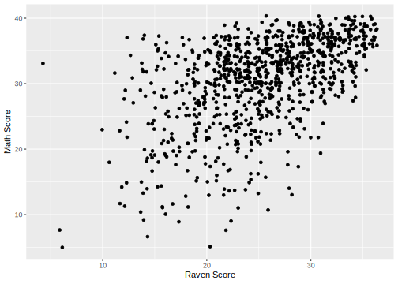
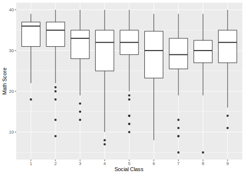
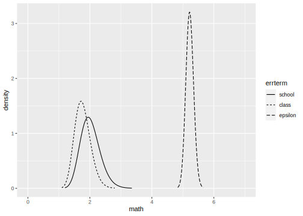
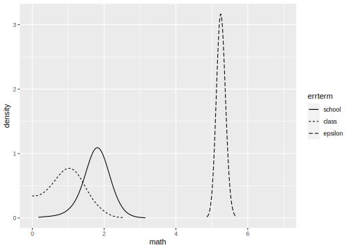

INLA analysis of a multilevel model
================
[Julian Faraway](https://julianfaraway.github.io/)
22 September 2020

See the [introduction](index.md) for an overview.

Load the libraries:

``` r
library(ggplot2)
library(INLA)
```

# Data

Load in and plot the data. We centre the Raven score and create unique
labels for the classes within schools:

``` r
data(jsp, package="faraway")
jspr <- jsp[jsp$year==2,]
jspr$craven <- jspr$raven-mean(jspr$raven)
jspr$classch <- paste(jspr$school,jspr$class,sep=".")
ggplot(jspr, aes(x=raven, y=math))+xlab("Raven Score")+ylab("Math Score")+geom_point(position = position_jitter())
```

<!-- -->

``` r
ggplot(jspr, aes(x=social, y=math))+xlab("Social Class")+ylab("Math Score")+geom_boxplot()
```

<!-- -->

# Default prior model

``` r
formula <- math ~ social+craven + f(school, model="iid") + f(classch, model="iid")
result <- inla(formula, family="gaussian", data=jspr)
result <- inla.hyperpar(result)
summary(result)
```

``` 

Call:
   "inla(formula = formula, family = \"gaussian\", data = jspr)" 
Time used:
    Pre = 1.96, Running = 3.81, Post = 0.0935, Total = 5.86 
Fixed effects:
              mean    sd 0.025quant 0.5quant 0.975quant   mode kld
(Intercept) 31.783 1.013     29.794   31.783     33.770 31.782   0
social2     -0.175 1.095     -2.324   -0.175      1.973 -0.175   0
social3     -0.517 1.164     -2.803   -0.517      1.766 -0.517   0
social4     -1.831 1.036     -3.865   -1.831      0.201 -1.831   0
social5     -1.154 1.156     -3.424   -1.154      1.115 -1.154   0
social6     -2.217 1.229     -4.630   -2.217      0.193 -2.217   0
social7     -2.929 1.265     -5.414   -2.929     -0.446 -2.929   0
social8     -3.348 1.707     -6.699   -3.348      0.001 -3.348   0
social9     -0.644 1.097     -2.798   -0.644      1.509 -0.644   0
craven       0.585 0.032      0.522    0.585      0.649  0.585   0

Random effects:
  Name    Model
    school IID model
   classch IID model

Model hyperparameters:
                                            mean       sd 0.025quant 0.5quant 0.975quant  mode
Precision for the Gaussian observations 3.60e-02 2.00e-03      0.033 3.60e-02   4.00e-02 0.036
Precision for school                    2.02e+04 2.04e+04    415.196 1.38e+04   7.60e+04 0.372
Precision for classch                   2.67e-01 7.80e-02      0.156 2.55e-01   4.45e-01 0.235

Expected number of effective parameters(stdev): 59.40(5.26)
Number of equivalent replicates : 16.04 

Marginal log-Likelihood:  -3032.02 
```

The school precision looks far too high. Need to change the default
prior

# Informative Gamma priors on the precisions

Now try more informative gamma priors for the precisions. Define it so
the mean value of gamma prior is set to the inverse of the variance of
the residuals of the fixed-effects only model. We expect the error
variances to be lower than this variance so this is an overestimate. The
variance of the gamma prior (for the precision) is controlled by the
`apar` shape parameter in the code.

``` r
apar <- 0.5
lmod <- lm(math ~ social+craven, jspr)
bpar <- apar*var(residuals(lmod))
lgprior <- list(prec = list(prior="loggamma", param = c(apar,bpar)))
formula = math ~ social+craven+f(school, model="iid", hyper = lgprior)+f(classch, model="iid", hyper = lgprior)
result <- inla(formula, family="gaussian", data=jspr)
result <- inla.hyperpar(result)
summary(result)
```

``` 

Call:
   "inla(formula = formula, family = \"gaussian\", data = jspr)" 
Time used:
    Pre = 1.92, Running = 3.05, Post = 0.0897, Total = 5.06 
Fixed effects:
              mean    sd 0.025quant 0.5quant 0.975quant   mode kld
(Intercept) 32.002 1.062     29.918   32.002     34.086 32.001   0
social2     -0.397 1.099     -2.555   -0.397      1.760 -0.397   0
social3     -0.761 1.171     -3.061   -0.761      1.537 -0.761   0
social4     -2.099 1.045     -4.151   -2.099     -0.048 -2.099   0
social5     -1.424 1.164     -3.710   -1.424      0.860 -1.425   0
social6     -2.350 1.239     -4.782   -2.350      0.080 -2.350   0
social7     -3.056 1.277     -5.565   -3.057     -0.550 -3.057   0
social8     -3.554 1.709     -6.909   -3.554     -0.201 -3.554   0
social9     -0.888 1.108     -3.063   -0.888      1.286 -0.888   0
craven       0.586 0.032      0.522    0.586      0.650  0.586   0

Random effects:
  Name    Model
    school IID model
   classch IID model

Model hyperparameters:
                                         mean    sd 0.025quant 0.5quant 0.975quant  mode
Precision for the Gaussian observations 0.037 0.002      0.033    0.037      0.040 0.037
Precision for school                    0.264 0.085      0.136    0.251      0.464 0.228
Precision for classch                   0.340 0.100      0.186    0.326      0.575 0.299

Expected number of effective parameters(stdev): 66.33(3.78)
Number of equivalent replicates : 14.37 

Marginal log-Likelihood:  -3028.28 
```

Compute the transforms to an SD scale for the random effect terms. Make
a table of summary statistics for the posteriors:

``` r
sigmaschool <- inla.tmarginal(function(x) 1/sqrt(exp(x)),result$internal.marginals.hyperpar[[2]])
sigmaclass <- inla.tmarginal(function(x) 1/sqrt(exp(x)),result$internal.marginals.hyperpar[[3]])
sigmaepsilon <- inla.tmarginal(function(x) 1/sqrt(exp(x)),result$internal.marginals.hyperpar[[1]])
restab <- sapply(result$marginals.fixed, function(x) inla.zmarginal(x,silent=TRUE))
restab <- cbind(restab, inla.zmarginal(sigmaschool,silent=TRUE))
restab <- cbind(restab, inla.zmarginal(sigmaclass,silent=TRUE))
restab <- cbind(restab, inla.zmarginal(sigmaepsilon,silent=TRUE))
colnames(restab) <- c(names(lmod$coef),"school","class","epsilon")
data.frame(restab)
```

``` 
           X.Intercept.  social2  social3   social4  social5  social6 social7  social8  social9   craven  school
mean             32.002 -0.39681 -0.76097    -2.099  -1.4243  -2.3498 -3.0565   -3.554 -0.88813    0.586  2.0186
sd               1.0616   1.0989   1.1709    1.0451   1.1639   1.2383   1.277   1.7084   1.1075 0.032416 0.31572
quant0.025       29.919  -2.5535  -3.0592   -4.1502  -3.7085  -4.7803 -5.5631  -6.9071  -3.0619  0.52237  1.4692
quant0.25        31.284  -1.1408  -1.5538   -2.8066  -2.2124  -3.1882 -3.9211  -4.7107   -1.638  0.56406  1.7943
quant0.5         31.999 -0.40014 -0.76448   -2.1022  -1.4278  -2.3535 -3.0603  -3.5592 -0.89146  0.58591  1.9939
quant0.75        32.715  0.34066 0.024893   -1.3976 -0.64322  -1.5187 -2.1994  -2.4075 -0.14483  0.60776  2.2154
quant0.975       34.081    1.754   1.5308 -0.053563  0.85375 0.073797 -0.5571 -0.21033   1.2796  0.64944  2.7063
             class epsilon
mean        1.7688  5.2235
sd         0.25492 0.12389
quant0.025  1.3201   4.987
quant0.25   1.5874  5.1381
quant0.5    1.7506  5.2209
quant0.75   1.9302  5.3058
quant0.975  2.3175  5.4734
```

Also construct a plot of the SD posteriors:

``` r
ddf <- data.frame(rbind(sigmaschool,sigmaclass,sigmaepsilon),errterm=gl(3,nrow(sigmaclass),labels = c("school","class","epsilon")))
ggplot(ddf, aes(x,y, linetype=errterm))+geom_line()+xlab("math")+ylab("density")+xlim(0,7)
```

<!-- -->

These look reasonable.

# Penalized Complexity Prior

In [Simpson et al (2015)](http://arxiv.org/abs/1403.4630v3), penalized
complexity priors are proposed. This requires that we specify a scaling
for the SDs of the random effects. We use the SD of the residuals of the
fixed effects only model (what might be called the base model in the
paper) to provide this scaling.

``` r
lmod <- lm(math ~ social+craven, jspr)
sdres <- sd(residuals(lmod))
pcprior <- list(prec = list(prior="pc.prec", param = c(3*sdres,0.01)))
formula = math ~ social+craven+f(school, model="iid", hyper = pcprior)+f(classch, model="iid", hyper = pcprior)
result <- inla(formula, family="gaussian", data=jspr)
result <- inla.hyperpar(result)
summary(result)
```

``` 

Call:
   "inla(formula = formula, family = \"gaussian\", data = jspr)" 
Time used:
    Pre = 1.92, Running = 6.51, Post = 0.114, Total = 8.55 
Fixed effects:
              mean    sd 0.025quant 0.5quant 0.975quant   mode kld
(Intercept) 31.988 1.036     29.954   31.988     34.022 31.987   0
social2     -0.345 1.093     -2.491   -0.346      1.799 -0.346   0
social3     -0.752 1.164     -3.037   -0.752      1.532 -0.752   0
social4     -2.093 1.038     -4.132   -2.093     -0.055 -2.093   0
social5     -1.350 1.157     -3.622   -1.350      0.921 -1.350   0
social6     -2.348 1.231     -4.764   -2.348      0.066 -2.348   0
social7     -3.030 1.268     -5.520   -3.030     -0.542 -3.030   0
social8     -3.522 1.700     -6.861   -3.522     -0.185 -3.522   0
social9     -0.865 1.101     -3.027   -0.865      1.296 -0.865   0
craven       0.584 0.032      0.521    0.584      0.648  0.584   0

Random effects:
  Name    Model
    school IID model
   classch IID model

Model hyperparameters:
                                          mean      sd 0.025quant 0.5quant 0.975quant  mode
Precision for the Gaussian observations  0.036   0.002      0.033    0.036       0.04 0.036
Precision for school                     0.471   1.465      0.155    0.310       1.32 0.254
Precision for classch                   42.138 451.350      0.260    1.050     151.51 0.466

Expected number of effective parameters(stdev): 54.85(5.88)
Number of equivalent replicates : 17.37 

Marginal log-Likelihood:  -3020.37 
```

Compute the summaries as before:

``` r
sigmaschool <- inla.tmarginal(function(x) 1/sqrt(exp(x)),result$internal.marginals.hyperpar[[2]])
sigmaclass <- inla.tmarginal(function(x) 1/sqrt(exp(x)),result$internal.marginals.hyperpar[[3]])
sigmaepsilon <- inla.tmarginal(function(x) 1/sqrt(exp(x)),result$internal.marginals.hyperpar[[1]])
restab <- sapply(result$marginals.fixed, function(x) inla.zmarginal(x,silent=TRUE))
restab <- cbind(restab, inla.zmarginal(sigmaschool,silent=TRUE))
restab <- cbind(restab, inla.zmarginal(sigmaclass,silent=TRUE))
restab <- cbind(restab, inla.zmarginal(sigmaepsilon,silent=TRUE))
colnames(restab) <- c(names(lmod$coef),"school","class","epsilon")
data.frame(restab)
```

``` 
           X.Intercept. social2  social3   social4  social5  social6  social7  social8  social9   craven  school
mean             31.988 -0.3454 -0.75176   -2.0926  -1.3499  -2.3481    -3.03  -3.5218 -0.86461  0.58445  1.7777
sd               1.0362  1.0926   1.1635    1.0383    1.157   1.2303   1.2676      1.7   1.1012 0.032131 0.40686
quant0.025       29.955 -2.4898  -3.0354   -4.1304  -3.6207   -4.763  -5.5181  -6.8585   -3.026  0.52138 0.87622
quant0.25        31.286 -1.0852  -1.5396   -2.7955  -2.1333  -3.1811  -3.8882  -4.6729  -1.6102  0.56269  1.5397
quant0.5         31.985 -0.3487 -0.75527   -2.0957  -1.3534  -2.3517  -3.0337  -3.5269 -0.86788  0.58435  1.7954
quant0.75        32.683 0.38789  0.02913   -1.3957 -0.57343  -1.5223  -2.1792  -2.3808 -0.12555  0.60601  2.0409
quant0.975       34.017  1.7932   1.5256 -0.060482  0.91459 0.059757 -0.54923 -0.19441   1.2905  0.64733  2.5342
              class epsilon
mean        0.97398   5.256
sd          0.49418 0.12556
quant0.025 0.081398  5.0163
quant0.25   0.61061  5.1695
quant0.5     0.9752  5.2534
quant0.75    1.3164  5.3395
quant0.975   1.9565  5.5093
```

Make the plots:

``` r
ddf <- data.frame(rbind(sigmaschool,sigmaclass,sigmaepsilon),errterm=gl(3,nrow(sigmaclass),labels = c("school","class","epsilon")))
ggplot(ddf, aes(x,y, linetype=errterm))+geom_line()+xlab("math")+ylab("density")+xlim(0,7)
```

<!-- -->

Posteriors look OK.

# Package version info

``` r
sessionInfo()
```

``` 
R version 4.0.2 (2020-06-22)
Platform: x86_64-apple-darwin17.0 (64-bit)
Running under: macOS Catalina 10.15.6

Matrix products: default
BLAS:   /Library/Frameworks/R.framework/Versions/4.0/Resources/lib/libRblas.dylib
LAPACK: /Library/Frameworks/R.framework/Versions/4.0/Resources/lib/libRlapack.dylib

locale:
[1] en_GB.UTF-8/en_GB.UTF-8/en_GB.UTF-8/C/en_GB.UTF-8/en_GB.UTF-8

attached base packages:
[1] parallel  stats     graphics  grDevices utils     datasets  methods   base     

other attached packages:
[1] gdtools_0.2.2 INLA_20.03.17 foreach_1.5.0 sp_1.4-2      Matrix_1.2-18 ggplot2_3.3.2 knitr_1.29   

loaded via a namespace (and not attached):
 [1] Rcpp_1.0.5           cpp11_0.2.1          pillar_1.4.6         compiler_4.0.2       iterators_1.0.12    
 [6] tools_4.0.2          digest_0.6.25        evaluate_0.14        lifecycle_0.2.0      tibble_3.0.3        
[11] gtable_0.3.0         lattice_0.20-41      pkgconfig_2.0.3      rlang_0.4.7          yaml_2.2.1          
[16] xfun_0.16            withr_2.2.0          dplyr_1.0.2          stringr_1.4.0        MatrixModels_0.4-1  
[21] systemfonts_0.3.1    generics_0.0.2       vctrs_0.3.4          grid_4.0.2           tidyselect_1.1.0    
[26] svglite_1.2.3.2      glue_1.4.2           R6_2.4.1             rmarkdown_2.3        farver_2.0.3        
[31] purrr_0.3.4          magrittr_1.5         splines_4.0.2        scales_1.1.1         codetools_0.2-16    
[36] ellipsis_0.3.1       htmltools_0.5.0.9000 colorspace_1.4-1     Deriv_4.0.1          labeling_0.3        
[41] stringi_1.4.6        munsell_0.5.0        crayon_1.3.4        
```
