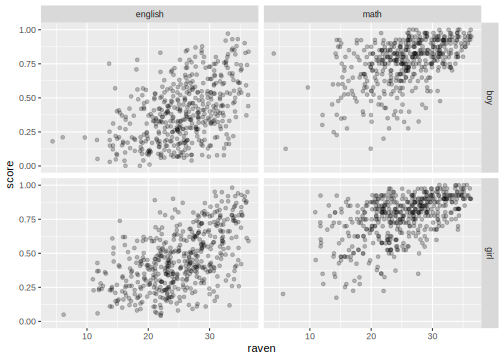
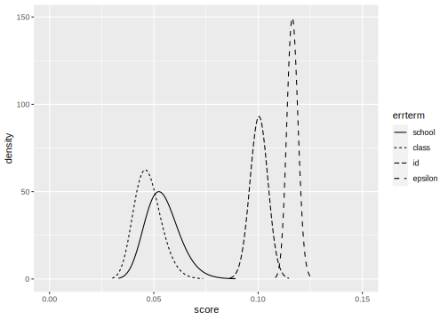
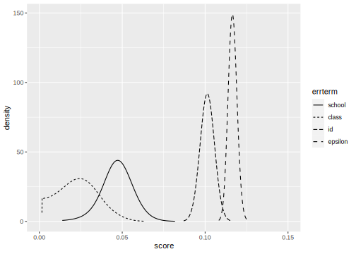

INLA analysis of a Multiple Response Multilevel model
================
[Julian Faraway](https://julianfaraway.github.io/)
22 September 2020

Load the libraries:

``` r
library(ggplot2)
library(INLA)
```

# Data

Load in and summarize the data:

``` r
data(jsp, package="faraway")
jspr <- jsp[jsp$year==2,]
mjspr <- data.frame(rbind(jspr[,1:6],jspr[,1:6]),subject=factor(rep(c("english","math"),c(953,953))),score=c(jspr$english/100,jspr$math/40))
mjspr$craven <- mjspr$raven-mean(mjspr$raven)
```

Plot the data

``` r
ggplot(mjspr, aes(x=raven, y=score))+geom_jitter(alpha=0.25)+facet_grid(gender ~ subject)
```

<!-- -->

# Default prior model

Need to construct unique labels for nested factor levels of class and
student:

``` r
mjspr$school <- factor(mjspr$school)
mjspr$classch <- factor(paste(mjspr$school,mjspr$class,sep="."))
mjspr$classchid <- factor(paste(mjspr$school,mjspr$class,mjspr$id,sep="."))
```

``` r
formula <- score ~ subject*gender+craven*subject+social + f(school, model="iid") + f(classch, model="iid") + f(classchid, model="iid")
result <- inla(formula, family="gaussian", data=mjspr)
result <- inla.hyperpar(result)
summary(result)
```

``` 

Call:
   "inla(formula = formula, family = \"gaussian\", data = mjspr)" 
Time used:
    Pre = 2.83, Running = 80.9, Post = 0.217, Total = 84 
Fixed effects:
                         mean    sd 0.025quant 0.5quant 0.975quant   mode kld
(Intercept)             0.442 0.026      0.390    0.442      0.494  0.442   0
subjectmath             0.367 0.008      0.351    0.367      0.382  0.367   0
gendergirl              0.064 0.010      0.044    0.064      0.084  0.064   0
craven                  0.017 0.001      0.016    0.017      0.019  0.017   0
social2                 0.014 0.027     -0.040    0.014      0.067  0.014   0
social3                -0.022 0.029     -0.078   -0.022      0.035 -0.022   0
social4                -0.072 0.026     -0.122   -0.072     -0.021 -0.072   0
social5                -0.051 0.029     -0.107   -0.051      0.006 -0.051   0
social6                -0.089 0.031     -0.149   -0.089     -0.029 -0.089   0
social7                -0.099 0.032     -0.161   -0.099     -0.038 -0.099   0
social8                -0.082 0.042     -0.165   -0.082      0.001 -0.082   0
social9                -0.048 0.027     -0.102   -0.048      0.006 -0.048   0
subjectmath:gendergirl -0.059 0.011     -0.080   -0.059     -0.038 -0.059   0
subjectmath:craven     -0.004 0.001     -0.006   -0.004     -0.002 -0.004   0

Random effects:
  Name    Model
    school IID model
   classch IID model
   classchid IID model

Model hyperparameters:
                                            mean       sd 0.025quant 0.5quant 0.975quant    mode
Precision for the Gaussian observations    73.56     3.38      67.07    73.50      80.33   73.40
Precision for school                      498.97   238.25     242.25   448.35    1078.99  394.32
Precision for classch                   16055.92 18365.70     773.69  9332.44   67433.35 1155.65
Precision for classchid                    97.38     8.38      82.41    96.86     115.28   95.88

Expected number of effective parameters(stdev): 596.64(23.66)
Number of equivalent replicates : 3.19 

Marginal log-Likelihood:  794.42 
```

The class precision looks too high. Need to change the default prior

# Informative Gamma priors on the precisions

Now try more informative gamma priors for the precisions. Define it so
the mean value of gamma prior is set to the inverse of the variance of
the residuals of the fixed-effects only model. We expect the error
variances to be lower than this variance so this is an overestimate. The
variance of the gamma prior (for the precision) is controlled by the
`apar` parameter.

``` r
apar <- 0.5
lmod <- lm(score ~ subject*gender+craven*subject+social,mjspr)
bpar <- apar*var(residuals(lmod))
lgprior <- list(prec = list(prior="loggamma", param = c(apar,bpar)))
formula = score ~ subject*gender+craven*subject+social+f(school, model="iid", hyper = lgprior)+f(classch, model="iid", hyper = lgprior)+f(classchid, model="iid", hyper = lgprior)
result <- inla(formula, family="gaussian", data=mjspr)
result <- inla.hyperpar(result)
summary(result)
```

``` 

Call:
   "inla(formula = formula, family = \"gaussian\", data = mjspr)" 
Time used:
    Pre = 3.36, Running = 101, Post = 0.217, Total = 105 
Fixed effects:
                         mean    sd 0.025quant 0.5quant 0.975quant   mode kld
(Intercept)             0.441 0.027      0.387    0.441      0.495  0.441   0
subjectmath             0.367 0.008      0.351    0.367      0.382  0.367   0
gendergirl              0.062 0.010      0.042    0.062      0.082  0.062   0
craven                  0.017 0.001      0.016    0.017      0.019  0.017   0
social2                 0.013 0.028     -0.041    0.013      0.067  0.013   0
social3                -0.020 0.029     -0.077   -0.020      0.038 -0.020   0
social4                -0.069 0.026     -0.120   -0.069     -0.018 -0.069   0
social5                -0.050 0.029     -0.108   -0.050      0.007 -0.050   0
social6                -0.085 0.031     -0.146   -0.085     -0.024 -0.085   0
social7                -0.098 0.032     -0.161   -0.098     -0.036 -0.098   0
social8                -0.080 0.043     -0.164   -0.080      0.004 -0.080   0
social9                -0.046 0.028     -0.101   -0.046      0.008 -0.046   0
subjectmath:gendergirl -0.059 0.011     -0.080   -0.059     -0.038 -0.059   0
subjectmath:craven     -0.004 0.001     -0.006   -0.004     -0.002 -0.004   0

Random effects:
  Name    Model
    school IID model
   classch IID model
   classchid IID model

Model hyperparameters:
                                          mean     sd 0.025quant 0.5quant 0.975quant   mode
Precision for the Gaussian observations  73.74   3.38      67.27    73.69      80.52  73.59
Precision for school                    362.55 111.15     191.06   347.04     622.74 317.70
Precision for classch                   473.81 132.18     265.96   456.62     779.72 423.33
Precision for classchid                  99.65   8.61      84.28    99.13     118.00  98.12

Expected number of effective parameters(stdev): 601.76(23.25)
Number of equivalent replicates : 3.17 

Marginal log-Likelihood:  788.63 
```

Compute the transforms to an SD scale for the field and error. Make a
table of summary statistics for the posteriors:

``` r
sigmaschool <- inla.tmarginal(function(x) 1/sqrt(exp(x)),result$internal.marginals.hyperpar[[2]])
sigmaclass <- inla.tmarginal(function(x) 1/sqrt(exp(x)),result$internal.marginals.hyperpar[[3]])
sigmaid <- inla.tmarginal(function(x) 1/sqrt(exp(x)),result$internal.marginals.hyperpar[[4]])
sigmaepsilon <- inla.tmarginal(function(x) 1/sqrt(exp(x)),result$internal.marginals.hyperpar[[1]])
restab=sapply(result$marginals.fixed, function(x) inla.zmarginal(x,silent=TRUE))
restab=cbind(restab, inla.zmarginal(sigmaschool,silent=TRUE))
restab=cbind(restab, inla.zmarginal(sigmaclass,silent=TRUE))
restab=cbind(restab, inla.zmarginal(sigmaid,silent=TRUE))
restab=cbind(restab, inla.zmarginal(sigmaepsilon,silent=TRUE))
colnames(restab) = c(names(lmod$coef),"school","class","id","epsilon")
data.frame(restab)
```

``` 
           X.Intercept. subjectmath gendergirl     craven    social2     social3   social4   social5   social6
mean            0.44093     0.36656   0.062045   0.017351   0.013333    -0.01977 -0.069006 -0.050485 -0.085307
sd             0.027399   0.0077026   0.010288 0.00093454   0.027514     0.02932  0.026188  0.029134  0.031016
quant0.025      0.38714     0.35145   0.041855   0.015517  -0.040674   -0.077322  -0.12041  -0.10767  -0.14619
quant0.25       0.42238     0.36135   0.055077   0.016718 -0.0052959   -0.039621 -0.086737  -0.07021   -0.1063
quant0.5        0.44085     0.36654   0.062014   0.017348   0.013251   -0.019856 -0.069083 -0.050571 -0.085396
quant0.75       0.45931     0.37173   0.068951   0.017978   0.031799 -9.1579e-05 -0.051429 -0.030931 -0.064489
quant0.975      0.49455     0.38164    0.08218    0.01918   0.067182    0.037611 -0.017755  0.006533 -0.024612
             social7   social8   social9 subjectmath.gendergirl subjectmath.craven    school     class        id
mean       -0.098481 -0.080234 -0.046183              -0.059194         -0.0037203  0.054327  0.047252   0.10045
sd          0.031991  0.042753  0.027736               0.010696         0.00092953 0.0081964 0.0064836 0.0042736
quant0.025  -0.16128  -0.16416  -0.10063              -0.080189         -0.0055449  0.040116  0.035848  0.092085
quant0.25   -0.12014  -0.10918 -0.064961              -0.066436         -0.0043496  0.048502  0.042644  0.097548
quant0.5   -0.098574 -0.080359 -0.046264              -0.059226          -0.003723  0.053666  0.046787   0.10043
quant0.75  -0.077009 -0.051539 -0.027567              -0.052015         -0.0030964  0.059418  0.051347   0.10333
quant0.975 -0.035876 0.0034334 0.0080975              -0.038262         -0.0019012  0.072236  0.061233   0.10888
             epsilon
mean         0.11654
sd         0.0026583
quant0.025   0.11146
quant0.25    0.11471
quant0.5     0.11649
quant0.75    0.11831
quant0.975    0.1219
```

Also construct a plot of the SD posteriors:

``` r
ddf <- data.frame(rbind(sigmaschool,sigmaclass,sigmaid,sigmaepsilon),errterm=gl(4,nrow(sigmaepsilon),labels = c("school","class","id","epsilon")))
ggplot(ddf, aes(x,y, linetype=errterm))+geom_line()+xlab("score")+ylab("density")+xlim(0,0.15)
```

<!-- -->

Posteriors look OK. More variation is assigned to the school and class
than previous models.

# Penalized Complexity Prior

In [Simpson et al (2015)](http://arxiv.org/abs/1403.4630v3), penalized
complexity priors are proposed. This requires that we specify a scaling
for the SDs of the random effects. We use the SD of the residuals of the
fixed effects only model (what might be called the base model in the
paper) to provide this scaling.

``` r
lmod <- lm(score ~ subject*gender+craven*subject+social,mjspr)
sdres <- sd(residuals(lmod))
pcprior <- list(prec = list(prior="pc.prec", param = c(3*sdres,0.01)))
formula = score ~ subject*gender+craven*subject+social+f(school, model="iid", hyper = pcprior)+f(classch, model="iid", hyper = pcprior)+f(classchid, model="iid", hyper = pcprior)
result <- inla(formula, family="gaussian", data=mjspr)
result <- inla.hyperpar(result)
summary(result)
```

``` 

Call:
   "inla(formula = formula, family = \"gaussian\", data = mjspr)" 
Time used:
    Pre = 2.79, Running = 134, Post = 0.239, Total = 137 
Fixed effects:
                         mean    sd 0.025quant 0.5quant 0.975quant   mode kld
(Intercept)             0.441 0.027      0.389    0.441      0.494  0.441   0
subjectmath             0.367 0.008      0.351    0.367      0.382  0.367   0
gendergirl              0.063 0.010      0.043    0.063      0.083  0.063   0
craven                  0.017 0.001      0.016    0.017      0.019  0.017   0
social2                 0.014 0.027     -0.040    0.014      0.067  0.014   0
social3                -0.020 0.029     -0.078   -0.020      0.037 -0.020   0
social4                -0.070 0.026     -0.121   -0.070     -0.019 -0.070   0
social5                -0.050 0.029     -0.107   -0.050      0.006 -0.050   0
social6                -0.088 0.031     -0.148   -0.088     -0.027 -0.088   0
social7                -0.099 0.032     -0.162   -0.099     -0.037 -0.099   0
social8                -0.081 0.042     -0.165   -0.081      0.002 -0.081   0
social9                -0.047 0.028     -0.101   -0.047      0.007 -0.047   0
subjectmath:gendergirl -0.059 0.011     -0.080   -0.059     -0.038 -0.059   0
subjectmath:craven     -0.004 0.001     -0.006   -0.004     -0.002 -0.004   0

Random effects:
  Name    Model
    school IID model
   classch IID model
   classchid IID model

Model hyperparameters:
                                            mean       sd 0.025quant 0.5quant 0.975quant   mode
Precision for the Gaussian observations    73.66     3.38      67.18    73.61      80.44  73.51
Precision for school                      539.02   379.27     229.52   449.49    1426.11 375.96
Precision for classch                   10606.93 34022.15     430.73  1828.48  100705.15 769.94
Precision for classchid                    97.91     8.48      82.78    97.39     116.01  96.38

Expected number of effective parameters(stdev): 599.27(23.39)
Number of equivalent replicates : 3.18 

Marginal log-Likelihood:  798.94 
```

Compute the summaries as before:

``` r
sigmaschool <- inla.tmarginal(function(x) 1/sqrt(exp(x)),result$internal.marginals.hyperpar[[2]])
sigmaclass <- inla.tmarginal(function(x) 1/sqrt(exp(x)),result$internal.marginals.hyperpar[[3]])
sigmaid <- inla.tmarginal(function(x) 1/sqrt(exp(x)),result$internal.marginals.hyperpar[[4]])
sigmaepsilon <- inla.tmarginal(function(x) 1/sqrt(exp(x)),result$internal.marginals.hyperpar[[1]])
restab=sapply(result$marginals.fixed, function(x) inla.zmarginal(x,silent=TRUE))
restab=cbind(restab, inla.zmarginal(sigmaschool,silent=TRUE))
restab=cbind(restab, inla.zmarginal(sigmaclass,silent=TRUE))
restab=cbind(restab, inla.zmarginal(sigmaid,silent=TRUE))
restab=cbind(restab, inla.zmarginal(sigmaepsilon,silent=TRUE))
colnames(restab) = c(names(lmod$coef),"school","class","id","epsilon")
data.frame(restab)
```

``` 
           X.Intercept. subjectmath gendergirl    craven    social2    social3   social4   social5   social6   social7
mean            0.44142     0.36656   0.063207  0.017388   0.013833  -0.020454 -0.070332 -0.050344 -0.087549 -0.099405
sd             0.026591     0.00771    0.01028 0.0009268   0.027299   0.029055  0.025946  0.028889  0.030768  0.031703
quant0.025      0.38922     0.35143   0.043034  0.015569  -0.039751  -0.077484  -0.12126  -0.10705  -0.14795  -0.16164
quant0.25       0.42342     0.36134   0.056245  0.016761 -0.0046496  -0.040125 -0.087898 -0.069903  -0.10838  -0.12087
quant0.5        0.44134     0.36654   0.063176  0.017386   0.013752  -0.020539 -0.070408 -0.050429 -0.087638 -0.099497
quant0.75       0.45927     0.37174   0.070108  0.018011   0.032154 -0.0009531 -0.052918 -0.030955 -0.066897 -0.078126
quant0.975      0.49346     0.38165   0.083329  0.019202   0.067258    0.03641 -0.019555 0.0061942  -0.02734 -0.037365
             social8   social9 subjectmath.gendergirl subjectmath.craven    school     class        id   epsilon
mean        -0.08134 -0.047095              -0.059194         -0.0037203  0.046993  0.023611   0.10134   0.11661
sd          0.042462  0.027512               0.010706         0.00093041 0.0097219  0.011976 0.0043231 0.0026644
quant0.025  -0.16469   -0.1011              -0.080209         -0.0055466  0.026517 0.0030768  0.092875   0.11152
quant0.25   -0.11009 -0.065721              -0.066443         -0.0043502  0.040925  0.014485  0.098405   0.11477
quant0.5   -0.081463 -0.047175              -0.059226          -0.003723  0.047148  0.023346   0.10132   0.11655
quant0.75   -0.05284  -0.02863              -0.052008         -0.0030958  0.053297  0.031898   0.10425   0.11838
quant0.975 0.0017572 0.0067447              -0.038242         -0.0018994  0.065879  0.048019   0.10986   0.12198
```

Make the plots:

``` r
ddf <- data.frame(rbind(sigmaschool,sigmaclass,sigmaid,sigmaepsilon),errterm=gl(4,nrow(sigmaepsilon),labels = c("school","class","id","epsilon")))
ggplot(ddf, aes(x,y, linetype=errterm))+geom_line()+xlab("score")+ylab("density")+xlim(0,0.15)
```

<!-- -->

Class variation is quite small compared to the other sources.

# Package version info

``` r
sessionInfo()
```

``` 
R version 4.0.2 (2020-06-22)
Platform: x86_64-apple-darwin17.0 (64-bit)
Running under: macOS Catalina 10.15.6

Matrix products: default
BLAS:   /Library/Frameworks/R.framework/Versions/4.0/Resources/lib/libRblas.dylib
LAPACK: /Library/Frameworks/R.framework/Versions/4.0/Resources/lib/libRlapack.dylib

locale:
[1] en_GB.UTF-8/en_GB.UTF-8/en_GB.UTF-8/C/en_GB.UTF-8/en_GB.UTF-8

attached base packages:
[1] parallel  stats     graphics  grDevices utils     datasets  methods   base     

other attached packages:
[1] gdtools_0.2.2 INLA_20.03.17 foreach_1.5.0 sp_1.4-2      Matrix_1.2-18 ggplot2_3.3.2 knitr_1.29   

loaded via a namespace (and not attached):
 [1] Rcpp_1.0.5           cpp11_0.2.1          pillar_1.4.6         compiler_4.0.2       iterators_1.0.12    
 [6] tools_4.0.2          digest_0.6.25        evaluate_0.14        lifecycle_0.2.0      tibble_3.0.3        
[11] gtable_0.3.0         lattice_0.20-41      pkgconfig_2.0.3      rlang_0.4.7          yaml_2.2.1          
[16] xfun_0.16            withr_2.2.0          dplyr_1.0.2          stringr_1.4.0        MatrixModels_0.4-1  
[21] systemfonts_0.3.1    generics_0.0.2       vctrs_0.3.4          grid_4.0.2           tidyselect_1.1.0    
[26] svglite_1.2.3.2      glue_1.4.2           R6_2.4.1             rmarkdown_2.3        farver_2.0.3        
[31] purrr_0.3.4          magrittr_1.5         splines_4.0.2        scales_1.1.1         codetools_0.2-16    
[36] ellipsis_0.3.1       htmltools_0.5.0.9000 colorspace_1.4-1     Deriv_4.0.1          labeling_0.3        
[41] stringi_1.4.6        munsell_0.5.0        crayon_1.3.4        
```
