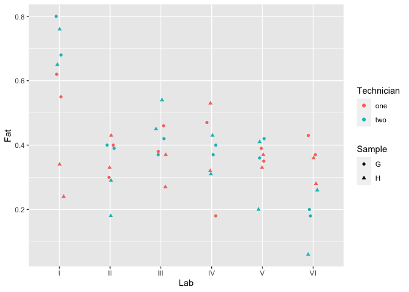
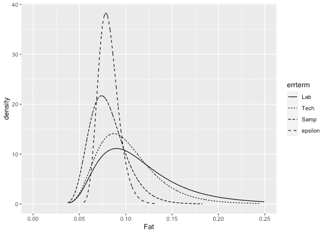

INLA analysis of a nested model
================
[Julian Faraway](https://julianfaraway.github.io/)
22 September 2020

See the [introduction](index.md) for an overview. Load the libraries:

``` r
library(ggplot2)
library(INLA)
```

# Data

Load in and plot the data:

``` r
data(eggs, package="faraway")
summary(eggs)
```

``` 
      Fat         Lab    Technician Sample
 Min.   :0.060   I  :8   one:24     G:24  
 1st Qu.:0.307   II :8   two:24     H:24  
 Median :0.370   III:8                    
 Mean   :0.388   IV :8                    
 3rd Qu.:0.430   V  :8                    
 Max.   :0.800   VI :8                    
```

``` r
ggplot(eggs, aes(y=Fat, x=Lab, color=Technician, shape=Sample)) + geom_point(position = position_jitter(width=0.1, height=0.0))
```

<!-- -->

# Default prior model

Need to construct unique labels for nested factor levels. Don’t really
care which technician and sample is which otherwise would take more care
with the labeling.

``` r
eggs$labtech <- factor(paste0(eggs$Lab,eggs$Technician))
eggs$labtechsamp <- factor(paste0(eggs$Lab,eggs$Technician,eggs$Sample))
```

``` r
formula <- Fat ~ 1 + f(Lab, model="iid") + f(labtech, model="iid") + f(labtechsamp, model="iid")
result <- inla(formula, family="gaussian", data=eggs)
result <- inla.hyperpar(result)
summary(result)
```

``` 

Call:
   "inla(formula = formula, family = \"gaussian\", data = eggs)" 
Time used:
    Pre = 1.58, Running = 8.69, Post = 0.326, Total = 10.6 
Fixed effects:
             mean    sd 0.025quant 0.5quant 0.975quant  mode kld
(Intercept) 0.387 0.035      0.319    0.387      0.456 0.387   0

Random effects:
  Name    Model
    Lab IID model
   labtech IID model
   labtechsamp IID model

Model hyperparameters:
                                            mean       sd 0.025quant 0.5quant 0.975quant   mode
Precision for the Gaussian observations   116.05    30.68      65.11   112.93     185.43 107.71
Precision for Lab                       17779.93 19489.81     149.20 11428.99   70845.02 123.17
Precision for labtech                     172.00   296.92      35.14   105.23     839.04  76.88
Precision for labtechsamp               17031.64 19250.73     178.94 10538.10   69701.26 132.15

Expected number of effective parameters(stdev): 10.37(1.18)
Number of equivalent replicates : 4.63 

Marginal log-Likelihood:  19.83 
```

The lab and sample precisions look far too high. Need to change the
default prior

# Informative Gamma priors on the precisions

Now try more informative gamma priors for the precisions. Define it so
the mean value of gamma prior is set to the inverse of the variance of
the residuals of the fixed-effects only model. We expect the error
variances to be lower than this variance so this is an overestimate. The
variance of the gamma prior (for the precision) is controlled by the
`apar` shape parameter in the code.

``` r
apar <- 0.5
bpar <- apar*var(eggs$Fat)
lgprior <- list(prec = list(prior="loggamma", param = c(apar,bpar)))
formula = Fat ~ 1+f(Lab, model="iid", hyper = lgprior)+f(labtech, model="iid", hyper = lgprior)+f(labtechsamp, model="iid", hyper = lgprior)
result <- inla(formula, family="gaussian", data=eggs)
result <- inla.hyperpar(result)
summary(result)
```

``` 

Call:
   "inla(formula = formula, family = \"gaussian\", data = eggs)" 
Time used:
    Pre = 1.59, Running = 6.11, Post = 0.237, Total = 7.93 
Fixed effects:
             mean    sd 0.025quant 0.5quant 0.975quant  mode kld
(Intercept) 0.387 0.061      0.264    0.387      0.511 0.388   0

Random effects:
  Name    Model
    Lab IID model
   labtech IID model
   labtechsamp IID model

Model hyperparameters:
                                          mean    sd 0.025quant 0.5quant 0.975quant   mode
Precision for the Gaussian observations 157.65 41.29      88.26   153.78     249.21 145.95
Precision for Lab                       108.89 81.99      16.38    87.47     323.69  50.99
Precision for labtech                   125.33 80.34      29.36   105.88     333.53  73.15
Precision for labtechsamp               179.43 89.77      60.60   161.03     404.45 128.58

Expected number of effective parameters(stdev): 18.85(1.71)
Number of equivalent replicates : 2.55 

Marginal log-Likelihood:  22.00 
```

Compute the transforms to an SD scale for the field and error. Make a
table of summary statistics for the posteriors:

``` r
sigmaLab <- inla.tmarginal(function(x) 1/sqrt(exp(x)),result$internal.marginals.hyperpar[[2]])
sigmaTech <- inla.tmarginal(function(x) 1/sqrt(exp(x)),result$internal.marginals.hyperpar[[3]])
sigmaSample <- inla.tmarginal(function(x) 1/sqrt(exp(x)),result$internal.marginals.hyperpar[[4]])
sigmaepsilon <- inla.tmarginal(function(x) 1/sqrt(exp(x)),result$internal.marginals.hyperpar[[1]])
restab=sapply(result$marginals.fixed, function(x) inla.zmarginal(x,silent=TRUE))
restab=cbind(restab, inla.zmarginal(sigmaLab,silent=TRUE))
restab=cbind(restab, inla.zmarginal(sigmaTech,silent=TRUE))
restab=cbind(restab, inla.zmarginal(sigmaSample,silent=TRUE))
restab=cbind(restab, inla.zmarginal(sigmaepsilon,silent=TRUE))
colnames(restab) = c("mu","Lab","Technician","Sample","epsilon")
data.frame(restab)
```

``` 
                mu      Lab Technician   Sample  epsilon
mean        0.3875  0.11794    0.10286 0.081426 0.081732
sd         0.06149 0.049958   0.033292  0.02007 0.010945
quant0.025 0.26415 0.055642   0.054842 0.049802 0.063401
quant0.25  0.34883 0.083664   0.079063 0.067013 0.073919
quant0.5    0.3872   0.1068   0.097119 0.078768 0.080622
quant0.75  0.42557  0.13903    0.12014 0.092871 0.088319
quant0.975 0.51025  0.24585    0.18394  0.12814  0.10629
```

Also construct a plot the SD posteriors:

``` r
ddf <- data.frame(rbind(sigmaLab,sigmaTech,sigmaSample,sigmaepsilon),errterm=gl(4,nrow(sigmaLab),labels = c("Lab","Tech","Samp","epsilon")))
ggplot(ddf, aes(x,y, linetype=errterm))+geom_line()+xlab("Fat")+ylab("density")+xlim(0,0.25)
```

<!-- -->

Posteriors look OK.

# Penalized Complexity Prior

In [Simpson et al (2015)](http://arxiv.org/abs/1403.4630v3), penalized
complexity priors are proposed. This requires that we specify a scaling
for the SDs of the random effects. We use the SD of the residuals of the
fixed effects only model (what might be called the base model in the
paper) to provide this scaling.

``` r
sdres <- sd(eggs$Fat)
pcprior <- list(prec = list(prior="pc.prec", param = c(3*sdres,0.01)))
formula = Fat ~ 1+f(Lab, model="iid", hyper = pcprior)+f(labtech, model="iid", hyper = pcprior)+f(labtechsamp,model="iid", hyper = pcprior)
result <- inla(formula, family="gaussian", data=eggs, control.family=list(hyper=pcprior))
result <- inla.hyperpar(result)
summary(result)
```

``` 

Call:
   "inla(formula = formula, family = \"gaussian\", data = eggs, control.family = list(hyper = pcprior))" 
Time used:
    Pre = 1.53, Running = 160, Post = 1.08, Total = 163 
Fixed effects:
             mean    sd 0.025quant 0.5quant 0.975quant  mode kld
(Intercept) 0.387 0.051      0.285    0.387       0.49 0.387   0

Random effects:
  Name    Model
    Lab IID model
   labtech IID model
   labtechsamp IID model

Model hyperparameters:
                                            mean       sd 0.025quant 0.5quant 0.975quant   mode
Precision for the Gaussian observations 1.31e+02 3.77e+01      70.45   126.57     216.81 117.35
Precision for Lab                       1.11e+08 1.60e+11      28.32   234.88   93149.65  64.68
Precision for labtech                   7.44e+06 7.35e+09      33.83   139.56   11119.18  72.49
Precision for labtechsamp               6.43e+07 6.60e+10      70.93   360.08   91223.11 136.54

Expected number of effective parameters(stdev): 16.00(2.72)
Number of equivalent replicates : 3.00 

Marginal log-Likelihood:  27.01 
```

Compute the summaries as before:

``` r
sigmaLab <- inla.tmarginal(function(x) 1/sqrt(exp(x)),result$internal.marginals.hyperpar[[2]])
sigmaTech <- inla.tmarginal(function(x) 1/sqrt(exp(x)),result$internal.marginals.hyperpar[[3]])
sigmaSample <- inla.tmarginal(function(x) 1/sqrt(exp(x)),result$internal.marginals.hyperpar[[4]])
sigmaepsilon <- inla.tmarginal(function(x) 1/sqrt(exp(x)),result$internal.marginals.hyperpar[[1]])
restab=sapply(result$marginals.fixed, function(x) inla.zmarginal(x,silent=TRUE))
restab=cbind(restab, inla.zmarginal(sigmaLab,silent=TRUE))
restab=cbind(restab, inla.zmarginal(sigmaTech,silent=TRUE))
restab=cbind(restab, inla.zmarginal(sigmaSample,silent=TRUE))
restab=cbind(restab, inla.zmarginal(sigmaepsilon,silent=TRUE))
colnames(restab) = c("mu","Lab","Technician","Sample","epsilon")
data.frame(restab)
```

``` 
                 mu       Lab Technician    Sample  epsilon
mean         0.3875  0.071442   0.085743  0.053833 0.090067
sd         0.051254  0.048612   0.040048  0.030283 0.013042
quant0.025   0.2844 0.0031728   0.009533 0.0032908  0.06798
quant0.25   0.35567  0.034331   0.059175  0.031038 0.080721
quant0.5    0.38725  0.065194   0.084616  0.052642 0.088865
quant0.75   0.41883  0.098684    0.11047  0.073776 0.098061
quant0.975   0.4901   0.18599    0.17031   0.11761  0.11895
```

Make the plots:

Posteriors look OK.

# Package version info

``` r
sessionInfo()
```

``` 
R version 4.0.2 (2020-06-22)
Platform: x86_64-apple-darwin17.0 (64-bit)
Running under: macOS Catalina 10.15.6

Matrix products: default
BLAS:   /Library/Frameworks/R.framework/Versions/4.0/Resources/lib/libRblas.dylib
LAPACK: /Library/Frameworks/R.framework/Versions/4.0/Resources/lib/libRlapack.dylib

locale:
[1] en_GB.UTF-8/en_GB.UTF-8/en_GB.UTF-8/C/en_GB.UTF-8/en_GB.UTF-8

attached base packages:
[1] parallel  stats     graphics  grDevices utils     datasets  methods   base     

other attached packages:
[1] INLA_20.03.17 foreach_1.5.0 sp_1.4-2      Matrix_1.2-18 ggplot2_3.3.2 knitr_1.29   

loaded via a namespace (and not attached):
 [1] pillar_1.4.6         compiler_4.0.2       iterators_1.0.12     tools_4.0.2          digest_0.6.25       
 [6] evaluate_0.14        lifecycle_0.2.0      tibble_3.0.3         gtable_0.3.0         lattice_0.20-41     
[11] pkgconfig_2.0.3      rlang_0.4.7          yaml_2.2.1           xfun_0.16            withr_2.2.0         
[16] dplyr_1.0.2          stringr_1.4.0        MatrixModels_0.4-1   generics_0.0.2       vctrs_0.3.4         
[21] grid_4.0.2           tidyselect_1.1.0     glue_1.4.2           R6_2.4.1             rmarkdown_2.3       
[26] farver_2.0.3         purrr_0.3.4          magrittr_1.5         splines_4.0.2        scales_1.1.1        
[31] codetools_0.2-16     ellipsis_0.3.1       htmltools_0.5.0.9000 colorspace_1.4-1     Deriv_4.0.1         
[36] labeling_0.3         stringi_1.4.6        munsell_0.5.0        crayon_1.3.4        
```
