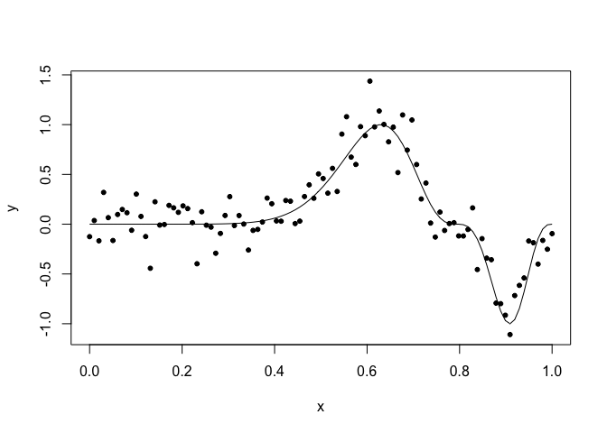
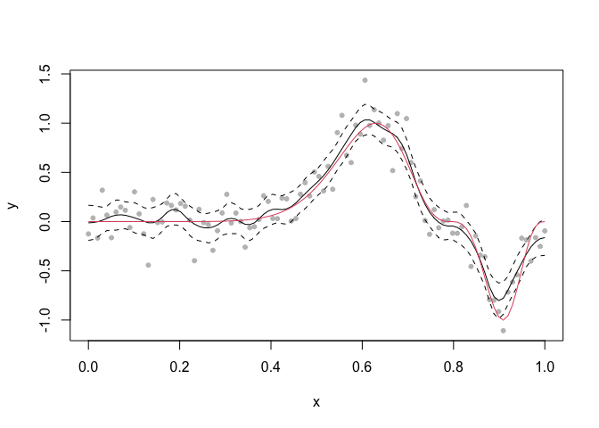
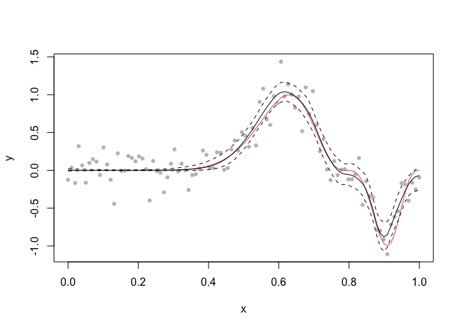

Non-stationary smoothing with Gaussian process regression using INLA
================
[Julian Faraway](https://julianfaraway.github.io/)
21 September 2020

See the [introduction](index.md) for more about INLA. See an example of
[Gaussian process regression](gpreg.md). The construction is detailed in
our [book](http://julianfaraway.github.io/brinla/).

Load the packages (you may need to [install the brinla
package](https://github.com/julianfaraway/brinla))

``` r
library(INLA)
library(brinla)
```

# Data

We simulate some data with a known true function.

``` r
set.seed(1)
n <- 100
x <- seq(0, 1, length = n)
f.true <- (sin(2 * pi * (x)^3))^3
y <- f.true + rnorm(n, sd = 0.2)
td <- data.frame(y = y, x = x, f.true)
```

and plot it:

``` r
plot(y ~ x, td)
lines(f.true ~ x, td)
```

<!-- -->

This function is challenging to fit because of the varying amount of
smoothness. You can see examples of various smoothing methods applied to
this data in (Faraway 2016).

# GP fitting

The default fit uses priors based on the SD of the response and the
range of the predictor to motivate sensible priors.

``` r
gpmod = bri.gpr(td$x, td$y)
```

We can plot the resulting fit and 95% credible bands

``` r
plot(y ~ x, td, col = gray(0.75))
lines(gpmod$xout, gpmod$mean)
lines(gpmod$xout, gpmod$lcb, lty=2)
lines(gpmod$xout, gpmod$ucb, lty=2)
lines(f.true ~ x, td, col=2)
```

<!-- -->

On the right end of the function, the fit is too rough. On the left end,
it is too smooth. The minimum at 0.9 is underestimated and the true
function is even outside the credibility bands in this region. The
problem is that the standard method uses the same amount of smoothness
everywhere.

# Variable smoothness

We can allow the smoothness to vary. A description of this can be found
in (Lindgren and Rue 2015) and also in our
[book](http://julianfaraway.github.io/brinla/). We have implemented this
in our `brinla` package:

``` r
fg <- bri.nonstat(td$x, td$y)
plot(y ~ x, td, col = gray(0.75))
lines(f.true ~ x, td, col = 2)
lines(fg$xout, fg$lcb, lty=2)
lines(fg$xout, fg$ucb, lty=2)
lines(fg$xout, fg$mean)
```

<!-- -->

We achieve a smoother fit on the left but keep the less smooth fit on
the right.

# Package versions

``` r
sessionInfo()
```

    R version 4.0.2 (2020-06-22)
    Platform: x86_64-apple-darwin17.0 (64-bit)
    Running under: macOS Catalina 10.15.6
    
    Matrix products: default
    BLAS:   /Library/Frameworks/R.framework/Versions/4.0/Resources/lib/libRblas.dylib
    LAPACK: /Library/Frameworks/R.framework/Versions/4.0/Resources/lib/libRlapack.dylib
    
    locale:
    [1] en_GB.UTF-8/en_GB.UTF-8/en_GB.UTF-8/C/en_GB.UTF-8/en_GB.UTF-8
    
    attached base packages:
    [1] parallel  stats     graphics  grDevices utils     datasets  methods   base     
    
    other attached packages:
    [1] brinla_0.1.0  INLA_20.03.17 foreach_1.5.0 sp_1.4-2      Matrix_1.2-18 knitr_1.29   
    
    loaded via a namespace (and not attached):
     [1] codetools_0.2-16     lattice_0.20-41      digest_0.6.25        grid_4.0.2           MatrixModels_0.4-1  
     [6] magrittr_1.5         evaluate_0.14        rlang_0.4.7          stringi_1.4.6        rmarkdown_2.3       
    [11] splines_4.0.2        iterators_1.0.12     tools_4.0.2          stringr_1.4.0        xfun_0.16           
    [16] yaml_2.2.1           compiler_4.0.2       htmltools_0.5.0.9000

# References

<div id="refs" class="references">

<div id="ref-Faraway:16b">

Faraway, Julian. 2016. *Extending the Linear Model with R: Generalized
Linear, Mixed Effects and Nonparametric Regression Models*. 2nd ed.
London: Chapman & Hall.

</div>

<div id="ref-lind:rue:jss:15">

Lindgren, Finn, and Havard Rue. 2015. “Bayesian Spatial Modelling with
R-INLA.” *Journal of Statistical Software* 63 (19): 1–25.

</div>

</div>
