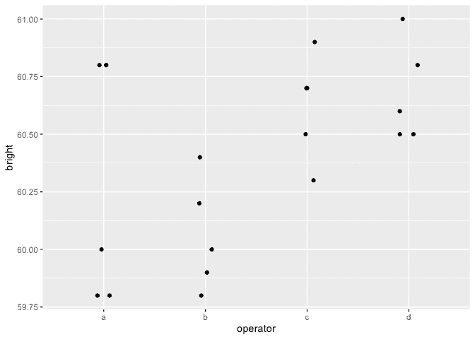
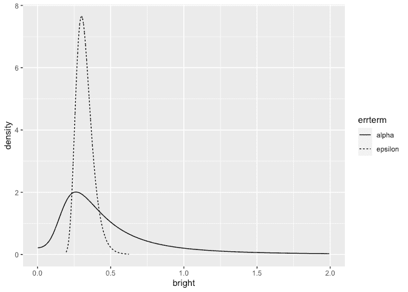

INLA for One Way Anova with a random effect
================
[Julian Faraway](https://julianfaraway.github.io/)
22 September 2020

See the [introduction](index.md) for an overview. Load the libraries:

``` r
library(ggplot2)
library(INLA)
```

# Data

Load up and look at the data:

``` r
data(pulp, package="faraway")
summary(pulp)
```

``` 
     bright     operator
 Min.   :59.8   a:5     
 1st Qu.:60.0   b:5     
 Median :60.5   c:5     
 Mean   :60.4   d:5     
 3rd Qu.:60.7           
 Max.   :61.0           
```

``` r
ggplot(pulp, aes(x=operator, y=bright))+geom_point(position = position_jitter(width=0.1, height=0.0))
```

<!-- -->

# Default fit

Run the default INLA model:

``` r
formula <- bright ~ f(operator, model="iid")
result <- inla(formula, family="gaussian", data=pulp)
result <- inla.hyperpar(result)
summary(result)
```

``` 

Call:
   "inla(formula = formula, family = \"gaussian\", data = pulp)" 
Time used:
    Pre = 0.963, Running = 0.134, Post = 0.075, Total = 1.17 
Fixed effects:
            mean    sd 0.025quant 0.5quant 0.975quant mode kld
(Intercept) 60.4 0.093     60.216     60.4     60.584 60.4   0

Random effects:
  Name    Model
    operator IID model

Model hyperparameters:
                                            mean       sd 0.025quant 0.5quant 0.975quant  mode
Precision for the Gaussian observations     7.04     2.25       3.41     6.78      12.13  6.30
Precision for operator                  19120.58 20029.37     100.47 12920.98   73424.29 14.40

Expected number of effective parameters(stdev): 1.17(0.488)
Number of equivalent replicates : 17.09 

Marginal log-Likelihood:  -19.41 
```

Precision for the operator term is unreasonably high. This is due to the
diffuse gamma prior on the precisions. Problems are seen with other
packages also. We can improve the calculation but result would remain
implausible so it is better we change the prior.

# Informative but weak prior on the SDs

Try a truncated normal prior with low precision instead. A precision of
0.01 corresponds to an SD of 10. This is substantially larger than the
SD of the response so the information supplied is very weak.

``` r
tnprior <- list(prec = list(prior="logtnormal", param = c(0,0.01)))
formula <- bright ~ f(operator, model="iid", hyper = tnprior)
result <- inla(formula, family="gaussian", data=pulp)
result <- inla.hyperpar(result)
summary(result)
```

``` 

Call:
   "inla(formula = formula, family = \"gaussian\", data = pulp)" 
Time used:
    Pre = 0.951, Running = 0.146, Post = 0.0743, Total = 1.17 
Fixed effects:
            mean   sd 0.025quant 0.5quant 0.975quant mode   kld
(Intercept) 60.4 0.41     59.612     60.4     61.188 60.4 0.022

Random effects:
  Name    Model
    operator IID model

Model hyperparameters:
                                            mean       sd 0.025quant 0.5quant 0.975quant  mode
Precision for the Gaussian observations    10.44 3.52e+00      4.728    10.04      18.40 9.236
Precision for operator                  68999.86 4.94e+07      0.231     6.67     139.05 0.176

Expected number of effective parameters(stdev): 3.43(0.637)
Number of equivalent replicates : 5.83 

Marginal log-Likelihood:  -20.36 
```

The results appear more plausible. Transform to the SD scale. Make a
table of summary statistics for the posteriors:

``` r
sigmaalpha <- inla.tmarginal(function(x) 1/sqrt(exp(x)),result$internal.marginals.hyperpar[[2]])
sigmaepsilon <- inla.tmarginal(function(x) 1/sqrt(exp(x)),result$internal.marginals.hyperpar[[1]])
restab <- sapply(result$marginals.fixed, function(x) inla.zmarginal(x,silent=TRUE))
restab <- cbind(restab, inla.zmarginal(sigmaalpha,silent=TRUE))
restab <- cbind(restab, inla.zmarginal(sigmaepsilon,silent = TRUE))
restab <- cbind(restab, sapply(result$marginals.random$operator,function(x) inla.zmarginal(x, silent = TRUE)))
colnames(restab)  <-  c("mu","alpha","epsilon",levels(pulp$operator))
data.frame(restab)
```

``` 
                mu    alpha  epsilon        a         b         c        d
mean          60.4   0.5489  0.32346  -0.1298  -0.27684   0.17976   0.2274
sd         0.41052  0.59606 0.057735  0.42072   0.42591   0.42327  0.42414
quant0.025  59.608 0.082628  0.23336 -0.96363    -1.141  -0.59516 -0.53446
quant0.25   60.255  0.24926  0.28217 -0.28764  -0.44163 0.0076432 0.045395
quant0.5    60.398  0.38448  0.31548 -0.11579  -0.25576   0.15884  0.20378
quant0.75    60.54   0.6217  0.35584 0.029438 -0.092496    0.3353  0.38524
quant0.975  61.187    2.051  0.45891  0.64599   0.47118    1.0208   1.0773
```

The results are now comparable to previous fits to this data using
likelihood and MCMC-based methods. Plot the posterior densities for the
two SD terms:

``` r
ddf <- data.frame(rbind(sigmaalpha,sigmaepsilon),errterm=gl(2,dim(sigmaalpha)[1],labels = c("alpha","epsilon")))
ggplot(ddf, aes(x,y, linetype=errterm))+geom_line()+xlab("bright")+ylab("density")+xlim(0,2)
```

<!-- -->

We see that the operator SD less precisely known than the error SD.

We can compute the probability that the operator SD is smaller than 0.1:

``` r
inla.pmarginal(0.1, sigmaalpha)
```

    [1] 0.034449

The probability is small but not negligible.

# Informative gamma priors on the precisions

Now try more informative gamma priors for the precisions. Define it so
the mean value of gamma prior is set to the inverse of the variance of
the response. We expect the two error variances to be lower than the
response variance so this is an overestimate. The variance of the gamma
prior (for the precision) is controlled by the `apar` shape parameter in
the code. `apar=1` is the exponential distribution. Shape values less
than one result in densities that have a mode at zero and decrease
monotonely. These have greater variance and hence less informative.

``` r
apar <- 0.5
bpar <- var(pulp$bright)*apar
lgprior <- list(prec = list(prior="loggamma", param = c(apar,bpar)))
formula <- bright ~ f(operator, model="iid", hyper = lgprior)
result <- inla(formula, family="gaussian", data=pulp)
result <- inla.hyperpar(result)
summary(result)
```

``` 

Call:
   "inla(formula = formula, family = \"gaussian\", data = pulp)" 
Time used:
    Pre = 0.963, Running = 0.13, Post = 0.0738, Total = 1.17 
Fixed effects:
            mean    sd 0.025quant 0.5quant 0.975quant mode   kld
(Intercept) 60.4 0.233     59.931     60.4     60.869 60.4 0.002

Random effects:
  Name    Model
    operator IID model

Model hyperparameters:
                                         mean   sd 0.025quant 0.5quant 0.975quant mode
Precision for the Gaussian observations 10.59 3.52       4.87    10.20      18.53 9.41
Precision for operator                  11.12 9.02       1.17     8.74      35.00 4.53

Expected number of effective parameters(stdev): 3.49(0.364)
Number of equivalent replicates : 5.73 

Marginal log-Likelihood:  -17.93 
```

Compute the summaries as before:

``` r
sigmaalpha <- inla.tmarginal(function(x) 1/sqrt(exp(x)),result$internal.marginals.hyperpar[[2]])
sigmaepsilon <- inla.tmarginal(function(x) 1/sqrt(exp(x)),result$internal.marginals.hyperpar[[1]])
restab <- sapply(result$marginals.fixed, function(x) inla.zmarginal(x,silent=TRUE))
restab <- cbind(restab, inla.zmarginal(sigmaalpha,silent=TRUE))
restab <- cbind(restab, inla.zmarginal(sigmaepsilon,silent = TRUE))
restab <- cbind(restab, sapply(result$marginals.random$operator,function(x) inla.zmarginal(x, silent = TRUE)))
colnames(restab)  <-  c("mu","alpha","epsilon",levels(pulp$operator))
data.frame(restab)
```

``` 
                mu   alpha  epsilon        a        b        c        d
mean          60.4 0.38937  0.32063 -0.13278 -0.28218  0.18258  0.23238
sd         0.23275 0.20389 0.056154  0.24942  0.25188  0.25004  0.25086
quant0.025   59.93 0.16902  0.23255 -0.64645 -0.81221 -0.30165 -0.24821
quant0.25   60.271 0.25984  0.28052 -0.27426 -0.42425 0.034853  0.08279
quant0.5    60.399 0.33765  0.31303 -0.12944 -0.27424  0.17508  0.22334
quant0.75   60.527 0.45472  0.35221 0.010768 -0.13309  0.32149  0.37148
quant0.975  60.868 0.92011  0.45204  0.35291  0.19263  0.69904  0.75429
```

Make the plots:

The posterior for the error SD is quite similar to that seen previously
but the operator SD is larger and bounded away from zero.

We can compute the probability that the operator SD is smaller than 0.1:

``` r
inla.pmarginal(0.1, sigmaalpha)
```

    [1] 7.2871e-05

The probability is very small. The choice of prior may be unsuitable in
that no density is placed on an SD=0 (or infinite precision). We also
have very little prior weight on low SD/high precision values. This
leads to a posterior for the operator with very little density assigned
to small values of the SD. But we can see from looking at the data or
from prior analyses of the data that there is some possibility that the
operator SD is negligibly small.

# Penalized Complexity Prior

In [Simpson et al (2015)](http://arxiv.org/abs/1403.4630v3), penalized
complexity priors are proposed. This requires that we specify a scaling
for the SDs of the random effects. We use the SD of the residuals of the
fixed effects only model (what might be called the base model in the
paper) to provide this scaling.

``` r
sdres <- sd(pulp$bright)
pcprior <- list(prec = list(prior="pc.prec", param = c(3*sdres,0.01)))
formula <- bright ~ f(operator, model="iid", hyper = pcprior)
result <- inla(formula, family="gaussian", data=pulp)
result <- inla.hyperpar(result)
summary(result)
```

``` 

Call:
   "inla(formula = formula, family = \"gaussian\", data = pulp)" 
Time used:
    Pre = 0.95, Running = 0.155, Post = 0.0984, Total = 1.2 
Fixed effects:
            mean    sd 0.025quant 0.5quant 0.975quant mode kld
(Intercept) 60.4 0.173     60.049     60.4     60.752 60.4   0

Random effects:
  Name    Model
    operator IID model

Model hyperparameters:
                                             mean       sd 0.025quant 0.5quant 0.975quant mode
Precision for the Gaussian observations     10.09 3.51e+00       4.48     9.67      18.05 8.82
Precision for operator                  954240.12 6.54e+08       2.24    16.61    1101.86 5.90

Expected number of effective parameters(stdev): 3.03(0.742)
Number of equivalent replicates : 6.61 

Marginal log-Likelihood:  -17.97 
```

Compute the summaries as before:

``` r
sigmaalpha <- inla.tmarginal(function(x) 1/sqrt(exp(x)),result$internal.marginals.hyperpar[[2]])
sigmaepsilon <- inla.tmarginal(function(x) 1/sqrt(exp(x)),result$internal.marginals.hyperpar[[1]])
restab <- sapply(result$marginals.fixed, function(x) inla.zmarginal(x,silent=TRUE))
restab <- cbind(restab, inla.zmarginal(sigmaalpha,silent=TRUE))
restab <- cbind(restab, inla.zmarginal(sigmaepsilon,silent = TRUE))
restab <- cbind(restab, sapply(result$marginals.random$operator,function(x) inla.zmarginal(x, silent = TRUE)))
colnames(restab)  <-  c("mu","alpha","epsilon",levels(pulp$operator))
data.frame(restab)
```

``` 
                mu    alpha epsilon         a         b        c        d
mean          60.4  0.27121 0.32985  -0.10938  -0.23306  0.15018  0.19075
sd         0.17283  0.15847 0.06051   0.19093   0.20358  0.19416  0.19867
quant0.025  60.048 0.030079 0.23563  -0.52204  -0.67978 -0.20284 -0.15633
quant0.25   60.302  0.16472  0.2864  -0.21783  -0.35386 0.024033 0.055881
quant0.5    60.399  0.24505 0.32141 -0.096252  -0.21757  0.13326  0.17326
quant0.75   60.496  0.34735 0.36398 0.0044809 -0.094222  0.26019   0.3052
quant0.975   60.75  0.66253 0.47167   0.24942   0.11059  0.57213  0.62442
```

Make the plots:

We get a similar result to the truncated normal prior used earlier
although the operator SD is generally smaller.

We can compute the probability that the operator SD is smaller than 0.1:

``` r
inla.pmarginal(0.1, sigmaalpha)
```

    [1] 0.10372

The probability is small but not insubstantial.

# Package version info

``` r
sessionInfo()
```

``` 
R version 4.0.2 (2020-06-22)
Platform: x86_64-apple-darwin17.0 (64-bit)
Running under: macOS Catalina 10.15.6

Matrix products: default
BLAS:   /Library/Frameworks/R.framework/Versions/4.0/Resources/lib/libRblas.dylib
LAPACK: /Library/Frameworks/R.framework/Versions/4.0/Resources/lib/libRlapack.dylib

locale:
[1] en_GB.UTF-8/en_GB.UTF-8/en_GB.UTF-8/C/en_GB.UTF-8/en_GB.UTF-8

attached base packages:
[1] parallel  stats     graphics  grDevices utils     datasets  methods   base     

other attached packages:
[1] INLA_20.03.17 foreach_1.5.0 sp_1.4-2      Matrix_1.2-18 ggplot2_3.3.2 knitr_1.29   

loaded via a namespace (and not attached):
 [1] pillar_1.4.6         compiler_4.0.2       iterators_1.0.12     tools_4.0.2          digest_0.6.25       
 [6] evaluate_0.14        lifecycle_0.2.0      tibble_3.0.3         gtable_0.3.0         lattice_0.20-41     
[11] pkgconfig_2.0.3      rlang_0.4.7          yaml_2.2.1           xfun_0.16            withr_2.2.0         
[16] dplyr_1.0.2          stringr_1.4.0        MatrixModels_0.4-1   generics_0.0.2       vctrs_0.3.4         
[21] grid_4.0.2           tidyselect_1.1.0     glue_1.4.2           R6_2.4.1             rmarkdown_2.3       
[26] farver_2.0.3         purrr_0.3.4          magrittr_1.5         splines_4.0.2        scales_1.1.1        
[31] codetools_0.2-16     ellipsis_0.3.1       htmltools_0.5.0.9000 colorspace_1.4-1     Deriv_4.0.1         
[36] labeling_0.3         stringi_1.4.6        munsell_0.5.0        crayon_1.3.4        
```
