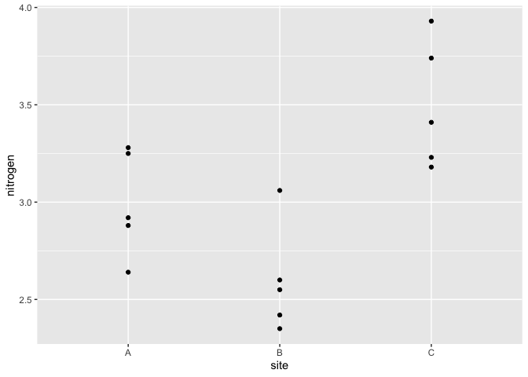
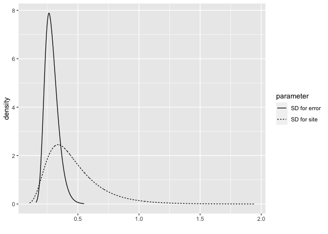
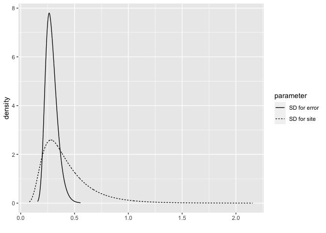

Define your own prior with INLA
================
[Julian Faraway](https://julianfaraway.github.io/)
21 September 2020

## Initialization

See the [introduction](index.md) for an overview. Load the libraries:

``` r
library(INLA)
library(brinla)
library(ggplot2)
```

We illustrate the method using the following data:

``` r
data(reeds, package="brinla")
ggplot(reeds,aes(site,nitrogen))+geom_point()
```

<!-- -->

We will build a model of the form:

    nitrogen = intercept + site + error

where `intercept` is a fixed effect modeled with a normal prior with a
zero mean and large variance. The `site` is a random effect and `error`
is the error term. These have distributions which are normal with mean
zero and some variance. These variances are treated as hyperparameters
with priors we shall specify.

# Analysis with default prior

By default, INLA places a gamma prior on the precisions (inverse of the
variance). We fit this model and examine the posteriors in terms of the
SDs (which are easier to understand than precisions)

``` r
formula <- nitrogen ~ 1 + f(site, model="iid")
imod <- inla(formula,family="gaussian", data = reeds)
bri.hyperpar.summary(imod)
```

``` 
                                    mean      sd  q0.025    q0.5  q0.975    mode
SD for the Gaussian observations 0.29079 0.05833 0.19817 0.28283 0.42608 0.26647
SD for site                      0.31313 0.15740 0.10893 0.27910 0.71369 0.22176
```

We can also plot the posteriors of these two SDs.

``` r
bri.hyperpar.plot(imod)
```

<!-- -->

# PC prior

INLA has [other choices](http://www.r-inla.org/models/priors) for the
priors. Here is an example using the [penalized complexity
prior](https://arxiv.org/abs/1403.4630). We use the SD of the response
to help us set the scale of this prior (although it is better if you set
this with knowledge of the problem behind the data)

``` r
sdres <- sd(reeds$nitrogen)
pcprior <- list(prec = list(prior="pc.prec", param = c(3*sdres,0.01)))
formula <- nitrogen ~ f(site, model="iid", hyper = pcprior)
pmod <- inla(formula, family="gaussian", data=reeds)
bri.hyperpar.summary(pmod)
```

``` 
                                    mean       sd  q0.025    q0.5  q0.975    mode
SD for the Gaussian observations 0.28651 0.055529 0.19794 0.27906 0.41494 0.26358
SD for site                      0.46599 0.219838 0.18247 0.41706 1.02813 0.33867
```

Plot the posterior densities.

``` r
bri.hyperpar.plot(pmod)
```

<!-- -->

# Half Cauchy prior

It is possible to set our own prior for the SD of the `site` effect. The
use of the half(ie. positive part of) Cauchy is a commonly used choice
which is not directly programmed in INLA. The density for the SD
(\(\sigma\)) with scaling \(\lambda\) is: \[
 p(\sigma | \lambda) = \frac{2}{\pi\lambda(1+(\sigma/\lambda)^2)}, \quad\quad \sigma \ge 0.
\]

We calculate scaling equivalent to the PC prior scaling for future use:

``` r
(lambda = 3*sdres/tan(pi*0.99/2))
```

    [1] 0.022066

INLA works with the precision and the calculation requires the log
density of the precision, \(\tau\), which is \[
  \log p(\tau | \lambda) = -\frac{3}{2}\log\tau - \log (\pi\lambda) - \log (1+1/(\tau\lambda^2))
\]

We then define the prior as:

``` r
halfcauchy = "expression:
              lambda = 0.022;
              precision = exp(log_precision);
              logdens = -1.5*log_precision-log(pi*lambda)-log(1+1/(precision*lambda^2));
              log_jacobian = log_precision;
              return(logdens+log_jacobian);"
```

And use this prior with

``` r
hcprior = list(prec = list(prior = halfcauchy))
formula <- nitrogen ~ f(site, model="iid", hyper = hcprior)
hmod <- inla(formula, family="gaussian", data=reeds)
bri.hyperpar.summary(hmod)
```

``` 
                                    mean       sd  q0.025    q0.5  q0.975    mode
SD for the Gaussian observations 0.28763 0.056198 0.19809 0.28006 0.41769 0.26436
SD for site                      0.42336 0.231600 0.14712 0.36565 1.03013 0.28080
```

Plot the posterior distributions:

``` r
bri.hyperpar.plot(hmod)
```

<!-- -->

The result is quite similar to the penalized complexity prior.
