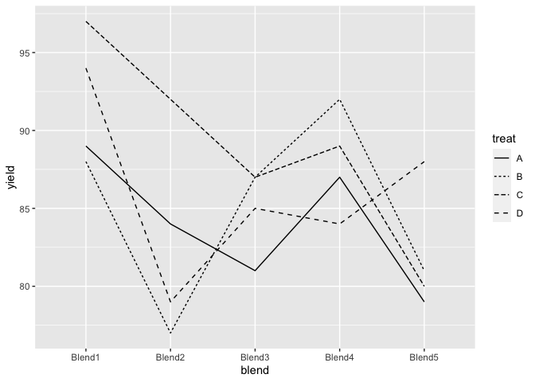
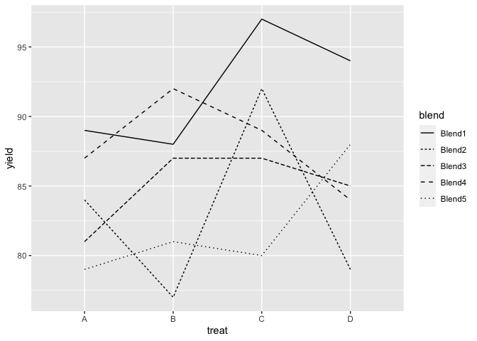
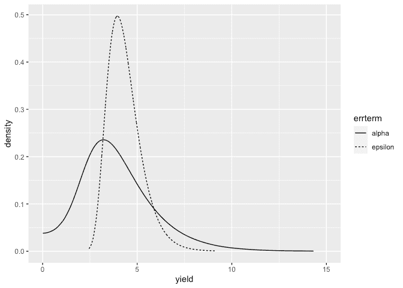
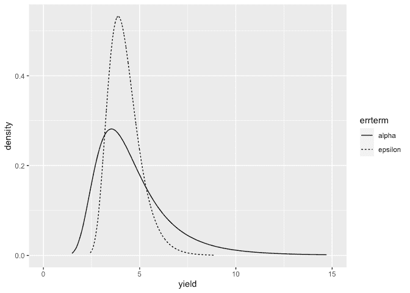
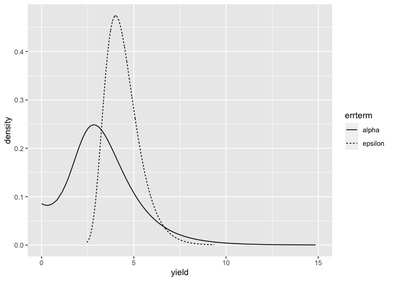

INLA analysis of block design - one fixed and one random effect
================
[Julian Faraway](https://julianfaraway.github.io/)
22 September 2020

See the [introduction](index.md) for an overview. Load the libraries:

``` r
library(ggplot2)
library(INLA)
```

# Data

Load in and plot the data:

``` r
data(penicillin, package="faraway")
summary(penicillin)
```

``` 
 treat    blend       yield   
 A:5   Blend1:4   Min.   :77  
 B:5   Blend2:4   1st Qu.:81  
 C:5   Blend3:4   Median :87  
 D:5   Blend4:4   Mean   :86  
       Blend5:4   3rd Qu.:89  
                  Max.   :97  
```

``` r
library(ggplot2, quietly=TRUE)
ggplot(penicillin,aes(x=blend,y=yield,group=treat,linetype=treat))+geom_line()
```

<!-- -->

``` r
ggplot(penicillin,aes(x=treat,y=yield,group=blend,linetype=blend))+geom_line()
```

<!-- -->

# Default prior model

Fit the default INLA model:

``` r
formula = yield ~ treat+f(blend, model="iid")
result = inla(formula, family="gaussian", data=penicillin)
result <- inla.hyperpar(result)
summary(result)
```

``` 

Call:
   "inla(formula = formula, family = \"gaussian\", data = penicillin)" 
Time used:
    Pre = 1.16, Running = 0.181, Post = 0.0755, Total = 1.42 
Fixed effects:
              mean    sd 0.025quant 0.5quant 0.975quant   mode kld
(Intercept) 84.048 2.447     79.198   84.045     88.905 84.040   0
treatB       0.947 3.461     -5.931    0.949      7.799  0.955   0
treatC       4.922 3.461     -1.959    4.927     11.771  4.934   0
treatD       1.941 3.461     -4.938    1.944      8.792  1.949   0

Random effects:
  Name    Model
    blend IID model

Model hyperparameters:
                                           mean      sd 0.025quant 0.5quant 0.975quant  mode
Precision for the Gaussian observations 3.7e-02 1.2e-02      0.017 3.50e-02    6.4e-02 0.033
Precision for blend                     2.0e+04 2.0e+04    500.709 1.39e+04    7.4e+04 0.082

Expected number of effective parameters(stdev): 3.96(0.014)
Number of equivalent replicates : 5.04 

Marginal log-Likelihood:  -80.80 
```

Precision for the blend effect looks implausibly large. Problem with
default gamma prior.

# Half-normal priors on the SDs

Try a half-normal prior on the blend precision. I have used variance of
the response to help with the scaling so these are more informative.

``` r
resprec <- 1/var(penicillin$yield)
formula = yield ~ treat+f(blend, model="iid", prior="logtnormal", param=c(0, resprec))
result = inla(formula, family="gaussian", data=penicillin)
result <- inla.hyperpar(result)
summary(result)
```

``` 

Call:
   "inla(formula = formula, family = \"gaussian\", data = penicillin)" 
Time used:
    Pre = 1.22, Running = 0.161, Post = 0.0745, Total = 1.46 
Fixed effects:
              mean    sd 0.025quant 0.5quant 0.975quant   mode kld
(Intercept) 84.030 2.772     78.505   84.029     89.553 84.028   0
treatB       0.966 2.765     -4.546    0.968      6.456  0.972   0
treatC       4.950 2.765     -0.565    4.954     10.437  4.960   0
treatD       1.962 2.765     -3.551    1.965      7.451  1.969   0

Random effects:
  Name    Model
    blend IID model

Model hyperparameters:
                                           mean       sd 0.025quant 0.5quant 0.975quant  mode
Precision for the Gaussian observations   0.059 2.30e-02      0.024    0.056      0.113 0.050
Precision for blend                     956.937 4.52e+05      0.013    0.074      2.644 0.031

Expected number of effective parameters(stdev): 6.73(0.929)
Number of equivalent replicates : 2.97 

Marginal log-Likelihood:  -78.71 
```

Looks more plausible. Compute the transforms to an SD scale for the
blend and error. Make a table of summary statistics for the posteriors:

``` r
sigmaalpha <- inla.tmarginal(function(x) 1/sqrt(exp(x)),result$internal.marginals.hyperpar[[2]])
sigmaepsilon <- inla.tmarginal(function(x) 1/sqrt(exp(x)),result$internal.marginals.hyperpar[[1]])
restab=sapply(result$marginals.fixed, function(x) inla.zmarginal(x,silent=TRUE))
restab=cbind(restab, inla.zmarginal(sigmaalpha,silent=TRUE))
restab=cbind(restab, inla.zmarginal(sigmaepsilon,silent=TRUE))
restab=cbind(restab, sapply(result$marginals.random$blend,function(x) inla.zmarginal(x, silent=TRUE)))
colnames(restab) = c("mu","B-A","C-A","D-A","alpha","epsilon",levels(penicillin$blend))
data.frame(restab)
```

``` 
               mu      B.A     C.A     D.A   alpha epsilon   Blend1  Blend2   Blend3   Blend4   Blend5
mean        84.03  0.96583  4.9504   1.962  3.9306  4.3484   4.1649 -2.0883 -0.69619   1.3925  -2.7824
sd         2.7724   2.7651  2.7651  2.7651  1.9924 0.90416   2.8532  2.6104   2.5357    2.564   2.6748
quant0.025 78.501  -4.5497 -0.5684 -3.5543 0.61883  2.9784 -0.75786  -7.676  -5.9853  -3.5355  -8.5319
quant0.25   82.26 -0.82636  3.1588 0.16993  2.5717  3.6984   2.1561 -3.6663  -2.1987 -0.20884  -4.4214
quant0.5   84.016  0.95464  4.9403  1.9511  3.6611  4.2103   3.9991 -1.9371  -0.6234   1.2428  -2.6229
quant0.75  85.772   2.7336  6.7188  3.7299  5.0027  4.8459   5.9317 -0.3922  0.80284   2.8989 -0.97575
quant0.975 89.538   6.4399  10.421  7.4353  8.6559  6.4986   10.231   2.733   4.3114   6.8014   1.9915
```

Also construct a plot the SD posteriors:

``` r
ddf <- data.frame(rbind(sigmaalpha,sigmaepsilon),errterm=gl(2,nrow(sigmaalpha),labels = c("alpha","epsilon")))
ggplot(ddf, aes(x,y, linetype=errterm))+geom_line()+xlab("yield")+ylab("density")+xlim(0,15)
```

<!-- -->

Posterior for the blend SD is more diffuse than the error SD. Posterior
for the blend SD has non-zero density at zero.

# Informative gamma priors on the precisions

Now try more informative gamma priors for the precisions. Define it so
the mean value of gamma prior is set to the inverse of the variance of
the fixed-effects model residuals. We expect the two error variances to
be lower than this variance so this is an overestimate. The variance of
the gamma prior (for the precision) is controlled by the `apar` shape
parameter - smaller values are less informative.

``` r
apar <- 0.5
lmod <- lm(yield ~ treat, data=penicillin)
bpar <- apar*var(residuals(lmod))
lgprior <- list(prec = list(prior="loggamma", param = c(apar,bpar)))
formula = yield ~ treat+f(blend, model="iid", hyper = lgprior)
result <- inla(formula, family="gaussian", data=penicillin)
result <- inla.hyperpar(result)
summary(result)
```

``` 

Call:
   "inla(formula = formula, family = \"gaussian\", data = penicillin)" 
Time used:
    Pre = 1.15, Running = 0.148, Post = 0.0728, Total = 1.37 
Fixed effects:
              mean    sd 0.025quant 0.5quant 0.975quant   mode   kld
(Intercept) 84.030 3.037     77.986   84.029     90.080 84.027 0.001
treatB       0.967 2.733     -4.481    0.969      6.392  0.973 0.000
treatC       4.952 2.733     -0.499    4.955     10.374  4.961 0.000
treatD       1.963 2.733     -3.486    1.965      7.388  1.970 0.000

Random effects:
  Name    Model
    blend IID model

Model hyperparameters:
                                         mean    sd 0.025quant 0.5quant 0.975quant  mode
Precision for the Gaussian observations 0.062 0.023      0.025    0.059      0.115 0.053
Precision for blend                     0.070 0.054      0.010    0.056      0.213 0.033

Expected number of effective parameters(stdev): 7.09(0.585)
Number of equivalent replicates : 2.82 

Marginal log-Likelihood:  -78.99 
```

Compute the summaries as before:

``` r
sigmaalpha <- inla.tmarginal(function(x) 1/sqrt(exp(x)),result$internal.marginals.hyperpar[[2]])
sigmaepsilon <- inla.tmarginal(function(x) 1/sqrt(exp(x)),result$internal.marginals.hyperpar[[1]])
restab=sapply(result$marginals.fixed, function(x) inla.zmarginal(x,silent=TRUE))
restab=cbind(restab, inla.zmarginal(sigmaalpha,silent=TRUE))
restab=cbind(restab, inla.zmarginal(sigmaepsilon,silent=TRUE))
restab=cbind(restab, sapply(result$marginals.random$blend,function(x) inla.zmarginal(x, silent=TRUE)))
colnames(restab) = c("mu","B-A","C-A","D-A","alpha","epsilon",levels(penicillin$blend))
data.frame(restab)
```

``` 
               mu      B.A      C.A     D.A  alpha epsilon  Blend1   Blend2   Blend3   Blend4  Blend5
mean        84.03  0.96662   4.9516  1.9629 4.7091  4.2387  4.6789  -2.3396 -0.77994   1.5598 -3.1194
sd         3.0376   2.7328   2.7329  2.7328 2.1182 0.84686   3.008   2.9173   2.8901   2.9003   2.941
quant0.025 77.977  -4.4847 -0.50307 -3.4893 2.1707  2.9473 -0.9083   -8.397  -6.6541  -4.1024 -9.2773
quant0.25  82.132 -0.80278   3.1828 0.19361 3.2989  3.6339  2.7317  -4.0828  -2.5208 -0.23398 -4.8748
quant0.5   84.014  0.95558   4.9416  1.9521 4.2169  4.1125   4.531  -2.2761   -0.767   1.4916 -3.0344
quant0.75  85.896   2.7119   6.6975  3.7083 5.5239  4.7015  6.4483 -0.54381  0.96007    3.269 -1.2872
quant0.975 90.058   6.3768   10.359  7.3723 10.175  6.2517  11.022   3.2473   4.9132   7.4932  2.4377
```

Make the plots:

``` r
ddf <- data.frame(rbind(sigmaalpha,sigmaepsilon),errterm=gl(2,nrow(sigmaalpha),labels = c("alpha","epsilon")))
ggplot(ddf, aes(x,y, linetype=errterm))+geom_line()+xlab("yield")+ylab("density")+xlim(0,15)
```

<!-- -->

Posterior for blend SD has no weight near zero.

# Penalized Complexity Prior

In [Simpson et al (2015)](http://arxiv.org/abs/1403.4630v3), penalized
complexity priors are proposed. This requires that we specify a scaling
for the SDs of the random effects. We use the SD of the residuals of the
fixed effects only model (what might be called the base model in the
paper) to provide this scaling.

``` r
lmod <- lm(yield ~ treat, data=penicillin)
sdres <- sd(residuals(lmod))
pcprior <- list(prec = list(prior="pc.prec", param = c(3*sdres,0.01)))
formula <- yield ~ treat + f(blend, model="iid", hyper = pcprior)
result <- inla(formula, family="gaussian", data=penicillin)
result <- inla.hyperpar(result)
summary(result)
```

``` 

Call:
   "inla(formula = formula, family = \"gaussian\", data = penicillin)" 
Time used:
    Pre = 1.16, Running = 0.171, Post = 0.0757, Total = 1.4 
Fixed effects:
              mean    sd 0.025quant 0.5quant 0.975quant   mode kld
(Intercept) 84.032 2.638     78.788   84.030     89.272 84.028   0
treatB       0.965 2.817     -4.654    0.967      6.560  0.972   0
treatC       4.949 2.817     -0.673    4.952     10.541  4.959   0
treatD       1.961 2.817     -3.659    1.963      7.555  1.968   0

Random effects:
  Name    Model
    blend IID model

Model hyperparameters:
                                           mean       sd 0.025quant 0.5quant 0.975quant  mode
Precision for the Gaussian observations 5.8e-02 2.30e-02      0.023    0.054      0.111 0.047
Precision for blend                     6.4e+03 3.51e+06      0.016    0.102     11.140 0.040

Expected number of effective parameters(stdev): 6.44(1.06)
Number of equivalent replicates : 3.11 

Marginal log-Likelihood:  -78.92 
```

Compute the summaries as before:

``` r
sigmaalpha <- inla.tmarginal(function(x) 1/sqrt(exp(x)),result$internal.marginals.hyperpar[[2]])
sigmaepsilon <- inla.tmarginal(function(x) 1/sqrt(exp(x)),result$internal.marginals.hyperpar[[1]])
restab=sapply(result$marginals.fixed, function(x) inla.zmarginal(x,silent=TRUE))
restab=cbind(restab, inla.zmarginal(sigmaalpha,silent=TRUE))
restab=cbind(restab, inla.zmarginal(sigmaepsilon,silent=TRUE))
restab=cbind(restab, sapply(result$marginals.random$blend,function(x) inla.zmarginal(x, silent=TRUE)))
colnames(restab) = c("mu","B-A","C-A","D-A","alpha","epsilon",levels(penicillin$blend))
data.frame(restab)
```

``` 
               mu      B.A      C.A     D.A   alpha epsilon   Blend1   Blend2   Blend3   Blend4   Blend5
mean       84.032  0.96456   4.9485  1.9606  3.3676  4.4304   3.7546  -1.8661 -0.62252   1.2443  -2.4724
sd         2.6382   2.8165   2.8165  2.8165  1.9125 0.93848   2.7536   2.4171   2.3075   2.3488   2.5159
quant0.025 78.784  -4.6575 -0.67705 -3.6624 0.29798  3.0047 -0.71206  -7.1459  -5.5114   -3.176  -7.9728
quant0.25  82.337 -0.85827   3.1264 0.13789   2.078  3.7521   1.7186  -3.3155  -1.9492 -0.20167  -4.0201
quant0.5   84.018  0.95327   4.9384  1.9496  3.1286  4.2888    3.566  -1.6535 -0.50078   1.0342  -2.2628
quant0.75  85.699   2.7626   6.7472  3.7587  4.3632  4.9538   5.4831 -0.25031  0.69006   2.5974 -0.67833
quant0.975 89.259   6.5438   10.524  7.5389  7.9169  6.6505    9.651   2.4311   3.9104   6.2997   1.7615
```

Make the plots:

``` r
ddf <- data.frame(rbind(sigmaalpha,sigmaepsilon),errterm=gl(2,nrow(sigmaalpha),labels = c("alpha","epsilon")))
ggplot(ddf, aes(x,y, linetype=errterm))+geom_line()+xlab("yield")+ylab("density")+xlim(0,15)
```

<!-- -->

Posterior for blend SD has some weight near zero. Results are comparable
to previous analyses.

# Package version info

``` r
sessionInfo()
```

``` 
R version 4.0.2 (2020-06-22)
Platform: x86_64-apple-darwin17.0 (64-bit)
Running under: macOS Catalina 10.15.6

Matrix products: default
BLAS:   /Library/Frameworks/R.framework/Versions/4.0/Resources/lib/libRblas.dylib
LAPACK: /Library/Frameworks/R.framework/Versions/4.0/Resources/lib/libRlapack.dylib

locale:
[1] en_GB.UTF-8/en_GB.UTF-8/en_GB.UTF-8/C/en_GB.UTF-8/en_GB.UTF-8

attached base packages:
[1] parallel  stats     graphics  grDevices utils     datasets  methods   base     

other attached packages:
[1] INLA_20.03.17 foreach_1.5.0 sp_1.4-2      Matrix_1.2-18 ggplot2_3.3.2 knitr_1.29   

loaded via a namespace (and not attached):
 [1] pillar_1.4.6         compiler_4.0.2       iterators_1.0.12     tools_4.0.2          digest_0.6.25       
 [6] evaluate_0.14        lifecycle_0.2.0      tibble_3.0.3         gtable_0.3.0         lattice_0.20-41     
[11] pkgconfig_2.0.3      rlang_0.4.7          yaml_2.2.1           xfun_0.16            withr_2.2.0         
[16] dplyr_1.0.2          stringr_1.4.0        MatrixModels_0.4-1   generics_0.0.2       vctrs_0.3.4         
[21] grid_4.0.2           tidyselect_1.1.0     glue_1.4.2           R6_2.4.1             rmarkdown_2.3       
[26] farver_2.0.3         purrr_0.3.4          magrittr_1.5         splines_4.0.2        scales_1.1.1        
[31] codetools_0.2-16     ellipsis_0.3.1       htmltools_0.5.0.9000 colorspace_1.4-1     Deriv_4.0.1         
[36] labeling_0.3         stringi_1.4.6        munsell_0.5.0        crayon_1.3.4        
```
