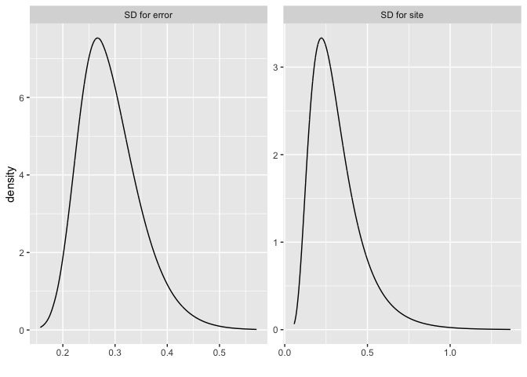
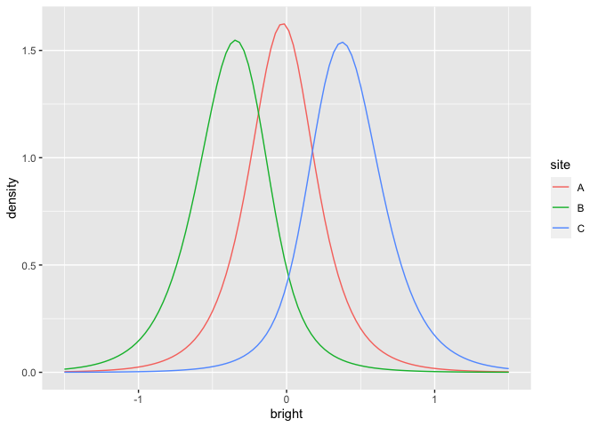
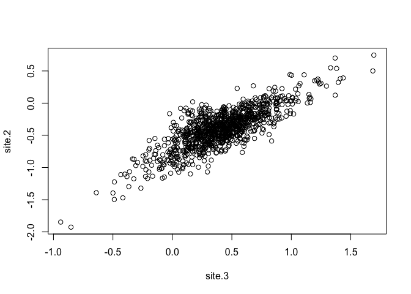

One way ANOVA - reeds
================
[Julian Faraway](https://julianfaraway.github.io/)
21 September 2020

See the [introduction](index.md) for an overview. Load the libraries:

``` r
library(ggplot2)
library(INLA)
library(brinla)
```

# Data

Plot the data which shows the nitrogen content of samples of reeds at
three different sites. The specific sites themselves are not important
but we are interested in how the response might vary between sites.

``` r
ggplot(reeds,aes(site,nitrogen))+geom_point()
```

<!-- -->

# Standard MLE analysis

We can fit a model with a fixed effect for the intercept and a random
effect for the site using `lme4`:

``` r
library(lme4)
mmod <- lmer(nitrogen ~ 1+(1|site), reeds)
summary(mmod)
```

    Linear mixed model fit by REML ['lmerMod']
    Formula: nitrogen ~ 1 + (1 | site)
       Data: reeds
    
    REML criterion at convergence: 13
    
    Scaled residuals: 
       Min     1Q Median     3Q    Max 
    -1.221 -0.754 -0.263  0.914  1.612 
    
    Random effects:
     Groups   Name        Variance Std.Dev.
     site     (Intercept) 0.1872   0.433   
     Residual             0.0855   0.292   
    Number of obs: 15, groups:  site, 3
    
    Fixed effects:
                Estimate Std. Error t value
    (Intercept)    3.029      0.261    11.6

These are REML rather than ML estimates to be precise

# Default INLA

Now try INLA:

``` r
formula <- nitrogen ~ 1 + f(site, model="iid")
imod  <-  inla(formula,family="gaussian", data = reeds)
```

We can get the fixed effect part of the output from:

``` r
imod$summary.fixed
```

``` 
              mean      sd 0.025quant 0.5quant 0.975quant   mode       kld
(Intercept) 3.0293 0.13496     2.7644   3.0293      3.294 3.0293 0.0022404
```

which is quite similar to the REML result. The random effect summary can
be extracted with:

``` r
bri.hyperpar.summary(imod)
```

``` 
                                    mean      sd  q0.025    q0.5  q0.975    mode
SD for the Gaussian observations 0.29079 0.05833 0.19817 0.28283 0.42608 0.26647
SD for site                      0.31313 0.15740 0.10893 0.27910 0.71369 0.22176
```

We can plot the posterior densities of the random effects with:

``` r
bri.hyperpar.plot(imod)
```

<!-- -->

or separately as:

``` r
bri.hyperpar.plot(imod, together=FALSE)
```

<!-- -->

# y=Xb+Zu+e model

Mixed effects models are sometimes presented in a *y=Xb+Zu+e* form where
*X* is the design matrix of the fixed effects and *Z* is the design
matrix of the random effects. The `lme4` package makes it easy to
extract the X and Z:

``` r
Z = getME(mmod, "Z")
X = getME(mmod, "X")
```

We can the use INLA to fit the model in this form. Note the `-1` is
because *X* already has an intercept column.

``` r
n = nrow(reeds)
formula = y ~ -1 + X +  f(id.z, model="z",  Z=Z)
imodZ = inla(formula, data = list(y=reeds$nitrogen, id.z = 1:n, X=X))
```

We can get the fixed effects as:

``` r
imodZ$summary.fixed
```

``` 
              mean      sd 0.025quant 0.5quant 0.975quant   mode       kld
(Intercept) 3.0293 0.13496     2.7644   3.0293      3.294 3.0293 0.0022396
```

and the random effects in terms of the SDs as

``` r
bri.hyperpar.summary(imodZ)
```

``` 
                                    mean      sd  q0.025    q0.5  q0.975    mode
SD for the Gaussian observations 0.29079 0.05833 0.19817 0.28283 0.42608 0.26647
SD for id.z                      0.31313 0.15740 0.10893 0.27909 0.71371 0.22176
```

which is identical to the previous result. Although the two methods are
equivalent here, we will probably find it easier to get the information
we need from the first approach when we have more complex random
effects.

# Penalized Complexity Prior

In [Simpson et al (2015)](http://arxiv.org/abs/1403.4630v3), penalized
complexity priors are proposed. This requires that we specify a scaling
for the SDs of the random effects. We use the SD of the residuals of the
fixed effects only model (what might be called the base model in the
paper) to provide this scaling.

``` r
sdres <- sd(reeds$nitrogen)
pcprior <- list(prec = list(prior="pc.prec", param = c(3*sdres,0.01)))
formula <- nitrogen ~ f(site, model="iid", hyper = pcprior)
imod <- inla(formula, family="gaussian", data=reeds)
```

Fixed effects

``` r
imod$summary.fixed
```

``` 
              mean      sd 0.025quant 0.5quant 0.975quant   mode        kld
(Intercept) 3.0293 0.30497      2.404   3.0293      3.655 3.0293 0.00025399
```

random effects

``` r
bri.hyperpar.summary(imod)
```

``` 
                                    mean       sd  q0.025    q0.5  q0.975    mode
SD for the Gaussian observations 0.28651 0.055529 0.19794 0.27906 0.41494 0.26358
SD for site                      0.46599 0.219838 0.18247 0.41706 1.02813 0.33867
```

which can be plotted as:

``` r
bri.hyperpar.plot(imod)
```

<!-- -->

This results in a larger posterior for the site SD. Hence the PC prior
is putting more weight on larger SDs.

# Random effects

We can plot the random effect posterior densities for the three sites:

``` r
reff <- imod$marginals.random
x <- seq(-1.5,1.5,len=100)
d1 <- inla.dmarginal(x, reff$site[[1]])
d2 <- inla.dmarginal(x, reff$site[[2]])
d3 <- inla.dmarginal(x, reff$site[[3]])
rdf <- data.frame(bright=c(x,x,x),density=c(d1,d2,d3),site=gl(3,100,labels=LETTERS[1:3]))
ggplot(rdf, aes(x=bright, y=density, color=site))+geom_line()
```

<!-- -->

What is the probability that a sample from site B would exceed the
nitrogen in a sample from site C? We can answer this question with a
sample from the posterior:

``` r
imod <- inla(formula, family="gaussian", data=reeds, control.compute=list(config = TRUE))
psamp = inla.posterior.sample(n=1000, imod)
lvsamp = t(sapply(psamp, function(x) x$latent))
colnames(lvsamp) = make.names(row.names(psamp[[1]]$latent))
plot(site.2 ~ site.3, lvsamp)
```

<!-- -->

``` r
mean(lvsamp[,'site.2'] > lvsamp[,'site.3'])
```

    [1] 0

Although the site posteriors overlap in the figure, the positive
correlation between the two variables means that the chance of B\>C is
negligible.
