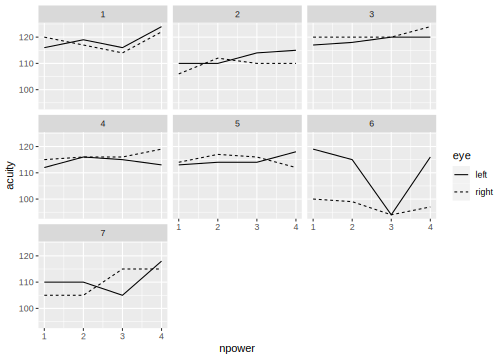
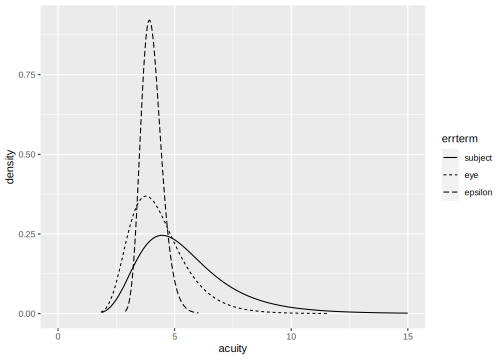
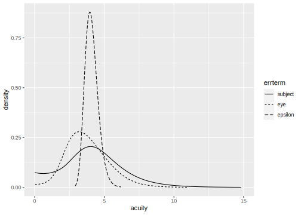

INLA analysis of a repeated measures model
================
[Julian Faraway](https://julianfaraway.github.io/)
22 September 2020

See the [introduction](index.md) for an overview.

Load the libraries:

``` r
library(ggplot2)
library(INLA)
```

# Data

Load in and summarize the data:

``` r
data(vision, package="faraway")
vision$npower <- rep(1:4,14)
vision$eyesub <- paste0(vision$eye,vision$subject)
summary(vision)
```

``` 
     acuity     power       eye     subject     npower        eyesub         
 Min.   : 94   6/6 :14   left :28   1:8     Min.   :1.00   Length:56         
 1st Qu.:110   6/18:14   right:28   2:8     1st Qu.:1.75   Class :character  
 Median :115   6/36:14              3:8     Median :2.50   Mode  :character  
 Mean   :113   6/60:14              4:8     Mean   :2.50                     
 3rd Qu.:118                        5:8     3rd Qu.:3.25                     
 Max.   :124                        6:8     Max.   :4.00                     
                                    7:8                                      
```

Plot the data:

``` r
ggplot(vision, aes(y=acuity, x=npower, linetype=eye))+geom_line()+facet_wrap(~ subject)
```

<!-- -->

# Default prior model

``` r
formula <- acuity ~ power + f(subject, model="iid") + f(eyesub, model="iid")
result <- inla(formula, family="gaussian", data=vision)
result <- inla.hyperpar(result)
summary(result)
```

``` 

Call:
   "inla(formula = formula, family = \"gaussian\", data = vision)" 
Time used:
    Pre = 1.5, Running = 5.79, Post = 0.25, Total = 7.54 
Fixed effects:
               mean    sd 0.025quant 0.5quant 0.975quant    mode kld
(Intercept) 112.646 1.747    109.190  112.646    116.097 112.646   0
power6/18     0.781 1.521     -2.222    0.781      3.780   0.782   0
power6/36    -1.002 1.521     -4.005   -1.002      1.996  -1.002   0
power6/60     3.278 1.521      0.275    3.279      6.276   3.279   0

Random effects:
  Name    Model
    subject IID model
   eyesub IID model

Model hyperparameters:
                                           mean      sd 0.025quant 0.5quant 0.975quant  mode
Precision for the Gaussian observations 6.2e-02 1.4e-02      0.038 6.10e-02   9.20e-02 0.059
Precision for subject                   2.0e+04 2.0e+04    501.984 1.39e+04   7.38e+04 0.047
Precision for eyesub                    4.3e-02 2.0e-02      0.016 3.90e-02   9.20e-02 0.033

Expected number of effective parameters(stdev): 15.02(0.812)
Number of equivalent replicates : 3.73 

Marginal log-Likelihood:  -207.44 
```

The subject precision looks far too high. Need to change the default
prior

# Informative Gamma priors on the precisions

Now try more informative gamma priors for the precisions. Define it so
the mean value of gamma prior is set to the inverse of the variance of
the residuals of the fixed-effects only model. We expect the error
variances to be lower than this variance so this is an overestimate. The
variance of the gamma prior (for the precision) is controlled by the
`cpar` parameter in the code.

``` r
apar <- 0.5
lmod <- lm(acuity ~ power, vision)
bpar <- apar*var(residuals(lmod))
lgprior <- list(prec = list(prior="loggamma", param = c(apar,bpar)))
formula = acuity ~ power+f(subject, model="iid", hyper = lgprior)+f(eyesub, model="iid", hyper = lgprior)
result <- inla(formula, family="gaussian", data=vision)
result <- inla.hyperpar(result)
summary(result)
```

``` 

Call:
   "inla(formula = formula, family = \"gaussian\", data = vision)" 
Time used:
    Pre = 1.42, Running = 1.44, Post = 0.109, Total = 2.97 
Fixed effects:
               mean    sd 0.025quant 0.5quant 0.975quant    mode kld
(Intercept) 112.646 2.698    107.255  112.646    118.034 112.646   0
power6/18     0.781 1.508     -2.194    0.781      3.752   0.782   0
power6/36    -1.002 1.508     -3.978   -1.002      1.968  -1.002   0
power6/60     3.278 1.508      0.303    3.279      6.249   3.279   0

Random effects:
  Name    Model
    subject IID model
   eyesub IID model

Model hyperparameters:
                                         mean    sd 0.025quant 0.5quant 0.975quant  mode
Precision for the Gaussian observations 0.064 0.014      0.039    0.063      0.094 0.061
Precision for subject                   0.047 0.034      0.008    0.038      0.136 0.025
Precision for eyesub                    0.066 0.037      0.018    0.058      0.161 0.044

Expected number of effective parameters(stdev): 15.23(0.729)
Number of equivalent replicates : 3.68 

Marginal log-Likelihood:  -194.30 
```

Compute the transforms to an SD scale for the random effect terms. Make
a table of summary statistics for the posteriors:

``` r
sigmasubject <- inla.tmarginal(function(x) 1/sqrt(exp(x)),result$internal.marginals.hyperpar[[2]])
sigmaeye <- inla.tmarginal(function(x) 1/sqrt(exp(x)),result$internal.marginals.hyperpar[[3]])
sigmaepsilon <- inla.tmarginal(function(x) 1/sqrt(exp(x)),result$internal.marginals.hyperpar[[1]])
restab=sapply(result$marginals.fixed, function(x) inla.zmarginal(x,silent=TRUE))
restab=cbind(restab, inla.zmarginal(sigmasubject,silent=TRUE))
restab=cbind(restab, inla.zmarginal(sigmaeye,silent=TRUE))
restab=cbind(restab, inla.zmarginal(sigmaepsilon,silent=TRUE))
colnames(restab) = c(names(lmod$coef),"subject","eyesub","epsilon")
data.frame(restab)
```

``` 
           X.Intercept. power6.18  power6.36 power6.60 subject eyesub epsilon
mean             112.65   0.78134    -1.0023    3.2785  5.5309 4.3463   4.034
sd               2.6982    1.5075     1.5075    1.5075  2.0993 1.2588 0.45005
quant0.025       107.25    -2.194    -3.9776    0.3029   2.714 2.4969  3.2659
quant0.25        110.92  -0.22552    -2.0092    2.2717  4.0733 3.4467  3.7139
quant0.5         112.63   0.77555    -1.0082    3.2728  5.1131 4.1372  3.9933
quant0.75        114.35    1.7765 -0.0071804    4.2737  6.4966 5.0107   4.309
quant0.975       118.02    3.7443     1.9608    6.2413  10.799 7.3901  5.0301
```

Also construct a plot the SD posteriors:

``` r
ddf <- data.frame(rbind(sigmasubject,sigmaeye,sigmaepsilon),errterm=gl(3,nrow(sigmaepsilon),labels = c("subject","eye","epsilon")))
ggplot(ddf, aes(x,y, linetype=errterm))+geom_line()+xlab("acuity")+ylab("density")+xlim(0,15)
```

<!-- -->

Posteriors look OK.

# Penalized Complexity Prior

In [Simpson et al (2015)](http://arxiv.org/abs/1403.4630v3), penalized
complexity priors are proposed. This requires that we specify a scaling
for the SDs of the random effects. We use the SD of the residuals of the
fixed effects only model (what might be called the base model in the
paper) to provide this scaling.

``` r
lmod <- lm(acuity ~ power, vision)
sdres <- sd(residuals(lmod))
pcprior <- list(prec = list(prior="pc.prec", param = c(3*sdres,0.01)))
formula = acuity ~ power+f(subject, model="iid", hyper = pcprior)+f(eyesub, model="iid", hyper = pcprior)
result <- inla(formula, family="gaussian", data=vision)
result <- inla.hyperpar(result)
summary(result)
```

``` 

Call:
   "inla(formula = formula, family = \"gaussian\", data = vision)" 
Time used:
    Pre = 1.49, Running = 1.34, Post = 0.1, Total = 2.94 
Fixed effects:
               mean    sd 0.025quant 0.5quant 0.975quant    mode kld
(Intercept) 112.647 2.467    107.710  112.646    117.581 112.646   0
power6/18     0.781 1.542     -2.262    0.781      3.820   0.781   0
power6/36    -1.002 1.542     -4.046   -1.002      2.036  -1.002   0
power6/60     3.278 1.542      0.235    3.278      6.316   3.279   0

Random effects:
  Name    Model
    subject IID model
   eyesub IID model

Model hyperparameters:
                                            mean       sd 0.025quant 0.5quant 0.975quant  mode
Precision for the Gaussian observations    0.062 1.40e-02      0.038    0.061      0.092 0.059
Precision for subject                   1413.403 4.63e+05      0.012    0.059      8.321 0.028
Precision for eyesub                     256.924 1.82e+05      0.019    0.077      0.798 0.039

Expected number of effective parameters(stdev): 14.49(1.14)
Number of equivalent replicates : 3.87 

Marginal log-Likelihood:  -192.60 
```

Compute the summaries as before:

``` r
sigmasubject <- inla.tmarginal(function(x) 1/sqrt(exp(x)),result$internal.marginals.hyperpar[[2]])
sigmaeye <- inla.tmarginal(function(x) 1/sqrt(exp(x)),result$internal.marginals.hyperpar[[3]])
sigmaepsilon <- inla.tmarginal(function(x) 1/sqrt(exp(x)),result$internal.marginals.hyperpar[[1]])
restab=sapply(result$marginals.fixed, function(x) inla.zmarginal(x,silent=TRUE))
restab=cbind(restab, inla.zmarginal(sigmasubject,silent=TRUE))
restab=cbind(restab, inla.zmarginal(sigmaeye,silent=TRUE))
restab=cbind(restab, inla.zmarginal(sigmaepsilon,silent=TRUE))
colnames(restab) = c(names(lmod$coef),"subject","eyesub","epsilon")
data.frame(restab)
```

``` 
           X.Intercept. power6.18 power6.36 power6.60 subject eyesub epsilon
mean             112.65   0.78114   -1.0025    3.2782  4.2502 3.7753  4.0923
sd               2.4671    1.5416    1.5416    1.5416  2.2214  1.544 0.47399
quant0.025       107.71   -2.2622   -4.0456   0.23463 0.34561  1.126  3.2916
quant0.25        111.07  -0.24865   -2.0323    2.2484  2.7839 2.6927  3.7546
quant0.5         112.64   0.77522   -1.0084    3.2723  4.1174 3.6064  4.0465
quant0.75         114.2     1.799  0.015382    4.2961  5.5139 4.7002  4.3794
quant0.975       117.57    3.8118    2.0283    6.3086  9.2105 7.2252  5.1499
```

Make the plots:

``` r
ddf <- data.frame(rbind(sigmasubject,sigmaeye,sigmaepsilon),errterm=gl(3,nrow(sigmaepsilon),labels = c("subject","eye","epsilon")))
ggplot(ddf, aes(x,y, linetype=errterm))+geom_line()+xlab("acuity")+ylab("density")+xlim(0,15)
```

<!-- -->

Posteriors have some weight near zero.

# Session Info

``` r
sessionInfo()
```

``` 
R version 4.0.2 (2020-06-22)
Platform: x86_64-apple-darwin17.0 (64-bit)
Running under: macOS Catalina 10.15.6

Matrix products: default
BLAS:   /Library/Frameworks/R.framework/Versions/4.0/Resources/lib/libRblas.dylib
LAPACK: /Library/Frameworks/R.framework/Versions/4.0/Resources/lib/libRlapack.dylib

locale:
[1] en_GB.UTF-8/en_GB.UTF-8/en_GB.UTF-8/C/en_GB.UTF-8/en_GB.UTF-8

attached base packages:
[1] parallel  stats     graphics  grDevices utils     datasets  methods   base     

other attached packages:
[1] gdtools_0.2.2 INLA_20.03.17 foreach_1.5.0 sp_1.4-2      Matrix_1.2-18 ggplot2_3.3.2 knitr_1.29   

loaded via a namespace (and not attached):
 [1] Rcpp_1.0.5           cpp11_0.2.1          pillar_1.4.6         compiler_4.0.2       iterators_1.0.12    
 [6] tools_4.0.2          digest_0.6.25        evaluate_0.14        lifecycle_0.2.0      tibble_3.0.3        
[11] gtable_0.3.0         lattice_0.20-41      pkgconfig_2.0.3      rlang_0.4.7          yaml_2.2.1          
[16] xfun_0.16            withr_2.2.0          dplyr_1.0.2          stringr_1.4.0        MatrixModels_0.4-1  
[21] systemfonts_0.3.1    generics_0.0.2       vctrs_0.3.4          grid_4.0.2           tidyselect_1.1.0    
[26] svglite_1.2.3.2      glue_1.4.2           R6_2.4.1             rmarkdown_2.3        farver_2.0.3        
[31] purrr_0.3.4          magrittr_1.5         splines_4.0.2        scales_1.1.1         codetools_0.2-16    
[36] ellipsis_0.3.1       htmltools_0.5.0.9000 colorspace_1.4-1     Deriv_4.0.1          labeling_0.3        
[41] stringi_1.4.6        munsell_0.5.0        crayon_1.3.4        
```
