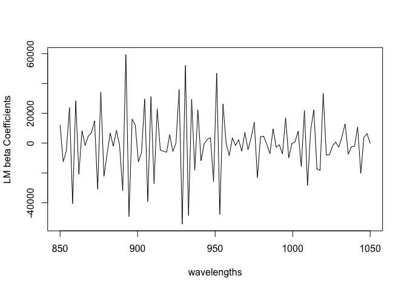
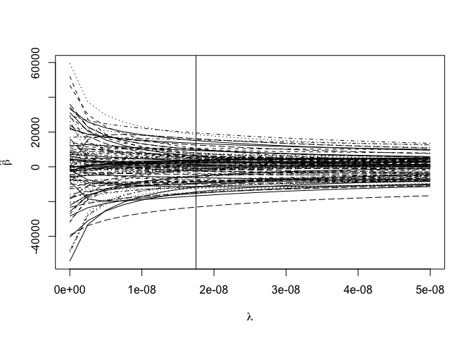
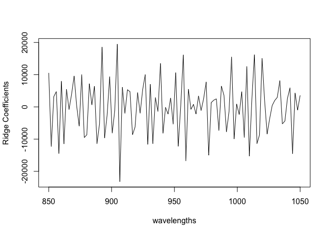
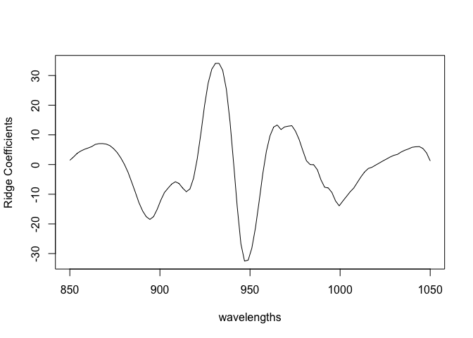
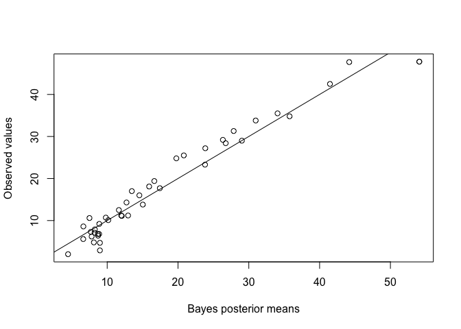
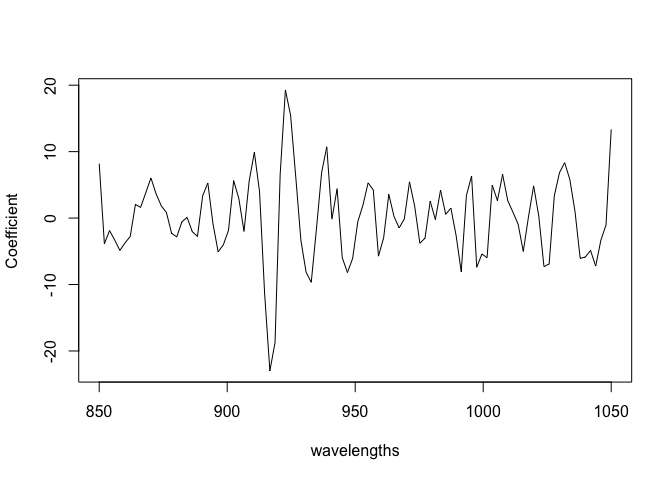
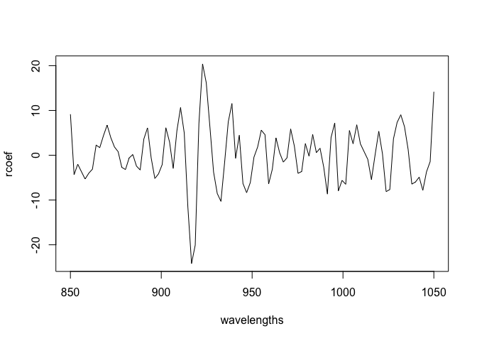

INLA for ridge regression
================
[Julian Faraway](https://julianfaraway.github.io/)
21 September 2020

See the [introduction](index.md) for an overview. Load the packages:

``` r
library(INLA)
library(faraway)
library(brinla)
```

## Data

Data come from the `faraway` package. The help page reads:

A Tecator Infratec Food and Feed Analyzer working in the wavelength
range 850 - 1050 nm by the Near Infrared Transmission (NIT) principle
was used to collect data on samples of finely chopped pure meat. 215
samples were measured. For each sample, the fat content was measured
along with a 100 channel spectrum of absorbances. Since determining the
fat content via analytical chemistry is time consuming we would like to
build a model to predict the fat content of new samples using the 100
absorbances which can be measured more easily.

Dataset contains the following variables

  - ‘V1-V100’ absorbances across a range of 100 wavelengths
  - ‘fat’ fat content

We split the data into a training set with the first 172 observations
and the remainder going into a test set:

``` r
data(meatspec, package="faraway")
trainmeat <- meatspec[1:172,]
testmeat <- meatspec[173:215,]
wavelengths <- seq(850, 1050, length=100)
```

## Linear regression

How well does linear regression predict the training set?:

``` r
modlm <- lm(fat ~ ., trainmeat)
summary(modlm)$r.squared
```

    [1] 0.99702

``` r
rmse <- function(x,y) sqrt(mean((x-y)^2))
rmse(fitted(modlm), trainmeat$fat)
```

    [1] 0.69032

But the fit to the test set:

``` r
rmse(predict(modlm,testmeat), testmeat$fat)
```

    [1] 3.814

is much worse indicating overfitting on the training set.

We can plot the coefficients.

``` r
plot(wavelengths,coef(modlm)[-1], type="l",ylab="LM beta Coefficients")
```

<!-- -->

There is a lot of variation. We expect some smoothness because the
effect on the response should vary continuously with the wavelength.

## Standard ridge regression

Use ridge regression from the `MASS` library. We use GCV to select
lambda which controls the shrinkage:

``` r
require(MASS)
rgmod <- lm.ridge(fat ~ ., trainmeat, lambda = seq(0, 5e-8, len=21))
which.min(rgmod$GCV)
```

    1.75e-08 
           8 

``` r
matplot(rgmod$lambda, coef(rgmod), type="l", xlab=expression(lambda),ylab=expression(hat(beta)),col=1)
abline(v=1.75e-08)
```

<!-- -->

Check the predictive performance:

``` r
ypred <- cbind(1,as.matrix(trainmeat[,-101])) %*% coef(rgmod)[8,]
rmse(ypred, trainmeat$fat)
```

    [1] 0.80244

``` r
ypred <- cbind(1,as.matrix(testmeat[,-101])) %*% coef(rgmod)[8,]
rmse(ypred, testmeat$fat)
```

    [1] 4.1011

The performance on the training set is slightly worse than LM as we
would expect. The test set performance is also worse which is a
disappointment (we would expect some improvement).

We can plot the coefficients:

``` r
plot(wavelengths,coef(rgmod)[8,-1],type="l",ylab="Ridge Coefficients")
```

<!-- -->

Still quite rough (although amplitude is less) than in the LM case.

## Bayes linear regression

We can use informative priors on beta *Y=X beta + epsilon* to control
the variation in these coefficients.

INLA does not like `fat ~ .` as a formula. It expects us to spell out
the predictors. We can take this from the previous linear model. Also we
want to make predictions for the test set so we create a data frame
where all the test responses are missing.

``` r
metab <- meatspec
testfat <- metab$fat[173:215]
metab$fat[173:215] <- NA
blrmod <- inla(formula(modlm), family="gaussian", data=metab, control.predictor = list(compute=TRUE))
```

Check the first few coefficients:

``` r
bcoef <- blrmod$summary.fixed[-1,1]
head(bcoef)
```

    [1] 1.4547 2.5114 3.7693 4.5443 5.1316 5.5611

compared with the linear model coefficients:

``` r
head(coef(modlm)[-1])
```

``` 
      V1       V2       V3       V4       V5       V6 
 12134.1 -12585.9  -5107.6  23880.5 -40509.6  28469.4 
```

Can see that the default prior on the betas is having some success in
avoiding extreme values. The default precision on the coefficients is
0.001 which corresponds to an SD of about 30.

Plot the coefficients

``` r
plot(wavelengths,bcoef,type="l",ylab="Ridge Coefficients")
```

<!-- -->

Quite smooth. Even without doing ridge calculations, we get some
smoothing effect.

See how well the test values are predicted:

``` r
predb <- blrmod$summary.fitted.values[173:215,1]
plot(predb, testmeat$fat, xlab="Bayes posterior means", ylab="Observed values")
abline(0,1)
```

<!-- -->

``` r
rmse(predb, testmeat$fat)
```

    [1] 2.7524

This is a much better result than the standard lm or ridge RMSEs.

Try it with less informative priors:

``` r
blrmodu <- inla(formula(modlm), family="gaussian", data=metab, control.fixed=list(mean=0,prec=1e-5), control.predictor = list(compute=TRUE))
bcoef <- blrmodu$summary.fixed[-1,1]
plot(wavelengths,bcoef,type="l",ylab="Ridge Coefficients")
```

<!-- -->

The coefficients vary more.

``` r
predb <- blrmodu$summary.fitted.values[173:215,1]
rmse(predb, testmeat$fat)
```

    [1] 2.2985

The result is the best so far. We could experiment with different
precisions on the fixed effect priors to get better predictions, but a
more principled approach is preferred.

## Ridge Regression using Bayes

Consider a ridge regression as a mixed model: *y = X beta + Z b + e*
where beta are the fixed effects, being just the intercept in this
example. The *b* are random effects for the coefficients of predictors.
X is just a column of ones while the Z matrix contains the original
predictors.

``` r
n <- nrow(meatspec)
X <- matrix(1,nrow = n, ncol= 1)
Z <- as.matrix(meatspec[,-101]) 
y <- meatspec$fat
y[173:215] <- NA
scaley <- 100
formula <- y ~ -1 + X +  f(idx.Z, model="z", Z=Z)
zmod <- inla(formula, data = list(y=y/scaley, idx.Z = 1:n, X=X), control.predictor = list(compute=TRUE))  
```

Check the predictive performance:

``` r
predb <- zmod$summary.fitted.values[173:215,1]*scaley
rmse(predb, testmeat$fat)
```

    [1] 1.9024

This is the best so far. Now make a plot of the coefficients:

``` r
rcoef <- zmod$summary.random$idx.Z[216:315,2]
plot(wavelengths, rcoef, type="l", ylab="Coefficient")
```

<!-- -->

These are moderately rough. Look at the hyperparameters:

``` r
bri.hyperpar.summary(zmod)
```

``` 
                                      mean        sd   q0.025      q0.5    q0.975      mode
SD for the Gaussian observations  0.018336 0.0017113 0.015467  0.018148  0.022149  0.017643
SD for idx.Z                     12.122040 4.1742774 5.669938 11.555983 21.878777 10.439970
```

We see that the SD of the random effects is quite large which is related
to the rough appearance of the coefficients. There is just one fixed
effect:

``` r
zmod$summary.fixed
```

``` 
      mean      sd 0.025quant 0.5quant 0.975quant     mode        kld
X 0.087715 0.02475   0.039659 0.087508     0.1369 0.087095 1.4329e-05
```

# A-matrix approach

A similar exposition is based on [material from INLA
website](https://www.math.ntnu.no/inla/r-inla.org/examples/stacks/stacks2.R)

In this approach, we treat X as a random effect so we need an index for
use in the model. There is just one X random effect but 100 Z random
effects. The indices are NA for the components they do not represent.

``` r
pX = ncol(X); pZ = ncol(Z)
idx.X = c(1:pX, rep(NA, pZ))
idx.Z = c(rep(NA,pX), 1:pZ)
```

or

``` r
idx.X <- c(1, rep(NA,100))
idx.Z <- c(NA, 1:100)
```

We set some priors

``` r
hyper.fixed = list(prec = list(initial = log(1.0e-9), fixed=TRUE))
param.data = list(prec = list(param = c(1.0e-3, 1.0e-3)))
param.Z <- list(prec = list(param = c(1.0e-3, 1.0e-3)))
```

We need two `f()` terms. The single X effect is given a fixed very small
precision while the 100 Z effects have a standard gamma prior for their
precision. The fitting process works better if we scale down the
response.

``` r
scaley = 100
formula = y ~ -1 + f(idx.X,  model="iid", hyper = hyper.fixed) + f(idx.Z,  model="iid", hyper = param.Z)
amod = inla(formula, data = list(y=y/scaley, idx.X=idx.X, idx.Z=idx.Z), control.predictor = list(A=cbind(X, Z),compute=TRUE), control.family = list(hyper = param.data))
```

Check out the predictive performance:

``` r
predb <- amod$summary.fitted.values[173:215,1]
rmse(predb, testmeat$fat/scaley)*scaley
```

    [1] 1.9012

A very similar result to the previous approach.

Make a plot of the coefficients:

``` r
rcoef <- amod$summary.random$idx.Z[,2]
plot(wavelengths, rcoef, type="l")
```

<!-- -->

Again, similar to the previous approach.
