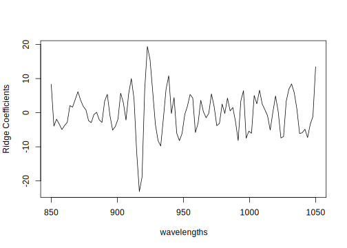

Bayesian Regression Modeling with INLA
================
Chapter Five: Linear Mixed Models
2022-02-14

-   [Single Random Effect](#single-random-effect)
-   [Longitudinal Data](#longitudinal-data)
-   [Prediction](#prediction)
-   [Classical Z-matrix Model](#classical-z-matrix-model)
-   [Generalized Linear Mixed Models](#generalized-linear-mixed-models)
-   [Poisson GLMM](#poisson-glmm)
-   [Binary GLMM](#binary-glmm)

Code from [Bayesian Regression Modeling with
INLA](http://julianfaraway.github.io/brinla/)

Throughout you will see small differences from the output in the
published book. Some of this is due to random number generation and some
due to minor changes in algorithms.

# Single Random Effect

``` r
data(reeds, package="brinla")
summary(reeds)
```

     site     nitrogen   
     A:5   Min.   :2.35  
     B:5   1st Qu.:2.62  
     C:5   Median :3.06  
           Mean   :3.03  
           3rd Qu.:3.27  
           Max.   :3.93  

``` r
library(lme4)
mmod <- lmer(nitrogen ~ 1+(1|site), reeds)
summary(mmod)
```

    Linear mixed model fit by REML ['lmerMod']
    Formula: nitrogen ~ 1 + (1 | site)
       Data: reeds

    REML criterion at convergence: 13

    Scaled residuals: 
       Min     1Q Median     3Q    Max 
    -1.221 -0.754 -0.263  0.914  1.612 

    Random effects:
     Groups   Name        Variance Std.Dev.
     site     (Intercept) 0.1872   0.433   
     Residual             0.0855   0.292   
    Number of obs: 15, groups:  site, 3

    Fixed effects:
                Estimate Std. Error t value
    (Intercept)    3.029      0.261    11.6

``` r
library(INLA); library(brinla)
formula <- nitrogen ~ 1 + f(site, model="iid")
imod <- inla(formula,family="gaussian", data = reeds)
summary(imod)
```


    Call:
       c("inla.core(formula = formula, family = family, contrasts = contrasts, ", " data = data, quantiles = 
       quantiles, E = E, offset = offset, ", " scale = scale, weights = weights, Ntrials = Ntrials, strata = 
       strata, ", " lp.scale = lp.scale, link.covariates = link.covariates, verbose = verbose, ", " lincomb = 
       lincomb, selection = selection, control.compute = control.compute, ", " control.predictor = 
       control.predictor, control.family = control.family, ", " control.inla = control.inla, control.fixed = 
       control.fixed, ", " control.mode = control.mode, control.expert = control.expert, ", " control.hazard = 
       control.hazard, control.lincomb = control.lincomb, ", " control.update = control.update, control.lp.scale = 
       control.lp.scale, ", " control.pardiso = control.pardiso, only.hyperparam = only.hyperparam, ", " inla.call 
       = inla.call, inla.arg = inla.arg, num.threads = num.threads, ", " blas.num.threads = blas.num.threads, keep 
       = keep, working.directory = working.directory, ", " silent = silent, inla.mode = inla.mode, safe = FALSE, 
       debug = debug, ", " .parent.frame = .parent.frame)") 
    Time used:
        Pre = 2.04, Running = 3.3, Post = 0.0203, Total = 5.36 
    Fixed effects:
                 mean    sd 0.025quant 0.5quant 0.975quant  mode   kld
    (Intercept) 3.029 0.135      2.764    3.029      3.294 3.029 0.002

    Random effects:
      Name    Model
        site IID model

    Model hyperparameters:
                                             mean    sd 0.025quant 0.5quant 0.975quant  mode
    Precision for the Gaussian observations 13.25  5.20       5.47    12.49      25.60 10.94
    Precision for site                      20.38 25.18       1.94    12.82      84.91  5.10

    Marginal log-Likelihood:  -20.88 
    Posterior summaries for the linear predictor and the fitted values are computed
    (Posterior marginals needs also 'control.compute=list(return.marginals.predictor=TRUE)')

fixed effects sd and quantiles differ noticeably from the printed book

``` r
invsqrt <- function(x) 1/sqrt(x)
sdt <- invsqrt(imod$summary.hyperpar[,-2])
row.names(sdt) <- c("SD of epsilson","SD of site")
sdt
```

                      mean 0.025quant 0.5quant 0.975quant    mode
    SD of epsilson 0.27472    0.42761  0.28296    0.19766 0.30238
    SD of site     0.22151    0.71878  0.27927    0.10852 0.44290

``` r
prec.site <- imod$marginals.hyperpar$"Precision for site"
prec.epsilon <- imod$marginals.hyperpar$"Precision for the Gaussian observations"
c(epsilon=inla.emarginal(invsqrt,prec.epsilon),
  site=inla.emarginal(invsqrt,prec.site))
```

    epsilon    site 
    0.29088 0.31337 

``` r
sigma.site <- inla.tmarginal(invsqrt, prec.site)
sigma.epsilon <- inla.tmarginal(invsqrt, prec.epsilon)
c(epsilon=inla.mmarginal(sigma.epsilon),
  site=inla.mmarginal(sigma.site))
```

    epsilon    site 
    0.26650 0.22162 

This function removed from INLA `inla.contrib.sd()`

``` r
sampvars <- 1/inla.hyperpar.sample(1000,imod)
sampicc <- sampvars[,2]/(rowSums(sampvars))
quantile(sampicc, c(0.025,0.5,0.975))
```

        2.5%      50%    97.5% 
    0.092515 0.481868 0.893400 

``` r
bri.hyperpar.summary(imod)
```

                                        mean       sd  q0.025    q0.5  q0.975    mode
    SD for the Gaussian observations 0.29081 0.058354 0.19816 0.28286 0.42616 0.26649
    SD for site                      0.31296 0.157333 0.10882 0.27894 0.71333 0.22162

``` r
alpha <- data.frame(imod$marginals.fixed[[1]])
library(ggplot2)
```

``` r
ggplot(alpha, aes(x,y)) + geom_line() + geom_vline(xintercept = c(2.66, 3.40)) +
       xlim(2,4)+xlab("nitrogen")+ylab("density")
```

<!-- -->

``` r
x <- seq(0,1,len=100)
d1 <- inla.dmarginal(x,sigma.site)
d2 <- inla.dmarginal(x,sigma.epsilon)
rdf <- data.frame(nitrogen=c(x,x),sigma=gl(2,100,
       labels=c("site","epsilon")),density=c(d1,d2))
```

``` r
ggplot(rdf, aes(x=nitrogen, y=density, linetype=sigma))+geom_line()
```

<!-- -->

``` r
bri.hyperpar.plot(imod)
```

<!-- -->

``` r
sdres <- sd(reeds$nitrogen)
pcprior <- list(prec = list(prior="pc.prec", param = c(3*sdres,0.01)))
formula <- nitrogen ~ f(site, model="iid", hyper = pcprior)
pmod <- inla(formula, family="gaussian", data=reeds)
pmod$summary.fixed
```

                  mean      sd 0.025quant 0.5quant 0.975quant   mode        kld
    (Intercept) 3.0293 0.30275     2.4096   3.0293     3.6493 3.0293 0.00020749

``` r
bri.hyperpar.summary(pmod)
```

                                        mean       sd  q0.025    q0.5  q0.975    mode
    SD for the Gaussian observations 0.28651 0.055539 0.19791 0.27907 0.41495 0.26360
    SD for site                      0.46571 0.219755 0.18219 0.41684 1.02754 0.33849

``` r
bri.hyperpar.plot(pmod)
```

<!-- -->

``` r
(lambda <- 3*sdres/tan(pi*0.99/2))
```

    [1] 0.022066

``` r
halfcauchy <- "expression:
              lambda = 0.022;
              precision = exp(log_precision);
              logdens = -1.5*log_precision-log(pi*lambda)-
                        log(1+1/(precision*lambda^2));
              log_jacobian = log_precision;
              return(logdens+log_jacobian);"
hcprior <- list(prec = list(prior = halfcauchy))
formula <- nitrogen ~ f(site, model="iid", hyper = hcprior)
hmod <- inla(formula, family="gaussian", data=reeds)
bri.hyperpar.summary(hmod)
```

                                        mean       sd  q0.025   q0.5  q0.975    mode
    SD for the Gaussian observations 0.28766 0.056201 0.19809 0.2801 0.41771 0.26444
    SD for site                      0.42323 0.231608 0.14703 0.3655 1.03005 0.28064

``` r
reff <- pmod$marginals.random
x <- seq(-1.5,1.5,len=100)
d1 <- inla.dmarginal(x, reff$site[[1]])
d2 <- inla.dmarginal(x, reff$site[[2]])
d3 <- inla.dmarginal(x, reff$site[[3]])
rdf <- data.frame(nitrogen=x,density=c(d1,d2,d3),site=gl(3,100,
                  labels=LETTERS[1:4]))
```

``` r
ggplot(rdf, aes(x=nitrogen, y=density, linetype=site))+geom_line()
```

<!-- -->

``` r
bri.random.plot(pmod)
```

<!-- -->

``` r
sdres <- sd(reeds$nitrogen)
pcprior <- list(prec = list(prior="pc.prec", param = c(3*sdres,0.01)))
formula <- nitrogen ~ f(site, model="iid", hyper = pcprior)
pmod <- inla(formula, family="gaussian", data=reeds, 
        control.compute=list(config = TRUE))
psamp <- inla.posterior.sample(n=1000, pmod)
psamp[[1]]
```

    $hyperpar
    Precision for the Gaussian observations                      Precision for site 
                                    10.4019                                  3.2077 

    $latent
                  sample:1
    Predictor:1    2.93752
    Predictor:2    2.93628
    Predictor:3    2.93714
    Predictor:4    2.93756
    Predictor:5    2.93618
    Predictor:6    2.59984
    Predictor:7    2.59954
    Predictor:8    2.60067
    Predictor:9    2.59860
    Predictor:10   2.59862
    Predictor:11   3.46623
    Predictor:12   3.46567
    Predictor:13   3.46595
    Predictor:14   3.46527
    Predictor:15   3.46755
    site:1        -0.78755
    site:2        -1.12402
    site:3        -0.25749
    (Intercept):1  3.72398

    $logdens
    $logdens$hyperpar
    [1] -5.0516

    $logdens$latent
    [1] 85.127

    $logdens$joint
    [1] 80.075

``` r
lvsamp <- t(sapply(psamp, function(x) x$latent))
colnames(lvsamp) <- row.names(psamp[[1]]$latent)
mean(lvsamp[,'site:3'] > lvsamp[,'site:1'])
```

    [1] 0.994

# Longitudinal Data

``` r
data(reading, package="brinla")
```

``` r
ggplot(reading, aes(agegrp, piat, group=id)) + geom_line()
```

<!-- -->

``` r
library(lme4)
lmod <- lmer(piat ~ agegrp + (1|id), reading)
summary(lmod)
```

    Linear mixed model fit by REML ['lmerMod']
    Formula: piat ~ agegrp + (1 | id)
       Data: reading

    REML criterion at convergence: 1868.7

    Scaled residuals: 
       Min     1Q Median     3Q    Max 
    -1.946 -0.595 -0.028  0.507  2.868 

    Random effects:
     Groups   Name        Variance Std.Dev.
     id       (Intercept) 29.8     5.46    
     Residual             44.9     6.70    
    Number of obs: 267, groups:  id, 89

    Fixed effects:
                Estimate Std. Error t value
    (Intercept)  -11.538      2.249   -5.13
    agegrp         5.031      0.251   20.04

    Correlation of Fixed Effects:
           (Intr)
    agegrp -0.949

``` r
formula <- piat ~ agegrp + f(id, model="iid")
imod <- inla(formula, family="gaussian", data=reading)
imod$summary.fixed
```

                    mean      sd 0.025quant 0.5quant 0.975quant     mode        kld
    (Intercept) -11.5352 2.25851    -15.974 -11.5353    -7.1004 -11.5352 9.1184e-07
    agegrp        5.0306 0.25262      4.534   5.0306     5.5267   5.0306 1.1005e-06

``` r
bri.hyperpar.summary(imod)
```

                                       mean      sd q0.025   q0.5 q0.975   mode
    SD for the Gaussian observations 6.7099 0.35848 6.0453 6.6946 7.4522 6.6571
    SD for id                        5.2914 0.62877 4.1360 5.2652 6.6006 5.2270

``` r
bri.hyperpar.plot(imod)
```

<!-- -->

``` r
summary(imod$summary.random$id$mean)
```

       Min. 1st Qu.  Median    Mean 3rd Qu.    Max. 
     -7.885  -2.940  -0.145   0.000   2.650  14.045 

``` r
bri.random.plot(imod)
```

<!-- -->

``` r
reading$cagegrp <- reading$agegrp - 8.5
lmod <- lmer(piat ~ cagegrp + (cagegrp|id), reading)
summary(lmod)
```

    Linear mixed model fit by REML ['lmerMod']
    Formula: piat ~ cagegrp + (cagegrp | id)
       Data: reading

    REML criterion at convergence: 1819.8

    Scaled residuals: 
       Min     1Q Median     3Q    Max 
    -2.654 -0.541 -0.150  0.385  3.281 

    Random effects:
     Groups   Name        Variance Std.Dev. Corr
     id       (Intercept) 35.73    5.98         
              cagegrp      4.49    2.12     0.83
     Residual             27.04    5.20         
    Number of obs: 267, groups:  id, 89

    Fixed effects:
                Estimate Std. Error t value
    (Intercept)   31.225      0.709    44.0
    cagegrp        5.031      0.297    16.9

    Correlation of Fixed Effects:
            (Intr)
    cagegrp 0.563 

``` r
nid <- length(levels(reading$id))
reading$numid <- as.numeric(reading$id)
reading$slopeid <- reading$numid + nid
formula <- piat ~ cagegrp + f(numid, model="iid2d", n = 2*nid) + 
           f(slopeid, cagegrp, copy="numid")
imod <- inla(formula, family="gaussian", data=reading)
imod$summary.fixed
```

                   mean      sd 0.025quant 0.5quant 0.975quant    mode        kld
    (Intercept) 31.2241 0.69762    29.8513  31.2241    32.5955 31.2241 4.6720e-13
    cagegrp      5.0305 0.29278     4.4544   5.0305     5.6059  5.0305 5.0772e-13

``` r
bri.hyperpar.summary(imod)
```

                                        mean       sd  q0.025   q0.5  q0.975   mode
    SD for the Gaussian observations 5.51434 0.309389 4.93679 5.5029 6.15115 5.4791
    SD for numid (component 1)       5.69892 0.557380 4.67939 5.6721 6.86592 5.6211
    SD for numid (component 2)       1.92303 0.258780 1.45763 1.9084 2.47189 1.8817
    Rho1:2 for numid                 0.94377 0.049309 0.81009 0.9584 0.98764 0.9752

``` r
postmean <- matrix(imod$summary.random$numid[,2],nid,2)
postmean <- sweep(postmean,2,imod$summary.fixed$mean,"+")
```

``` r
p <- ggplot(reading, aes(cagegrp, piat, group=id)) + 
     geom_line(color="grey85") + xlab("centered age")
p+geom_abline(intercept=postmean[,1],slope=postmean[,2])
```

<!-- -->

``` r
library(gridExtra)
sd.epsilon <- bri.hyper.sd(imod$internal.marginals.hyperpar[[1]],
              internal=TRUE)
sd.intercept <- bri.hyper.sd(imod$internal.marginals.hyperpar[[2]],
                internal=TRUE)
sd.slope <- bri.hyper.sd(imod$internal.marginals.hyperpar[[3]],
            internal=TRUE)
p1 <- ggplot(data.frame(sd.epsilon),aes(x,y))+geom_line()+
      ggtitle("Epsilon")+xlab("piat")+ylab("density")
p2 <- ggplot(data.frame(sd.intercept),aes(x,y))+geom_line()+
      ggtitle("Intercept")+xlab("piat")+ylab("density")
p3 <- ggplot(data.frame(sd.slope),aes(x,y))+geom_line()+
      ggtitle("Slope")+xlab("piat")+ylab("density")
p4 <- ggplot(data.frame(imod$marginals.hyperpar[[4]]),aes(x,y))+
      geom_line()+ggtitle("Rho")+ylab("density")
```

``` r
grid.arrange(p1,p2,p3,p4,ncol=2)
```

<!-- -->

``` r
bri.hyperpar.plot(imod, together=FALSE)
```

<!-- -->

``` r
formula <- log(piat) ~ cagegrp + f(numid, model="iid2d", n = 2*nid) + 
           f(slopeid, cagegrp, copy="numid")
imod <- inla(formula, family="gaussian", data=reading)
bri.density.summary(imod$marginals.hyperpar[[4]])
```

         mean        sd    q0.025      q0.5    q0.975      mode 
     0.058865  0.112103 -0.160797  0.058633  0.276842  0.057839 

# Prediction

``` r
data(reading, package="brinla")
reading$id <- as.numeric(reading$id)
newsub <- data.frame(id=90, agegrp = c(6.5,8.5,10.5), 
          piat=c(18, 25, NA))
nreading <- rbind(reading, newsub)
formula <- piat ~ agegrp + f(id, model="iid")
```

`control.compute` option added to ensure marginals are computed

``` r
imod <- inla(formula, family="gaussian", data=nreading, 
        control.predictor = list(compute=TRUE),
        control.compute=list(return.marginals.predictor=TRUE))
pm90 <- imod$marginals.fitted.values[[270]]
p1 <- ggplot(data.frame(pm90),aes(x,y))+geom_line()+xlim(c(20,60))
newsub=data.frame(id=90, agegrp = c(6.5,8.5,10.5), piat=c(NA, NA, NA))
nreading <- rbind(reading, newsub)
formula <- piat ~ agegrp + f(id, model="iid")
```

`control.compute` option added to ensure marginals are computed

``` r
imodq <- inla(formula, family="gaussian", data=nreading, 
              control.predictor = list(compute=TRUE),
              control.compute=list(return.marginals.predictor=TRUE))
qm90 <- imodq$marginals.fitted.values[[270]]
# error here
```

``` r
p1+geom_line(data=data.frame(qm90),aes(x,y),linetype=2)+
   xlab("PIAT")+ylab("density")
```

<!-- -->

``` r
nsamp <- 10000
randprec <- inla.hyperpar.sample(nsamp, imod)[,1]
neweps <- rnorm(nsamp, mean=0, sd=1/sqrt(randprec))
newobs <- inla.rmarginal(nsamp, pm90) + neweps
dens <- density(newobs)
```

``` r
p1 + geom_line(data=data.frame(x=dens$x,y=dens$y),aes(x,y),linetype=2)
```

<!-- -->

# Classical Z-matrix Model

``` r
library(lme4)
mmod <- lmer(nitrogen ~ 1+(1|site), reeds)
Z <- getME(mmod, "Z")
X <- getME(mmod, "X")
n <- nrow(reeds)
formula <- y ~ -1 + X +  f(id.z, model="z",  Z=Z)
imodZ <- inla(formula, data = list(y=reeds$nitrogen, id.z = 1:n, X=X))
bri.hyperpar.summary(imodZ)
```

                                        mean       sd  q0.025    q0.5  q0.975    mode
    SD for the Gaussian observations 0.29081 0.058337 0.19818 0.28286 0.42612 0.26650
    SD for id.z                      0.31307 0.157406 0.10892 0.27901 0.71370 0.22167

``` r
imodZ$summary.random
```

    $id.z
       ID       mean       sd 0.025quant    0.5quant 0.975quant        mode        kld
    1   1 -0.0038920 0.079222  -0.196922  6.4720e-05   0.144042 -0.00013002 0.02168782
    2   2 -0.0038925 0.079222  -0.196923  6.4265e-05   0.144041 -0.00013048 0.02168784
    3   3 -0.0038874 0.079221  -0.196913  6.8469e-05   0.144051 -0.00012630 0.02168777
    4   4 -0.0038959 0.079222  -0.196930  6.1539e-05   0.144034 -0.00013318 0.02168790
    5   5 -0.0038869 0.079221  -0.196912  6.8810e-05   0.144052 -0.00012596 0.02168775
    6   6 -0.0582026 0.152650  -0.548170 -4.9058e-03   0.026597 -0.00171605 0.00074450
    7   7 -0.0582111 0.152654  -0.548189 -4.9117e-03   0.026593 -0.00172170 0.00074507
    8   8 -0.0582120 0.152655  -0.548191 -4.9123e-03   0.026592 -0.00172231 0.00074513
    9   9 -0.0582144 0.152656  -0.548197 -4.9140e-03   0.026591 -0.00172391 0.00074529
    10 10 -0.0582157 0.152657  -0.548200 -4.9148e-03   0.026590 -0.00172476 0.00074538
    11 11  0.0719061 0.170315  -0.031754  8.1997e-03   0.599670  0.00265317 0.00827647
    12 12  0.0719027 0.170313  -0.031756  8.1974e-03   0.599662  0.00265097 0.00827555
    13 13  0.0719159 0.170320  -0.031748  8.2063e-03   0.599690  0.00265953 0.00827913
    14 14  0.0719123 0.170318  -0.031750  8.2039e-03   0.599683  0.00265721 0.00827815
    15 15  0.0719018 0.170313  -0.031756  8.1968e-03   0.599660  0.00265036 0.00827529
    16 16 -0.0038912 0.079298  -0.197231  8.0282e-05   0.144345 -0.00014719 0.02136214
    17 17 -0.0590015 0.153574  -0.550537 -4.9573e-03   0.026682 -0.00170338 0.00105403
    18 18  0.0731154 0.171520  -0.031806  8.3596e-03   0.602349  0.00265821 0.00990181

``` r
data(meatspec, package="brinla")
trainmeat <- meatspec[1:172,]
testmeat <- meatspec[173:215,]
wavelengths <- seq(850, 1050, length=100)
modlm <- lm(fat ~ ., trainmeat)
rmse <- function(x,y) sqrt(mean((x-y)^2))
rmse(predict(modlm,testmeat), testmeat$fat)
```

    [1] 3.814

``` r
plot(wavelengths,coef(modlm)[-1], type="l",ylab="LM Coefficients")
```

<!-- -->

``` r
n <- nrow(meatspec)
X <- matrix(1,nrow = n, ncol= 1)
Z <- as.matrix(meatspec[,-101])
y <- meatspec$fat
y[173:215] <- NA
scaley <- 100
formula <- y ~ -1 + X +  f(idx.Z, model="z", Z=Z)
zmod <- inla(formula, data = list(y=y/scaley, idx.Z = 1:n, X=X), control.predictor = list(compute=TRUE))
predb <- zmod$summary.fitted.values[173:215,1]*scaley
rmse(predb, testmeat$fat)
```

    [1] 1.902

``` r
rcoef <- zmod$summary.random$idx.Z[216:315,2]
```

``` r
plot(wavelengths, rcoef, type="l", ylab="Ridge Coefficients")
```

<!-- -->

``` r
int.fixed <- list(prec = list(initial = log(1.0e-9), fixed=TRUE))
u.prec <- list(prec = list(param = c(1.0e-3, 1.0e-3)))
epsilon.prec <- list(prec = list(param = c(1.0e-3, 1.0e-3)))
idx.X <- c(1, rep(NA,100))
idx.Z <- c(NA, 1:100)
scaley <- 100
formula <- y ~ -1 + f(idx.X,  model="iid", hyper = int.fixed) + f(idx.Z,  model="iid", hyper = u.prec)
amod <- inla(formula, data = list(y=y/scaley, idx.X=idx.X, idx.Z=idx.Z), 
        control.predictor = list(A=cbind(X, Z),compute=TRUE), 
        control.family = list(hyper = epsilon.prec))
predb <- amod$summary.fitted.values[173:215,1]
rmse(predb, testmeat$fat/scaley)*scaley
```

    [1] 1.9017

# Generalized Linear Mixed Models

# Poisson GLMM

``` r
data(nitrofen, package="boot")
head(nitrofen)
```

      conc brood1 brood2 brood3 total
    1    0      3     14     10    27
    2    0      5     12     15    32
    3    0      6     11     17    34
    4    0      6     12     15    33
    5    0      6     15     15    36
    6    0      5     14     15    34

``` r
library(dplyr)
library(tidyr)
lnitrofen <- select(nitrofen, -total) %>% 
             mutate(id=1:nrow(nitrofen)) %>% 
             gather(brood,live,-conc,-id) %>% 
             arrange(id)
lnitrofen$brood <- factor(lnitrofen$brood,labels=1:3)
head(lnitrofen)
```

      conc id brood live
    1    0  1     1    3
    2    0  1     2   14
    3    0  1     3   10
    4    0  2     1    5
    5    0  2     2   12
    6    0  2     3   15

``` r
lnitrofen$jconc <- lnitrofen$conc + rep(c(-10,0,10),50)
```

``` r
ggplot(lnitrofen, aes(x=jconc,y=live, shape=brood)) + 
       geom_point(position = position_jitter(w = 0, h = 0.5)) + 
       xlab("Concentration")
```

<!-- -->

``` r
library(lme4)
glmod <- glmer(live ~ I(conc/300)*brood + (1|id), nAGQ=25, 
         family=poisson, data=lnitrofen)
summary(glmod)
```

    Generalized linear mixed model fit by maximum likelihood (Adaptive Gauss-Hermite Quadrature, nAGQ = 25) ['glmerMod']
     Family: poisson  ( log )
    Formula: live ~ I(conc/300) * brood + (1 | id)
       Data: lnitrofen

         AIC      BIC   logLik deviance df.resid 
       313.9    335.0   -150.0    299.9      143 

    Scaled residuals: 
       Min     1Q Median     3Q    Max 
    -2.208 -0.606 -0.008  0.618  3.565 

    Random effects:
     Groups Name        Variance Std.Dev.
     id     (Intercept) 0.0911   0.302   
    Number of obs: 150, groups:  id, 50

    Fixed effects:
                       Estimate Std. Error z value Pr(>|z|)
    (Intercept)          1.6386     0.1367   11.99  < 2e-16
    I(conc/300)         -0.0437     0.2193   -0.20     0.84
    brood2               1.1688     0.1377    8.48  < 2e-16
    brood3               1.3512     0.1351   10.00  < 2e-16
    I(conc/300):brood2  -1.6730     0.2487   -6.73  1.7e-11
    I(conc/300):brood3  -1.8312     0.2451   -7.47  7.9e-14

    Correlation of Fixed Effects:
                (Intr) I(c/300) brood2 brood3 I(/300):2
    I(conc/300) -0.831                                 
    brood2      -0.700  0.576                          
    brood3      -0.714  0.587    0.735                 
    I(cn/300):2  0.529 -0.609   -0.804 -0.571          
    I(cn/300):3  0.538 -0.617   -0.569 -0.804  0.613   

``` r
formula <- live ~ I(conc/300)*brood + f(id, model="iid")
imod <- inla(formula, family="poisson", data=lnitrofen)
imod$summary.fixed
```

                            mean      sd 0.025quant  0.5quant 0.975quant      mode        kld
    (Intercept)         1.639526 0.13603    1.36760  1.641087    1.90265  1.644245 1.1145e-07
    I(conc/300)        -0.041657 0.21793   -0.47300 -0.040736    0.38409 -0.038949 7.7332e-07
    brood2              1.163995 0.13760    0.89794  1.162635    1.43778  1.159942 1.2728e-06
    brood3              1.346183 0.13498    1.08569  1.344691    1.61526  1.341734 1.9684e-06
    I(conc/300):brood2 -1.663827 0.24833   -2.15579 -1.662325   -1.18060 -1.659304 1.3591e-06
    I(conc/300):brood3 -1.821182 0.24479   -2.30639 -1.819607   -1.34509 -1.816441 2.1791e-06

``` r
bri.hyperpar.summary(imod)
```

                 mean       sd  q0.025    q0.5  q0.975   mode
    SD for id 0.29334 0.057514 0.18807 0.29033 0.41496 0.2845

``` r
library(reshape2)
mf <- melt(imod$marginals.fixed)
cf <- spread(mf,Var2,value)
names(cf)[2] <- 'parameter'
```

``` r
ggplot(cf,aes(x=x,y=y)) + geom_line()+facet_wrap(~ parameter, 
       scales="free") + geom_vline(xintercept=0) + ylab("density")
```

<!-- -->

``` r
bri.fixed.plot(imod)
```

<!-- -->

``` r
bri.fixed.plot(imod,together=TRUE)
```

<!-- -->

``` r
multeff <- exp(imod$summary.fixed$mean)
names(multeff) <- imod$names.fixed
multeff[-1]
```

           I(conc/300)             brood2             brood3 I(conc/300):brood2 I(conc/300):brood3 
               0.95920            3.20270            3.84273            0.18941            0.16183 

``` r
sden <- data.frame(bri.hyper.sd(imod$marginals.hyperpar[[1]]))
```

``` r
ggplot(sden,aes(x,y)) + geom_line() + ylab("density") + 
       xlab("linear predictor")
```

<!-- -->

``` r
bri.hyperpar.plot(imod)
```

<!-- -->

``` r
mden <- data.frame(inla.tmarginal(function(x) exp(1/sqrt(x)), 
        imod$marginals.hyperpar[[1]]))
```

``` r
ggplot(mden,aes(x,y)) + geom_line() + ylab("density") + 
       xlab("multiplicative")
```

<!-- -->

``` r
formula <- live ~ I(conc/300)*brood + f(id, model="iid")
imod <- inla(formula, family="poisson", data=lnitrofen, 
        control.compute=list(dic=TRUE))
formula <- live ~ log(conc+1)*brood + f(id, model="iid")
imod2 <- inla(formula, family="poisson", data=lnitrofen, 
         control.compute=list(dic=TRUE))
c(imod$dic$dic,  imod2$dic$dic)
```

    [1] 786.19 841.86

``` r
mreff <- imod$summary.random$id$mean
qqnorm(mreff)
qqline(mreff)
```

<!-- -->

``` r
formula <- live ~ I(conc/300)*brood + f(id, model="iid")
imod <- inla(formula, family="poisson", data=lnitrofen, 
        control.compute=list(cpo=TRUE))
```

``` r
plot(log(imod$cpo$cpo),ylab="log(CPO)")
```

<!-- -->

``` r
lnitrofen[which.min(imod$cpo$cpo),]
```

        conc id brood live jconc
    134  310 45     2   10   310

``` r
lnitrofen %>% filter(brood == 2, conc==310)
```

       conc id brood live jconc
    1   310 41     2    0   310
    2   310 42     2    0   310
    3   310 43     2    0   310
    4   310 44     2    0   310
    5   310 45     2   10   310
    6   310 46     2    0   310
    7   310 47     2    0   310
    8   310 48     2    0   310
    9   310 49     2    0   310
    10  310 50     2    0   310

``` r
pit <- imod$cpo$pit
n <- length(pit)
uniquant <- (1:n)/(n+1)
logit <- function(p) log(p/(1-p))
```

``` r
plot(logit(uniquant), logit(sort(pit)), xlab="uniform quantiles", 
     ylab="Sorted PIT values")
abline(0,1)
```

<!-- -->

``` r
which.max(pit)
```

    [1] 134

``` r
sdu <- 0.3
pcprior <- list(prec = list(prior="pc.prec", param = c(3*sdu,0.01)))
formula <- live ~ I(conc/300)*brood + f(id, model="iid", 
           hyper = pcprior)
imod2 <- inla(formula, family="poisson", data=lnitrofen)
bri.hyperpar.summary(imod2)
```

                 mean      sd q0.025    q0.5  q0.975    mode
    SD for id 0.30965 0.05673 0.2071 0.30633 0.43046 0.30013

``` r
lnitrofen$obsid <- 1:nrow(nitrofen)
formula <- live ~ I(conc/300)*brood + f(id, model="iid") + 
           f(obsid, model="iid")
imodo <- inla(formula, family="poisson", data=lnitrofen)
bri.hyperpar.summary(imodo)
```

                     mean       sd    q0.025      q0.5   q0.975      mode
    SD for id    0.293338 0.056439 0.1950587 0.2892099 0.415804 0.2822650
    SD for obsid 0.010508 0.006448 0.0038655 0.0086309 0.027945 0.0062525

# Binary GLMM

``` r
data(ohio, package="brinla")
table(ohio$smoke)/4
```


      0   1 
    350 187 

``` r
xtabs(resp ~ smoke + age, ohio)/c(350,187)
```

         age
    smoke      -2      -1       0       1
        0 0.16000 0.14857 0.14286 0.10571
        1 0.16578 0.20856 0.18717 0.13904

``` r
library(lme4)
modagh <- glmer(resp ~ age + smoke + (1|id), nAGQ=25, 
          family=binomial, data=ohio)
summary(modagh)
```

    Generalized linear mixed model fit by maximum likelihood (Adaptive Gauss-Hermite Quadrature, nAGQ = 25) ['glmerMod']
     Family: binomial  ( logit )
    Formula: resp ~ age + smoke + (1 | id)
       Data: ohio

         AIC      BIC   logLik deviance df.resid 
      1603.3   1626.0   -797.6   1595.3     2144 

    Scaled residuals: 
       Min     1Q Median     3Q    Max 
    -1.373 -0.201 -0.177 -0.149  2.508 

    Random effects:
     Groups Name        Variance Std.Dev.
     id     (Intercept) 4.69     2.16    
    Number of obs: 2148, groups:  id, 537

    Fixed effects:
                Estimate Std. Error z value Pr(>|z|)
    (Intercept)  -3.1015     0.2191  -14.16   <2e-16
    age          -0.1756     0.0677   -2.60   0.0095
    smoke         0.3986     0.2731    1.46   0.1444

    Correlation of Fixed Effects:
          (Intr) age   
    age    0.244       
    smoke -0.493 -0.008

``` r
formula <- resp ~ age + smoke + f(id, model="iid")
imod <- inla(formula, family="binomial", data=ohio)
imod$summary.fixed
```

                    mean       sd 0.025quant 0.5quant 0.975quant     mode        kld
    (Intercept) -2.99278 0.201997  -3.410824 -2.98483  -2.619234 -2.96843 9.3165e-05
    age         -0.16660 0.062841  -0.290583 -0.16639  -0.043858 -0.16598 8.6609e-07
    smoke        0.39181 0.239510  -0.077427  0.39120   0.863867  0.39003 7.7474e-07

``` r
ilogit <- function(x) exp(x)/(1 + exp(x))
ilogit(imod$summary.fixed[1,c(3,4,5)])
```

                0.025quant 0.5quant 0.975quant
    (Intercept)   0.031959 0.048116   0.067911

``` r
exp(imod$summary.fixed[-1, c(3,4,5)])
```

          0.025quant 0.5quant 0.975quant
    age      0.74783  0.84671    0.95709
    smoke    0.92549  1.47876    2.37232

``` r
bri.hyperpar.summary(imod)
```

                mean      sd q0.025   q0.5 q0.975   mode
    SD for id 1.9249 0.16081 1.6295 1.9184 2.2582 1.9074

``` r
exp(bri.hyperpar.summary(imod)[3:5])
```

    [1] 5.1014 6.8101 9.5655

``` r
table(xtabs(resp ~ id, ohio))
```


      0   1   2   3   4 
    355  97  44  23  18 

``` r
library(gridExtra)
```

``` r
p1 <- ggplot(data.frame(imod$marginals.fixed[[1]]),aes(x,y)) +
      geom_line()+xlab("logit")+ylab("density")+ggtitle("Intercept")
p2 <- ggplot(data.frame(imod$marginals.fixed[[2]]),aes(x,y)) +
      geom_line()+xlab("logit")+ylab("density")+ggtitle("age")
p3 <- ggplot(data.frame(imod$marginals.fixed[[3]]),aes(x,y)) +
      geom_line()+xlab("logit")+ylab("density")+ggtitle("smoke")
sden <- data.frame(bri.hyper.sd(imod$marginals.hyperpar[[1]]))
p4 <- ggplot(sden,aes(x,y)) + geom_line() + xlab("logit") + 
      ylab("density")+ggtitle("SD(u)")
grid.arrange(p1,p2,p3,p4,ncol=2)
```

<!-- -->

``` r
inla.pmarginal(0,imod$marginals.fixed$smoke)
```

    [1] 0.050769

``` r
formula <- resp ~ age + smoke + f(id, model="iid")
imod <- inla(formula, family="binomial", data=ohio, 
        control.compute=list(dic=TRUE,waic=TRUE))
formula <- resp ~ factor(age) + smoke + f(id, model="iid")
imod1 <- inla(formula, family="binomial", data=ohio, 
         control.compute=list(dic=TRUE,waic=TRUE))
formula <- resp ~ factor(age)*smoke + f(id, model="iid")
imod2 <- inla(formula, family="binomial", data=ohio, 
         control.compute=list(dic=TRUE,waic=TRUE))
c(imod$dic$dic, imod1$dic$dic, imod2$dic$dic)
```

    [1] 1463.0 1459.9 1460.2

``` r
c(imod$waic$waic, imod1$waic$waic, imod2$waic$waic)
```

    [1] 1415.8 1413.1 1414.4

``` r
exp(imod1$summary.fixed[-1, c(3,4,5)])
```

                  0.025quant 0.5quant 0.975quant
    factor(age)-1    0.74501  1.08353    1.57698
    factor(age)0     0.65637  0.95983    1.40240
    factor(age)1     0.38380  0.57815    0.86377
    smoke            0.92525  1.48260    2.38556

``` r
ohio$obst <- rep(1:4,537)
ohio$repl <- ohio$id + 1
formula <- resp ~ factor(age) + smoke + f(obst, model="ar1", 
           replicate = repl)
imod <- inla(formula, family="binomial", data=ohio)
exp(imod$summary.fixed[-1, c(3,4,5)])
```

                  0.025quant 0.5quant 0.975quant
    factor(age)-1    0.74405  1.08437    1.58155
    factor(age)0     0.65326  0.95888    1.40615
    factor(age)1     0.37908  0.57430    0.86224
    smoke            0.92579  1.48679    2.39721

``` r
bri.hyperpar.summary(imod)
```

                    mean       sd q0.025    q0.5  q0.975    mode
    SD for obst  1.96722 0.174107 1.6490 1.95849 2.33228 1.94019
    Rho for obst 0.98134 0.020248 0.9274 0.98721 0.99784 0.99481

Section 5.7.1 *Improving the approximation* was removed from the INLA
package due to stability concerns:
<https://groups.google.com/g/r-inla-discussion-group/c/GocEfBc5q00>

``` r
sessionInfo()
```

    R version 4.1.0 (2021-05-18)
    Platform: x86_64-apple-darwin17.0 (64-bit)
    Running under: macOS Big Sur 10.16

    Matrix products: default
    BLAS:   /Library/Frameworks/R.framework/Versions/4.1/Resources/lib/libRblas.dylib
    LAPACK: /Library/Frameworks/R.framework/Versions/4.1/Resources/lib/libRlapack.dylib

    locale:
    [1] en_GB.UTF-8/en_GB.UTF-8/en_GB.UTF-8/C/en_GB.UTF-8/en_GB.UTF-8

    attached base packages:
    [1] parallel  stats     graphics  grDevices utils     datasets  methods   base     

    other attached packages:
     [1] reshape2_1.4.4 tidyr_1.2.0    dplyr_1.0.7    gridExtra_2.3  ggplot2_3.3.5  brinla_0.1.0   INLA_22.01.25 
     [8] sp_1.4-6       foreach_1.5.2  lme4_1.1-27.1  Matrix_1.4-0   svglite_2.0.0 

    loaded via a namespace (and not attached):
     [1] Rcpp_1.0.8          lattice_0.20-45     assertthat_0.2.1    digest_0.6.29       utf8_1.2.2         
     [6] plyr_1.8.6          R6_2.5.1            MatrixModels_0.5-0  stats4_4.1.0        evaluate_0.14      
    [11] highr_0.9           pillar_1.7.0        rlang_1.0.1         rstudioapi_0.13     minqa_1.2.4        
    [16] nloptr_2.0.0        rmarkdown_2.11      labeling_0.4.2      splines_4.1.0       stringr_1.4.0      
    [21] munsell_0.5.0       compiler_4.1.0      numDeriv_2016.8-1.1 Deriv_4.1.3         xfun_0.29          
    [26] pkgconfig_2.0.3     systemfonts_1.0.3   mnormt_2.0.2        tmvnsim_1.0-2       htmltools_0.5.2    
    [31] tidyselect_1.1.1    tibble_3.1.6        codetools_0.2-18    fansi_1.0.2         crayon_1.4.2       
    [36] withr_2.4.3         MASS_7.3-55         grid_4.1.0          nlme_3.1-155        gtable_0.3.0       
    [41] lifecycle_1.0.1     DBI_1.1.2           magrittr_2.0.2      scales_1.1.1        cli_3.1.1          
    [46] stringi_1.7.6       farver_2.1.0        sn_2.0.1            ellipsis_0.3.2      generics_0.1.2     
    [51] vctrs_0.3.8         boot_1.3-28         iterators_1.0.14    tools_4.1.0         glue_1.6.1         
    [56] purrr_0.3.4         fastmap_1.1.0       yaml_2.2.2          colorspace_2.0-2    knitr_1.37         
