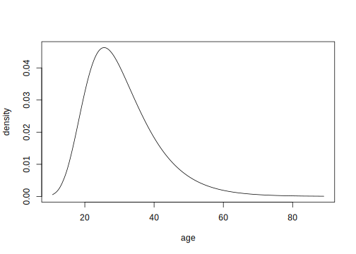
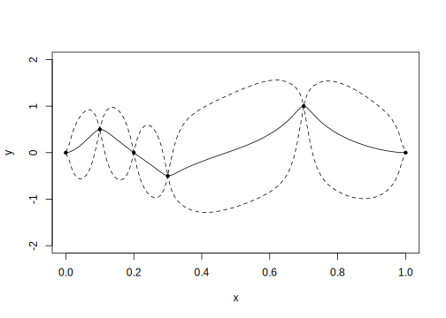

Bayesian Regression Modeling with INLA
================
Chapter Eight: Gaussian Process Regression
2022-02-17

-   [Introduction](#introduction)
-   [Penalized Complexity Priors](#penalized-complexity-priors)
-   [Credible bands for smoothness](#credible-bands-for-smoothness)
-   [Non-stationary Fields](#non-stationary-fields)
-   [Interpolation with Uncertainty](#interpolation-with-uncertainty)
-   [Survival response](#survival-response)

Code from [Bayesian Regression Modeling with
INLA](http://julianfaraway.github.io/brinla/)

``` r
library(brinla)
```

# Introduction

``` r
data(fossil, package="brinla")
fossil$sr <- (fossil$sr-0.7)*100
```

``` r
library(ggplot2)
pf <- ggplot(fossil, aes(age, sr)) + geom_point() + xlab("Age")+ylab("Strontium Ratio")
pf+geom_smooth(method="gam", formula = y ~ s(x, bs = "cs"))
```

<!-- -->

``` r
nbasis <- 25
library(INLA)
mesh <- inla.mesh.1d(seq(min(fossil$age),max(fossil$age),length.out = nbasis),degree =2)
alpha <- 2
nu <- alpha - 1/2
sigma0 <- sd(fossil$sr)
rho0 <- 0.25*(max(fossil$age) - min(fossil$age))
kappa0 <- sqrt(8 * nu)/rho0
tau0 <- 1 / (4 * kappa0^3 * sigma0^2)^0.5
spde <- inla.spde2.matern(mesh, alpha=alpha,
                           B.tau = cbind(log(tau0), 1, 0),
                           B.kappa = cbind(log(kappa0), 0, 1),
                           theta.prior.prec = 1e-4)
A <-  inla.spde.make.A(mesh, loc=fossil$age)
 index <- inla.spde.make.index("sinc", n.spde = spde$n.spde)
st.est <- inla.stack(data=list(y=fossil$sr), A=list(A),  effects=list(index),  tag="est")
formula <- y ~ -1 + f(sinc, model=spde)
data <- inla.stack.data(st.est)
result <- inla(formula, data=data,  family="gaussian",control.predictor= list(A=inla.stack.A(st.est), compute=TRUE))
ii <- inla.stack.index(st.est, "est")$data
```

``` r
plot(sr ~ age, fossil)
tdx <- fossil$age
lines(tdx, result$summary.fitted.values$mean[ii])
lines(tdx, result$summary.fitted.values$"0.025quant"[ii], lty = 2)
lines(tdx, result$summary.fitted.values$"0.975quant"[ii], lty = 2)
```

<!-- -->

``` r
library(brinla)
```

Do it using our function

``` r
fg <- bri.gpr(fossil$age, fossil$sr)
```

``` r
plot(sr ~ age, fossil, pch=20)
lines(fg$xout, fg$mean)
lines(fg$xout, fg$ucb,lty=2)
lines(fg$xout, fg$lcb,lty=2)
```

<!-- -->

# Penalized Complexity Priors

``` r
spde <- inla.spde2.pcmatern(mesh,alpha=alpha,prior.range=c(5,0.05),prior.sigma=c(2,0.05))
formula <- y ~ -1 + f(sinc, model=spde)
resultpc <- inla(formula, data=data,  family="gaussian",control.predictor= list(A=inla.stack.A(st.est), compute=TRUE))
pcmod <-  bri.gpr(fossil$age, fossil$sr, pcprior=c(5,2)) 
```

# Credible bands for smoothness

``` r
library(brinla)
errorsd <- bri.hyper.sd(result$marginals.hyperpar[[1]])
mres <- inla.spde.result(result,"sinc",spde)
mv <- mres$marginals.variance.nominal[[1]]
sigmad <- as.data.frame(inla.tmarginal(function(x) sqrt(x), mv))
rhod <- mres$marginals.range.nominal[[1]]
```

``` r
plot(y ~ x, errorsd, type="l", xlab="sr", ylab="density")
```

<!-- -->

``` r
plot(y ~ x,sigmad, type="l",xlab="sr",ylab="density")
```

<!-- -->

``` r
plot(rhod,type="l",xlab="age",ylab="density")
```

<!-- -->

``` r
exp(mres$summary.log.kappa[c(4,6)])
```

            0.025quant 0.975quant
    kappa.1    0.06169    0.21809

``` r
kappa0 <- exp(mres$summary.log.kappa['0.025quant'])[,]
sigma02 <- exp(mres$summary.log.variance.nominal['0.5quant'])[,]
tau0 <- 1 / (4 * kappa0^3 * sigma02)^0.5
```

Changed from published spec

``` r
spde <- inla.spde2.matern(mesh, alpha=alpha, constr = FALSE,
  prior.tau = tau0,
  prior.kappa = kappa0,
  theta.prior.prec = 1e5)
formula <- y ~ -1 + f(sinc, model=spde)
resulta <- inla(formula, data=data,  family="gaussian",control.predictor= list(A=inla.stack.A(st.est),compute=TRUE))
kappa0 <- exp(mres$summary.log.kappa['0.975quant'])[,]
sigma02 <- exp(mres$summary.log.variance.nominal['0.5quant'])[,]
tau0 <- 1 / (4 * kappa0^3 * sigma02)^0.5
```

Changed from published spec

``` r
spde <- inla.spde2.matern(mesh, alpha=alpha, constr = FALSE,
  prior.tau = tau0,
  prior.kappa = kappa0,
  theta.prior.prec = 1e5)
formula <- y ~ -1 + f(sinc, model=spde)
resultb <- inla(formula, data=data,  family="gaussian",control.predictor= list(A=inla.stack.A(st.est),compute=TRUE))
ii <- inla.stack.index(st.est, "est")$data
```

``` r
plot(sr ~ age, fossil, pch=20)
tdx <- fossil$age
lines(tdx, resulta$summary.fitted.values$mean[ii],lty=2)
lines(tdx, resultb$summary.fitted.values$mean[ii],lty=1)
```

<!-- -->

Do it using our function

``` r
fg <- bri.smoothband(fossil$age, fossil$sr)  
plot(sr ~ age, fossil, pch=20)
lines(fg$xout, fg$rcb,lty=1)
lines(fg$xout, fg$scb,lty=2)
```

<!-- -->

# Non-stationary Fields

``` r
set.seed(1)
n <- 100
x <- seq(0, 1, length=n)
f.true <- (sin(2*pi*(x)^3))^3
y <- f.true + rnorm(n, sd = 0.2)
td <- data.frame(y = y, x = x, f.true)
nbasis <- 25
mesh <- inla.mesh.1d(seq(0,1,length.out = nbasis),degree =2)
alpha <- 2
nu <- alpha - 1/2
sigma0 <- sd(y)
rho0 <- 0.1
kappa0 <- sqrt(8 * nu)/rho0
tau0 <- 1 / (4 * kappa0^3 * sigma0^2)^0.5
spde <- inla.spde2.matern(mesh, alpha=alpha,
                           B.tau = cbind(log(tau0), 1, 0),
                           B.kappa = cbind(log(kappa0), 0, 1),
                           theta.prior.prec = 1e-4)
A <-  inla.spde.make.A(mesh, loc=td$x)
index <- inla.spde.make.index("sinc", n.spde = spde$n.spde)
st.est <- inla.stack(data=list(y=td$y), A=list(A),
          effects=list(index),  tag="est")
formula <- y ~ -1 + f(sinc, model=spde)
data <- inla.stack.data(st.est)
result <- inla(formula, data=data,  family="gaussian",
    control.predictor= list(A=inla.stack.A(st.est), compute=TRUE))
ii <- inla.stack.index(st.est, "est")$data
```

``` r
plot(y ~ x, td, col=gray(0.75))
tdx <- td$x
lines(tdx, result$summary.fitted.values$mean[ii])
lines(tdx,f.true,lty=2)
```

<!-- -->

``` r
basis.T <-as.matrix(inla.mesh.basis(mesh, type="b.spline",
  n=5, degree=2))
basis.K <-as.matrix(inla.mesh.basis(mesh, type="b.spline",
  n=5, degree=2))
spde <- inla.spde2.matern(mesh, alpha=alpha,
              B.tau = cbind(basis.T[-1,],0),
          B.kappa = cbind(0,basis.K[-1,]/2),
                    theta.prior.prec = 1e-4)
formula <- y ~ -1 + f(sinc, model=spde)
result <- inla(formula, data=data,  family="gaussian",
  control.predictor= list(A=inla.stack.A(st.est), compute=TRUE))
```

``` r
plot(y ~ x, td, col=gray(0.75))
lines(tdx, result$summary.fitted.values$mean[ii])
lines(tdx,f.true,lty=2)
```

<!-- -->

``` r
fg <- bri.nonstat(td$x, td$y)
```

``` r
plot(y ~ x, td, col=gray(0.75))
lines(f.true ~ x, td, lty=2)
lines(fg$xout, fg$mean)
```

<!-- -->

# Interpolation with Uncertainty

``` r
x <- c(0,0.1,0.2,0.3,0.7,1.0)
y <- c(0,0.5,0,-0.5,1,0)
td <- data.frame(x,y)
nbasis <- 100
alpha <- 2
mesh <- inla.mesh.1d(seq(0,1,length.out = nbasis),degree = 2)
spde <- inla.spde2.pcmatern(mesh,alpha=alpha,prior.range=c(0.05,0.1),prior.sigma=c(5,0.05))
A <-  inla.spde.make.A(mesh, loc=td$x)
ngrid <- 101
Ap <-  inla.spde.make.A(mesh, loc=seq(0,1,length.out = ngrid))
index <- inla.spde.make.index("sinc", n.spde = spde$n.spde)
st.est <- inla.stack(data=list(y=td$y), A=list(A),
          effects=list(index),  tag="est")
st.pred <- inla.stack(data=list(y=NA), A=list(Ap),
           effects=list(index),  tag="pred")
formula <- y ~ -1 + f(sinc, model=spde)
sestpred <- inla.stack(st.est,st.pred)
result <- inla(formula, data=inla.stack.data(sestpred), family="gaussian",
 control.predictor= list(A=inla.stack.A(sestpred), compute=TRUE),
 control.family(hyper=list(prec = list(fixed = TRUE, initial = 1e8))),
 control.compute=list(return.marginals.predictor=TRUE))
ii <- inla.stack.index(sestpred, tag='pred')$data
```

``` r
plot(y ~ x, td,pch=20,ylim=c(-2,2))
tdx <- seq(0,1,length.out = ngrid)
lines(tdx, result$summary.linear.pred$mean[ii])
lines(tdx, result$summary.linear.pred$"0.025quant"[ii], lty = 2)
lines(tdx, result$summary.linear.pred$"0.975quant"[ii], lty = 2)
```

<!-- -->

``` r
jj <- which(tdx == 0.5)
margpred <- result$marginals.linear[ii]
```

``` r
plot(margpred[[jj]],type="l", ylab="Density")
```

<!-- -->

``` r
mres <- inla.spde.result(result,"sinc",spde)
exp(mres$summary.log.range.nominal[c(2,4,5,6,7)])
```

                       mean 0.025quant 0.5quant 0.975quant    mode
    range.nominal.1 0.14027   0.033283  0.15185    0.39902 0.19455

``` r
sqrt(exp(mres$summary.log.variance.nominal[c(2,4,5,6,7)]))
```

                          mean 0.025quant 0.5quant 0.975quant    mode
    variance.nominal.1 0.55615    0.31254  0.56071    0.95169 0.57379

``` r
spde <- inla.spde2.pcmatern(mesh,alpha=alpha,
  prior.range=c(0.033269,NA),prior.sigma=c(0.53804,NA))
resultl <- inla(formula, data=inla.stack.data(sestpred), family="gaussian",
 control.predictor= list(A=inla.stack.A(sestpred), compute=TRUE),
 control.family(hyper=list(prec = list(fixed = TRUE, initial = 1e8))))
spde <- inla.spde2.pcmatern(mesh,alpha=alpha,
  prior.range=c(0.3462,NA),prior.sigma=c(0.53804,NA))
resulth <- inla(formula, data=inla.stack.data(sestpred), family="gaussian",
 control.predictor= list(A=inla.stack.A(sestpred), compute=TRUE),
 control.family(hyper=list(prec = list(fixed = TRUE, initial = 1e8))))
```

``` r
plot(y ~ x, td,pch=20)
tdx <- seq(0,1,length.out = ngrid)
lines(tdx, result$summary.linear.pred$mean[ii])
lines(tdx, resultl$summary.linear.pred$mean[ii],lty=2)
lines(tdx, resulth$summary.linear.pred$mean[ii],lty=3)
```

<!-- -->

# Survival response

``` r
data(larynx, package="brinla")
nbasis <- 25
alpha <- 2
xspat <- larynx$age
mesh <- inla.mesh.1d(seq(min(xspat),max(xspat),length.out = nbasis),degree =2)
spde <- inla.spde2.pcmatern(mesh,alpha=alpha,prior.range=c(20,0.1),prior.sigma=c(10,0.05))
A <-  inla.spde.make.A(mesh, loc=xspat)
index <- inla.spde.make.index("sinc", n.spde = spde$n.spde)
st.est=inla.stack(data=list(time=larynx$time,censor=larynx$delta), A=list(A),  effects=list(index),  tag="est")
formula <- inla.surv(time,censor) ~  0 +f(sinc, model=spde)
data <- inla.stack.data(st.est)
result <- inla(formula, data=data,  family="weibull.surv",control.predictor= list(A=inla.stack.A(st.est), compute=TRUE))
ii <- inla.stack.index(st.est, "est")$data
lcdf <- data.frame(result$summary.linear.predictor[ii,],larynx)
alpha <- result$summary.hyperpar[1,1]
lambda <- exp(lcdf$mean)
lcdf$exptime <- lambda^(-1/alpha)*gamma(1/alpha + 1)
lambda <- exp(lcdf$X0.025quant)
lcdf$lcb <- lambda^(-1/alpha)*gamma(1/alpha + 1)
lambda <- exp(lcdf$X0.975quant)
lcdf$ucb <- lambda^(-1/alpha)*gamma(1/alpha + 1)
```

``` r
p <- ggplot(data=lcdf,aes(x=age,y=time)) + geom_point()
p + geom_line(aes(x=age,y=exptime)) + geom_line(aes(x=age,y=ucb),linetype=2) + geom_line(aes(x=age,y=lcb),linetype=2)
```

<!-- -->

``` r
lambda <- exp(lcdf$mean)
lcdf$hazard <- alpha * lcdf$age^(alpha-1) * lambda
lambda <- exp(lcdf$X0.025quant)
lcdf$hazlo <- alpha * lcdf$age^(alpha-1) * lambda
lambda <- exp(lcdf$X0.975quant)
lcdf$hazhi <- alpha * lcdf$age^(alpha-1) * lambda
```

``` r
ggplot(data=lcdf,aes(x=age,y=hazard))+geom_line()+geom_line(aes(x=age,y=hazlo),lty=2)+geom_line(aes(x=age,y=hazhi),lty=2)
```

<!-- -->

``` r
sessionInfo()
```

    R version 4.1.0 (2021-05-18)
    Platform: x86_64-apple-darwin17.0 (64-bit)
    Running under: macOS Big Sur 10.16

    Matrix products: default
    BLAS:   /Library/Frameworks/R.framework/Versions/4.1/Resources/lib/libRblas.dylib
    LAPACK: /Library/Frameworks/R.framework/Versions/4.1/Resources/lib/libRlapack.dylib

    locale:
    [1] en_GB.UTF-8/en_GB.UTF-8/en_GB.UTF-8/C/en_GB.UTF-8/en_GB.UTF-8

    attached base packages:
    [1] parallel  stats     graphics  grDevices utils     datasets  methods   base     

    other attached packages:
    [1] ggplot2_3.3.5 brinla_0.1.0  INLA_22.01.25 sp_1.4-6      foreach_1.5.2 Matrix_1.4-0  svglite_2.0.0

    loaded via a namespace (and not attached):
     [1] tidyselect_1.1.1   xfun_0.29          purrr_0.3.4        splines_4.1.0      lattice_0.20-45    colorspace_2.0-2  
     [7] vctrs_0.3.8        generics_0.1.2     htmltools_0.5.2    yaml_2.2.2         mgcv_1.8-38        utf8_1.2.2        
    [13] rlang_1.0.1        pillar_1.7.0       glue_1.6.1         withr_2.4.3        DBI_1.1.2          lifecycle_1.0.1   
    [19] stringr_1.4.0      MatrixModels_0.5-0 munsell_0.5.0      gtable_0.3.0       codetools_0.2-18   evaluate_0.14     
    [25] labeling_0.4.2     knitr_1.37         fastmap_1.1.0      fansi_1.0.2        highr_0.9          scales_1.1.1      
    [31] farver_2.1.0       systemfonts_1.0.3  Deriv_4.1.3        digest_0.6.29      stringi_1.7.6      dplyr_1.0.7       
    [37] grid_4.1.0         cli_3.1.1          tools_4.1.0        magrittr_2.0.2     tibble_3.1.6       crayon_1.4.2      
    [43] pkgconfig_2.0.3    ellipsis_0.3.2     assertthat_0.2.1   rmarkdown_2.11     rstudioapi_0.13    iterators_1.0.14  
    [49] R6_2.5.1           nlme_3.1-155       compiler_4.1.0    
