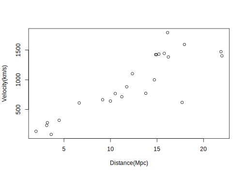
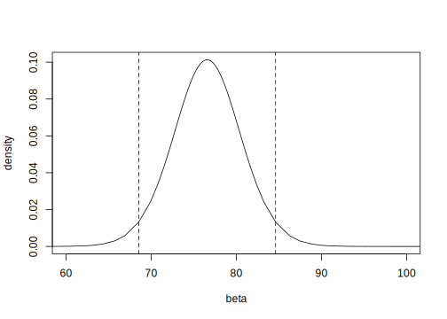
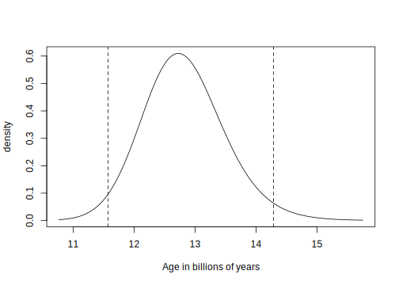

Bayesian Regression Modeling with INLA
================
Chapter One: Introduction
2022-02-11

Code from [Bayesian Regression Modeling with
INLA](http://julianfaraway.github.io/brinla/)

# Quick Start

``` r
data(hubble, package = "brinla")
```

``` r
plot(y ~ x, xlab = "Distance(Mpc)", ylab = "Velocity(km/s)", data = hubble)
```

<!-- -->

``` r
lmod <- lm(y ~ x - 1, data = hubble)
coef(lmod)
```

         x 
    76.581 

``` r
hubtoage <- function(x) 3.09e+19/(x * 60^2 * 24 * 365.25 * 1e+09)
hubtoage(coef(lmod))
```

         x 
    12.786 

``` r
(bci <- confint(lmod))
```

       2.5 % 97.5 %
    x 68.379 84.783

``` r
hubtoage(bci)
```

      2.5 % 97.5 %
    x 14.32 11.549

``` r
library(INLA)
imod <- inla(y ~ x - 1, family = "gaussian", control.fixed = list(prec = 1e-09), 
    data = hubble)
(ibci <- imod$summary.fixed)
```

        mean     sd 0.025quant 0.5quant 0.975quant   mode       kld
    x 76.581 4.0627     68.538   76.581     84.617 76.581 5.206e-05

``` r
plot(imod$marginals.fixed$x, type = "l", xlab = "beta", ylab = "density", 
    xlim = c(60, 100))
abline(v = ibci[c(3, 5)], lty = 2)
```

<!-- -->

``` r
hubtoage(ibci[c(1, 3, 4, 5, 6)])
```

        mean 0.025quant 0.5quant 0.975quant   mode
    x 12.786     14.287   12.786     11.572 12.786

``` r
ageden <- inla.tmarginal(hubtoage, imod$marginals.fixed$x)
```

``` r
plot(ageden, type = "l", xlab = "Age in billions of years", ylab = "density")
abline(v = hubtoage(ibci[c(3, 5)]), lty = 2)
```

<!-- -->

``` r
hubtoage(c(10, 15, 20))
```

    [1] 97.916 65.277 48.958

``` r
imod <- inla(y ~ x - 1, family = "gaussian", control.fixed = list(mean = 65, 
    prec = 1/(12^2)), data = hubble)
(ibci <- imod$summary.fixed)
```

        mean    sd 0.025quant 0.5quant 0.975quant   mode        kld
    x 75.102 4.316     66.407   75.156     83.489 75.262 5.5568e-06

``` r
hubtoage(ibci[c(1, 3, 4, 5, 6)])
```

        mean 0.025quant 0.5quant 0.975quant  mode
    x 13.038     14.745   13.028     11.728 13.01

``` r
(uhub <- hubtoage((2016 + 4004 - 1)/1e+09))
```

    [1] 162678504

``` r
imod <- inla(y ~ x - 1, family = "gaussian", control.fixed = list(mean = uhub, 
    prec = 1/((0.05 * uhub)^2)), data = hubble)
(ibci <- imod$summary.fixed)
```

        mean     sd 0.025quant 0.5quant 0.975quant   mode       kld
    x 76.581 7.3864     62.074   76.581     91.082 76.581 1.666e-05

``` r
hubtoage(ibci[c(1, 3, 4, 5, 6)])
```

        mean 0.025quant 0.5quant 0.975quant   mode
    x 12.786     15.774   12.786      10.75 12.786

# Version information

``` r
sessionInfo()
```

    R version 4.1.0 (2021-05-18)
    Platform: x86_64-apple-darwin17.0 (64-bit)
    Running under: macOS Big Sur 10.16

    Matrix products: default
    BLAS:   /Library/Frameworks/R.framework/Versions/4.1/Resources/lib/libRblas.dylib
    LAPACK: /Library/Frameworks/R.framework/Versions/4.1/Resources/lib/libRlapack.dylib

    locale:
    [1] en_GB.UTF-8/en_GB.UTF-8/en_GB.UTF-8/C/en_GB.UTF-8/en_GB.UTF-8

    attached base packages:
    [1] parallel  stats     graphics  grDevices utils     datasets  methods   base     

    other attached packages:
    [1] INLA_22.01.25 sp_1.4-6      foreach_1.5.2 Matrix_1.4-0  svglite_2.0.0

    loaded via a namespace (and not attached):
     [1] compiler_4.1.0      pillar_1.7.0        highr_0.9           iterators_1.0.14    tools_4.1.0        
     [6] digest_0.6.29       lattice_0.20-45     evaluate_0.14       lifecycle_1.0.1     tibble_3.1.6       
    [11] gtable_0.3.0        pkgconfig_2.0.3     rlang_1.0.1         DBI_1.1.2           cli_3.1.1          
    [16] rstudioapi_0.13     yaml_2.2.2          xfun_0.29           fastmap_1.1.0       stringr_1.4.0      
    [21] dplyr_1.0.7         knitr_1.37          MatrixModels_0.5-0  generics_0.1.2      vctrs_0.3.8        
    [26] systemfonts_1.0.3   grid_4.1.0          tidyselect_1.1.1    glue_1.6.1          R6_2.5.1           
    [31] fansi_1.0.2         rmarkdown_2.11      ggplot2_3.3.5       purrr_0.3.4         magrittr_2.0.2     
    [36] splines_4.1.0       codetools_0.2-18    scales_1.1.1        ellipsis_0.3.2      htmltools_0.5.2    
    [41] assertthat_0.2.1    colorspace_2.0-2    numDeriv_2016.8-1.1 Deriv_4.1.3         utf8_1.2.2         
    [46] stringi_1.7.6       munsell_0.5.0       crayon_1.4.2       
